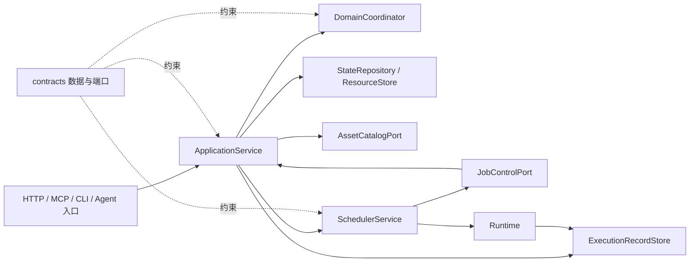

# 核心合同、领域规则、应用服务与任务调度

[返回框架设计目录](README.md)

本文按当前工作区源码说明 `contracts`、`domain`、`application` 和 `dispatch`，共 45 个 Python 文件。描述包含当前未提交的实现；不以历史设计稿、文件头中的旧版本号或旧测试结果代替现行行为。当前合同常量为 `SCHEMA_VERSION = 11`、`CONTRACT_REVISION = "v11-contract-r2"`。

## 1. 分层与依赖

| 层 | 输入与输出 | 职责和边界 |
| --- | --- | --- |
| `contracts` | Python DTO、Protocol、枚举、规范 JSON 和 schema | 统一跨层数据、校验规则、错误码、版本与资源上限。内部 DTO 可以嵌套；这些 DTO 不等同于公开 MCP 输入 schema，MCP 的扁平化由接入层负责。 |
| `domain` | `CaseSnapshot + ValidatedTrigger → TransitionPlan / ApplicationError` | 只计算业务决策；不访问仓库、资源文件、时钟、模型或调度队列。领域计划描述接受什么、如何变更状态、是否创建下一 Job。 |
| `application` | 外部命令、查询、Job 控制请求 → 回执、视图、流 | 校验当前状态和资源，构建领域输入，将计划转换为正式对象，发布资源并提交状态，提交后通知调度器和等待者。 |
| `dispatch` | 已提交的 `job_id` → Runtime 调用与交付回执 | 管理进程内队列、领取、并发、取消、提交重试、服务关闭，以及独立后台归档。业务状态仍由应用服务和仓库决定。 |

依赖倒置主要落在同步 `Protocol` 端口上。Web 异步调用、文件系统、模型子进程和数据库适配放在外围；应用服务不依赖具体 HTTP 框架。当前代码也有明确的具体实现扩展：`ArchiveService` 使用归档任务和存储布局接口，查询、上传使用可选的 `case_usage` 生命周期租约，不能把这些扩展误读成全部已经收录在 `StateRepository` Protocol 内。

## 2. Case、Job 与 Outcome 的主流程

### 2.1 核心对象和版本

| 对象 | 关键内容 | 设计含义 |
| --- | --- | --- |
| `Case` | `case_id`、`status`、`case_revision`、`diagnosis_state`、`active_job_id`、选定 Skill、结果、失败、归档状态 | 一次诊断的业务入口；指向当前有效 Job，汇总对用户可见的结果。 |
| `DiagnosisState` | 问题定义、用户事实、确认事实、假设、待解问题、补充要求、证据引用、候选结论、`revision` | 表示诊断语义。与 Case 的运行状态分开计数，避免领取、上传等动作使模型上下文无谓失效。 |
| `Job` | 类型、目标、`base_state_revision`、上下文快照、资源引用、固定版本资产、资源上限、生命周期、`runtime_epoch` | 执行单元。后续 Catalog 或配置变化不能悄悄替换已经写入 Job 的资产绑定。 |
| `JobOutcome` | Job/Case/版本绑定、结果类型、业务 payload、证据与产物提议、错误、审计字段 | Runtime 已完成并发布的执行结果；模型草稿与正式 Outcome 有不同 DTO，不能互换。 |
| `TransitionPlan` | 状态增量、接受的提议键、Job 更新、下一 JobSpec、结果绑定、清除 active Job 等动作 | 领域决策产物，不直接含仓库副作用。应用层再次校验后执行。 |
| `StateMutation` | Case 更新、Job/Outcome/审计记录插入、附件更新、证据与产物插入、幂等记录 | 一个状态提交的完整变更集合。由仓库核对预期 generation 和 Case revision。 |

`case_revision` 表示业务聚合的变更；`diagnosis_state.revision` 表示诊断语义变更；`StateFile.generation` 是仓库快照提交令牌。创建时两个 Case 内版本均为 1；普通领取、附件生命周期、路由结果和取消通常只增加 `case_revision`。接受语义增量时才增加诊断版本；幂等重放和重复 Outcome 不增加二者。精确规则由 `REVISION_MATRIX` 和各模型校验共同约束。

### 2.2 创建和执行

1. `ExternalCommandHandler._create_case` 先读取幂等记录，确定首次请求后再分配 Case、Job、Trigger 和事实 ID，并从 Catalog 获取 ROUTE 绑定。
2. `preparation.py` 归一化问题定义和用户事实，构造临时 `NEW` Case 与创建 Trigger。领域协调器只接受与 Trigger 完全一致的临时状态。
3. 领域返回 `RUNNING + ROUTE JobSpec`。`formalization.build_job` 将目标诊断状态投影为固定快照，创建 `PENDING` Job。
4. 发布 `job.json`，再把 Case、Job、业务回执对应的幂等记录放入同一次仓库提交。成功后才通知调度器。
5. `InProcessDispatcher` 将 ROUTE 放入路由队列，将 DIAGNOSE/REVIEW 放入诊断队列。`JobWorker` 调用 `claim_job`，只有领取成功才调用 Runtime。
6. 领取时核对当前 active Job、Case 状态、Job 状态和固定资产可用性；成功提交 `RUNNING`、开始时间和当前 epoch。资产不可用时，应用层可以提交失败状态并返回未领取回执。
7. Runtime 返回已发布的 `RuntimeExecutionReceipt`。Worker 不自行接受其业务结论，而是把同一回执交给 `submit_outcome`。

### 2.3 Outcome 接受与后继任务

`OutcomeSubmissionService` 按以下顺序处理：

1. 先把嵌套 DTO 还原成原始数据，严格重建 `SubmitJobOutcome`，防止绕过 Pydantic 校验的对象直接穿过端口。
2. 根据 `outcome_id` 和文件摘要判断重放。相同内容返回 `DUPLICATE`；相同 ID 绑定不同 Job 或摘要返回 `IDEMPOTENCY_CONFLICT`。
3. 从 `ExecutionRecordStore` 重读已发布 Outcome，逐字节比较规范 JSON 和文件引用。Worker 传来的对象本身不具有最终权威性。
4. 先核对源 Job 固定的身份、类型、基础版本、Review target 等约束，再判断结果是否过期。因此伪造 Review target 不能借“已经过期”绕过验证。
5. `ACTIVE` 结果才继续检查资源、确定后继资产绑定并请求领域计划；`STALE` 只走过期结果记录路径；技术性拒绝写入确定性的处理记录。
6. 接受的 `proposal_key` 被转换为稳定的 Evidence/Artifact ID。应用层在发布租约内校验容量、发布资源、落实诊断增量，必要时发布下一 Job。
7. Case、Job 生命周期、Outcome、OutcomeProcessingRecord、Evidence、Artifact 和后继 Job 作为同一状态变更提交。成功后才发通知与入队信号。

后继 Job 和资源 ID 使用 installation、Case、Outcome、提议键等稳定字段派生，以便提交冲突后保持同一身份。若后继 `job.json` 已经发布但状态尚未提交，可以校验并复用该 Job 的固定绑定；这属于单次交付重试，不代表服务启动时自动重放历史任务。

### 2.4 业务分支

| 输入/分支 | 主要行为 | 输出状态或后续动作 |
| --- | --- | --- |
| ROUTE `MATCHED` | 固定选中的 Skill，沿当前资源闭包继续 | 创建 SPECIALIZED DIAGNOSE，Case 保持 `RUNNING`。 |
| ROUTE `NO_CAPABILITY` | 清除专用 Skill，使用原始问题文本；恰好一个附件时可直接选用 | 创建 GENERIC DIAGNOSE。没有专用能力不等同于立即失败。 |
| GENERIC 缺少期望日志 | 接受等待附件的要求 | `WAITING_ATTACHMENT`，清除 active Job。 |
| GENERIC / Skill 直接交付 | 校验 `GenericDiagnosisOutcomeV2` 的 Markdown、UTF-8 长度与 SHA-256；直接交付分支由固定的 profile/output-contract 和 review policy 判断 | 生成正式 Markdown Artifact，进入 `RESOLVED` 或 `UNRESOLVED`。 |
| 专用诊断要求补充 | 校验 requested input/attachment 和状态增量 | `WAITING_INPUT` 或 `WAITING_ATTACHMENT`。 |
| 传统候选结论与审阅 | 绑定候选 ID、revision、content hash；通过审阅后只能接受该固定候选 | `REVIEWING`，随后按 verdict 形成最终结果、补证要求或未解决结果。 |
| `SubmitSupplement` | 只接收当前开放要求允许的输入/READY 附件；稳定诊断目标发生变化时返回 `NEW_CASE_REQUIRED` | 要求尚未满足则继续等待，否则创建后继诊断 Job。 |
| `CancelCase` | 在业务提交中将可取消的非终态 Case/active Job 标记取消，再向调度器发取消信号 | `CANCELLED`；迟到 Outcome 不能覆盖取消状态。 |
| `ResumeCase` | 对已有 PENDING Job 可重新发入队信号；对中断源任务按规则生成唯一替代 Job | 保留固定资产及上下文关系；替代 Job 使用 `replacement_for_job_id`。 |
| `RestartGenericDiagnosis` | 取消正在等待/执行的通用源 Job，并保留其固定绑定；需要日志时只按明确规则补入 logparse 绑定 | 创建新的 GENERIC Job，避免把新日志意图写进旧执行结果。 |

当前源码保留 Methods V2 的合同、领域状态机、Review handoff 和终态投影函数，但 `Case` 与 `CaseView` 的现行校验明确要求 `methods_result` 为空。因此，Methods V2 纯函数能表达某个状态，不等于该状态可以直接写入当前 Case 或作为当前默认交付路径。阅读这些模块时必须继续核对实际 Runtime 入口和最终 Case 校验。

## 3. 合同层逐文件设计（12 个文件）

### 3.1 [models.py](../../src/problem_locator/contracts/models.py)

这是跨层 DTO 的主体，既承载接口对象，也承载持久化对象。输入通常是 JSON 解码结果或 Python 字段；输出是已校验模型。`ContractModel` 拒绝未知字段并校验赋值；基础模型的 `strict=False` 用于接受 JSON 枚举值，具体标量别名和端口重建会继续限制类型，不能笼统理解为“所有字段自动强制转换”或“所有对象不可变”。Methods V2 子合同另行设置 `frozen=True`。

| 模型组/主要符号 | 详细职责和校验 |
| --- | --- |
| UUID、UTC 时间、SHA-256、相对路径、文本别名 | UUID 和摘要采用规范小写格式；时间精确到毫秒；路径必须是相对 POSIX 路径并拒绝 `..`、盘符、反斜杠；文本限制按 UTF-8 字节计。 |
| `VersionedRef`、`ResourceLimits`、`RuntimeBindings` | 用 `id/version/content_hash` 固定资产；约束 ROUTE、GENERIC、SPECIALIZED、REVIEW 各自允许的 Skill、logparse、profile 和 policy 组合。 |
| `ProblemSpecInput`、`ProblemSpec`、`ProblemSpecPatch` | 定义八个问题字段；目标与完成标准不能为空，列表项不重复。Patch 以“字段是否出现”为语义，不能用显式 `null` 代替缺省，序列化只输出真正出现的字段。 |
| `DiagnosisItem`、`DiagnosisProvenance`、`PendingRequirement` | 表达事实/假设/问题的状态、来源、替代关系，以及输入/附件要求及其约束。用户事实与 Agent Outcome 的来源字段互斥校验。 |
| `CandidateConclusion`、`CandidateTarget`、`CompletionCriterionMapping`、`CausalFactor` | 保存候选结论、内容摘要、完成标准映射、原因/贡献因素/条件和证据关系；Review target 必须固定到具体候选版本。 |
| `DiagnosisState`、`ContextSnapshot`、`Case`、`Job` | 校验聚合状态与执行输入一致性。Job 的 `PENDING/RUNNING/终态` 与时间和 epoch 必须匹配；GENERIC 不接受专用 ContextSnapshot；直接交付禁止 Candidate 和 Review 绑定。 |
| `Attachment`、`Evidence`、`Artifact`、各类 metadata 与 locator | 保存正式资源身份、归属、字节长度、摘要和存储键；Evidence 的定位类型区分用户事实、附件、logparse、工具输出、历史 Outcome。Artifact 类型与 metadata、文件/目录形态对应。 |
| `StagedResourceRef`、`AttachmentStagedRef`、`PlannedResourceTarget`、`ResourceRef` | 区分临时资源、计划位置和正式资源，避免把 Agent 提议当作已经发布的文件。 |
| `WorkspaceInputManifest`、`Workspace*Input`、`ReviewSubjectV2`、`ResolvedLogparse*` | 固定运行工作区的输入资源及相对路径，校验与 Job 引用、logparse 计划或审阅对象的绑定。 |
| `AgentJobOutcomeDraftV2`、`AgentJobOutcome`、`JobOutcome` | 分隔模型原始声明、转换后的 Agent 输出和服务端最终结果；服务端生成的用户报告不允许由草稿伪装，结果类型、payload、error 和提议资源必须一致。 |
| `DiagnosisStateDelta`、`JobSpec`、`ValidatedTrigger`、`TransitionPlan` | 为纯领域计算提供显式输入和结果；增量、下一 Job、被接受的资源、清除操作、结果草稿分别建模，避免隐式更改状态。 |
| `CaseAggregate`、`StateFile`、`StateMutation` | 校验字典键与实体 ID、跨对象归属、active Job、Outcome 接受记录、资源引用和终态结果等聚合关系。`StateFile` 当前要求 schema 11。 |
| 命令、回执、`CaseView`、`ArtifactSummary` | 定义外部命令和查询的应用层形态；区分持久化业务回执与动态视图；`OpenArtifactResult` 带调用方负责关闭的流。 |
| 验证/导出/schema/交接模型 | `ValidationReport`、`ReadinessReport`、`StateExport`、`ContractManifest`、`FixtureManifest`、`HandoffRecord` 等为管理工具、合同生成和交接记录提供一致的数据结构。 |

附件工具函数 `derive_attachment_filename_suffix`、`derive_attachment_content_type` 和 `workspace_attachment_relative_path` 对支持的压缩包后缀、媒体类型与工作区落盘路径作统一约束，调用方不应各自猜测扩展名。

### 3.2 [outcomes.py](../../src/problem_locator/contracts/outcomes.py)

该文件导出 Outcome/Trigger/Plan 相关类型，并提供跨对象校验；单个 DTO 的字段合法并不意味着它能用于任意 Job。

| 主要函数 | 输入 → 输出 | 关键规则/调用方 |
| --- | --- | --- |
| `validate_outcome_for_job` | Job、Outcome、可选聚合 → 校验完成或异常 | 核对 Job 身份、版本、角色、资源范围、审阅对象及输出合同；Runtime 和 Outcome 应用路径共用。 |
| `validate_outcome_resources_for_job` | Job、Outcome、聚合 → 校验完成或异常 | 约束消费和提议的资源与源 Job、Case 的关系。 |
| `validate_user_result_for_outcome`、`validate_user_result_resolution` | 用户报告、Outcome 等 → 校验完成或 `UserResultValidationError` | 检查结论、证据、完成标准与服务端有效结果相符，错误带具体类别。 |
| `validate_logparse_claim_for_job` | logparse claim、Job 等 → 校验完成或异常 | 防止 claim 脱离 Job 固定的 logparse 绑定与输入范围。 |
| `validate_coordinator_plan_result` | Trigger、领域返回值 → 经校验的计划或错误 | 每种 Trigger 只能返回允许的错误码与计划形态。 |
| `validate_transition_plan_for_outcome` | Plan、Outcome → 经校验的 Plan | 接受集合只能引用实际提议；路由选定 Skill、REROUTE 清除 Skill、Generic 全量报告绑定、Review PASS 固定候选均需一致。 |
| `apply_problem_spec_patch` | 当前问题、Patch → 新问题定义 | 按实际出现的字段应用补丁；维护问题版本语义。 |
| `coordinator_outcome_error_failure` | Trigger、领域错误 → `ExecutionFailure` | 将允许的领域拒绝转换为确定性的 Outcome 失败。 |

### 3.3 [ports.py](../../src/problem_locator/contracts/ports.py)

所有端口是同步、框架无关的 `runtime_checkable Protocol`，接口显式约定流和租约的所有权。

| 端口组 | 输入/输出与所有权 |
| --- | --- |
| `ApplicationCommandPort`、`ApplicationQueryPort`、`JobControlPort`、`StateAdminPort` | 分别处理命令、查询/下载、领取/结果/失败/epoch 控制，以及就绪检查/状态验证/导出。业务负回执与异常通道分开。 |
| `Coordinator`、`ContextSnapshotProjector` | DTO 输入、DTO 输出；领域层不接管 I/O。 |
| `StateRepository` | 读取 Case/Job/Artifact/定向快照；`commit(expected_generation, expected_case_revision, mutation)` 返回 `CommitReceipt`。 |
| `ResourceStore` | 暂存流或目录、校验暂存对象、规划最终位置、校验容量、发布、读取/物化只读副本、丢弃暂存对象。 |
| `ExecutionRecordStore` | 发布 Job/Outcome/被拒 Agent 字节/审计文件，读取已发布回执，创建受限日志 sink。已发布记录与业务仓库分开。 |
| `AssetCatalogPort` | 检查或解析版本引用，按 ROUTE/DIAGNOSE/GENERIC/REVIEW 返回固定运行绑定。 |
| `Runtime`、`Dispatcher` | Runtime 接收完整 Job 和取消信号并返回执行回执；Dispatcher 只接收 Job ID 或取消请求。 |
| `StateChangeNotifier` | 发出 generation 提示并有限等待；通知不是业务状态本身。 |
| `AttachmentUploadGuard/Lease`、`PublicationCommitGuard/Lease` | 分别保护单附件上传生命周期与资源发布/状态提交临界区；持有者必须释放。 |
| `BinaryStream`、`AppendOnlyByteSink`、`CancellationSignal` | 前向只读流、全写入或报错的追加 sink、线程安全单向取消观察面。 |
| `LogparseBrokerFactory/Session`、`Clock`、`IdGenerator` | 提供 Job 级 logparse 能力、可注入时间、新建/稳定派生 ID。 |

### 3.4 其余合同文件

| 文件 | 职责、主要符号和输入输出 |
| --- | --- |
| [__init__.py](../../src/problem_locator/contracts/__init__.py) | 汇总各模块的 `__all__`，提供统一导入面；`SCHEMA_MODELS` 登记 20 个 schema 根模型，供生成器产生 schema 字节。登记某个 DTO 不等于运行时所有分支都启用。 |
| [commands.py](../../src/problem_locator/contracts/commands.py) | 从 `models.py` 按命令/查询/响应/回执职责重新导出，包含创建、补充、附件上传、取消、恢复、Generic 重启和初始日志意图；不执行命令，不增加第二套 DTO。 |
| [enums.py](../../src/problem_locator/contracts/enums.py) | `StrEnum` 集中定义 Case/Job/Outcome、资源、候选、错误、阶段和 Trigger 词汇。输入是稳定字符串，供 schema、日志和持久化共同使用；错误码与状态不得由各层自由拼写。 |
| [limits.py](../../src/problem_locator/contracts/limits.py) | 版本、上限和 `REVISION_MATRIX` 的统一来源；`default_resource_limits(job_type)` 返回角色对应 `ResourceLimits`。当前附件上限 2.5 GiB、Case 资源 5 GiB、Job 1800 秒、日志 64 MiB、工作区 1 GiB、等待 30 秒；ROUTE/DIAGNOSE/REVIEW 上下文分别为 128/256/200 KiB。 |
| [errors.py](../../src/problem_locator/contracts/errors.py) | `ERROR_SPECS` 映射 HTTP 状态、应用可重试性和 CLI 退出码；`PORT_ERROR_CODES` 限定各方法错误词汇；`ApplicationPortError` 是应用端口的类型化异常；`RuntimeInfrastructureError` 限定执行记录发布失败；`LogparseBrokerError` 限定资产解析错误。Outcome 交付可重试码单列，不能用全局 retryable 标志推导“重新执行模型”。 |
| [serialization.py](../../src/problem_locator/contracts/serialization.py) | `canonical_json_bytes` 产出 UTF-8、无 BOM、键排序、紧凑分隔、末尾一个 LF 的字节；解析拒绝重复键、非有限数和非规范拼写。`business_request_sha256` 按 schema 声明排除等待参数或流对象；`schema_bundle_bytes` 生成 schema；`contract_manifest` 读取合同与 schema 文件构建 SHA-256 清单，返回数据而不负责写文件。 |
| [methods_v2.py](../../src/problem_locator/contracts/methods_v2.py) | 定义不可变的 `MethodEvidenceSourceV2/HitV2/EventV2/GraphV2`、评估计划、限制记录、角色评估与共识。引用由规范内容摘要派生；Graph 校验证据来源闭包；`CONFIRMED` 必须有支持事件，`REJECTED/UNKNOWN` 不得携带支持事件；计划、方法、事件、命中引用要求一致。 |
| [methods_state_v2.py](../../src/problem_locator/contracts/methods_state_v2.py) | `MethodStateV2` 保存角色、计划、两角色结果、协议失败次数、共识、原因与诊断 ID；`MethodTerminalResultV2` 保存终态方法/事件/命中闭包。`method_state_ref_v2` 等计算内容身份；`validate_method_terminal_result_v2` 跨证据图/计划/状态验证终态；`project_method_terminal_result_v2` 转换公开投影。 |
| [methods_reason_v2.py](../../src/problem_locator/contracts/methods_reason_v2.py) | 集中定义 Methods 原因码及中文公开文案，并区分 UNRESOLVED 与 FAILED 原因。模型协议/语义/执行失败和缺证据属于未解决；资源快照漂移、服务端不变量破坏、审计归档失败属于 FAILED。领域与 DTO 共用此表。 |

## 4. 领域层逐文件设计（4 个文件）

### 4.1 [coordinator.py](../../src/problem_locator/domain/coordinator.py)

`DomainCoordinator.plan` 是 Case 业务决策入口。它先校验 Trigger 的 Case 归属和预期 revision；补充改变稳定诊断目标时优先返回 `NEW_CASE_REQUIRED`。随后按 12 种 `TriggerType` 分派，并用 `validate_coordinator_plan_result` 校验返回值。

| 方法组 | 输入事实 | 输出决策与约束 |
| --- | --- | --- |
| `_create_case`、`_route_outcome` | 临时初态、路由结果、固定 runtime bindings | 创建 ROUTE；路由命中进入专用诊断；无能力进入通用诊断。ROUTE 不允许提议证据或产物。 |
| `_diagnosis_outcome` | 有效 active DIAGNOSE 及 Outcome | 按直接交付、Generic、Methods、补充要求、重新路由、候选结论和失败等分支形成计划。通用报告与专用证据/候选路径有明确隔离。 |
| `_review_outcome`、`_review_unresolved_plan` | active REVIEW 与固定 Review target | Review PASS 接受目标候选；拒绝/补证结果按 verdict 和请求合法性处理，不能接受后来的其他候选。 |
| `_submit_supplement` | 开放要求、已验证用户事实和附件、稳定目标变化标志 | 应用约束范围内的补充，满足需求后继续；不把任意补充当作可改写整个问题的授权。 |
| `_restart_generic_diagnosis` | 当前 GENERIC Job、新日志意图、固定绑定 | 旧 Job 取消、新 Job 创建；保留原始文本和已有补充，避免更换固定运行资产。 |
| `_cancel_case`、`_resume_interrupted` | 当前生命周期、源 Job、替代关系 | 取消可取消状态；恢复中断任务时拒绝已有替代 Job，并保留源 Job 的阶段、资产和审阅目标。 |
| `_execution_failed`、`_asset_unavailable`、`_old_epoch`、`_stale_active_outcome` | 已验证控制触发器 | 形成失败/中断等纯计划；没有直接取消进程或读写文件的行为。 |
| `_normalize_delta`、`_normalize_patch` 及验证辅助函数 | 模型提出的语义增量、证据绑定、需求、候选 | 核对 ID、来源、supersedes 关系、现有与提议资源引用，拒绝非法跨阶段变化。 |
| `_job_spec` | 下一阶段目标与资源闭包 | 必须从 Trigger 提供的角色绑定生成 JobSpec；Coordinator 不自行查 Catalog，也不分配正式资源 ID。 |

`_methods_terminal_plan` 只计算已验证 Methods 终态的计划，并要求无 Candidate；该能力受最终 `Case` 校验边界限制，见前文。

### 4.2 其余领域文件

| 文件 | 职责、输入输出与机制 |
| --- | --- |
| [projector.py](../../src/problem_locator/domain/projector.py) | `PureContextSnapshotProjector.project(DiagnosisState) → ContextSnapshot`，完整投影诊断版本、问题、各类事实/假设、需求、证据和候选。无 I/O，也不读取“最新状态”；Job 创建时只使用已经确定的目标诊断状态。 |
| [methods_state_v2.py](../../src/problem_locator/domain/methods_state_v2.py) | Methods 纯状态机。`start_method_state_v2` 有评估项时进入 `SPECIALIST_PENDING`，无匹配项直接 `UNRESOLVED`；`accept_specialist_evaluation_v2` 转入 REVIEWER，`finalize_specialist_evaluation_v2` 支持直接终结；`finalize_reviewer_consensus_v2` 校验双方结果和共识。首次协议错误记录一次修复机会，第二次进入未解决；语义或模型执行失败也产生明确原因。`interrupt/resume_method_state_v2` 只处理中断中的角色，状态内容变化重新计算引用。 |
| [__init__.py](../../src/problem_locator/domain/__init__.py) | 公开导出 `DomainCoordinator` 与 `PureContextSnapshotProjector`；Methods 状态机从其专用模块直接导入。无初始化副作用。 |

## 5. 应用层逐文件设计（19 个文件）

### 5.1 [service.py](../../src/problem_locator/application/service.py)

`ApplicationService` 是命令、查询和 JobControl 的统一门面；`build_application_service` 接收仓库、资源、两类租约、执行记录、Coordinator、Projector、Catalog、Dispatcher、Notifier、Clock、IdGenerator 和可选 OperationalState，组装五个服务。

`execute` 将 `UploadAttachmentContent` 交给上传服务，其他外部命令交给 `ExternalCommandHandler`。查询和 Job 控制方法委托相应服务。上传已经提交后，若刷新视图遇到状态损坏或 schema 不支持，仍返回已保存的业务回执，允许 `case_view=None`，避免向调用方谎报“上传未成功”并诱发第二次读取上传体。

### 5.2 [external_commands.py](../../src/problem_locator/application/external_commands.py)

`ExternalCommandHandler` 处理 `CreateCase`、`PrepareAttachment`、`SubmitSupplement`、`ResumeCase`、`CancelCase`、`RestartGenericDiagnosis`、`MarkInitialLogArchiveExpected`。输入为已建模命令，输出 `ApplicationResponse`，包含持久化业务回执、当前视图、等待超时和待调度标志。

命令执行先检查适用的 OperationalState 接单条件，再查幂等记录和业务前置条件。补充必须处于等待输入/附件状态，携带匹配的预期 Case revision；附件归属、READY 状态、需求名和稳定目标分别校验。创建/后继 Job 的时间、ID 和绑定在同一命令内重试时复用。

`_commit_case_plan` 落实状态增量与下一 Job；`_commit` 在发布租约中先发布 Job 文件再提交 mutation。主要变更路径最多尝试三次 revision conflict；重试并不重新读取上传字节或调用模型。`_after_commit` 记录业务事件、通知、取消/入队并构造响应；调度失败反映为 `dispatch_pending`，不会撤回已持久化回执。`_respond` 在命令幂等重放时，可为仍为 PENDING 的已保存 Job 再发入队信号。

### 5.3 [job_control.py](../../src/problem_locator/application/job_control.py)

`JobControlService` 是调度器改变持久化生命周期的入口，默认提交冲突最多三次。

| 方法 | 输入 → 输出 | 关键机制 |
| --- | --- | --- |
| `claim_job` | Job ID、runtime epoch → `ClaimReceipt` | 先严格重建命令；仅当前 active、可领取 Job 可进入 RUNNING。检查固定资产后提交生命周期和 Case revision；普通未领取是负回执，不必抛异常。 |
| `report_execution_infrastructure_failure` | Job/epoch/failure ID、`ExecutionFailure` → `FailureReceipt` | 用 failure ID 和记录内容保证幂等，区分 APPLIED/DUPLICATE/STALE；过期执行不能改写新的 active Job。 |
| `interrupt_previous_epoch` | 新 epoch、recovery ID → `RecoveryReceipt` | 保存恢复处理记录，逐个处理已确定的旧 epoch Job，再标记完成；重放已完成恢复返回既有回执。当前调度启动路径不调用此方法。 |
| `_commit`、`_notify` | StateMutation/Case ID/generation | 提交在发布租约内；通知只是提交后的提示，不决定事务是否成功。 |

### 5.4 [outcome_submission.py](../../src/problem_locator/application/outcome_submission.py)

`OutcomeSubmissionService` 将执行记录转为正式 Case 状态，是资源和业务结果的主要提交边界。完整顺序见 2.3。

`_validate_active_outcome` 检查正式资源/暂存资源；`_bindings_for_outcome` 只为预期后继角色取绑定；`_apply_plan` 派生资源 ID、生成 Markdown 报告或未解决审计包、校验容量并发布，随后落实 Case、候选和下一 Job；`_reject` 写确定性拒绝记录，`_record_stale` 保存过期结果记录；`_discard_proposals` 回收不再需要的暂存提议；`_after_commit` 记录旅程事件并通知后续执行。

所有接受、拒绝和过期记录均绑定 Outcome ID 与已发布文件摘要。提交冲突在服务内最多重试三次；外层 Worker 还可以在有限时间内重交同一回执。资源发布失败、状态写失败与模型输出无效有不同错误通道，不能统一改成重新执行 Runtime。提交后的通知/队列异常不能撤销已保存的 Outcome。

### 5.5 [uploads.py](../../src/problem_locator/application/uploads.py)

`AttachmentUploadService.execute` 只接收 `UploadAttachmentContent`，输出 `BusinessReceipt`。上传路径依次获得单附件租约、查幂等、核对附件归属和上传条件、暂存并校验字节、进入短发布临界区、发布正式附件并提交 READY 状态和幂等记录。

上传体仅由一次 `stage_attachment` 消费；耗时接收不持有发布租约。暂存后如 revision conflict，最多三次重试发布/提交阶段，复用暂存内容。READY 附件的匹配重放可以直接返回；资源大小/摘要必须与请求和暂存回执一致。若仓库支持 Case 生命周期租约，先保护 Case，再重新检查归属，避免历史清理与上传竞争。所有退出路径释放租约并尽力清理暂存资源。

### 5.6 [formalization.py](../../src/problem_locator/application/formalization.py)

该文件执行“计划引用 → 正式对象”的机械转换，不负责资源 I/O，也不替代领域决策。

| 函数组 | 输入 → 输出与约束 |
| --- | --- |
| `resolve_evidence_binding`、`resolve_planned_resource_binding`、`resolve_review_target_binding` | 在现有 ID 与已接受提议映射中解析引用；必须唯一存在，不能把未接受提议变成正式资源。 |
| `formalize_accepted_artifacts/evidence/candidate` | Plan 接受集合、提议、已发布引用及正式 ID → Artifact/Evidence/Candidate；核对 staged/published 大小、摘要、归属、完成标准和证据。 |
| `apply_diagnosis_state_delta` | 当前状态、已接受增量、正式资源映射、候选动作 → 新 DiagnosisState；保持事实/假设分类、替代关系和版本一致。 |
| `apply_selected_skill_update`、`apply_case_failure_update`、`apply_candidate_mutation`、`resolve_final_result` | 显式区分不变、SET、CLEAR、安装候选与修改候选状态；结果必须指向符合目标的已接受候选。 |
| `build_job` | JobSpec、目标状态、资源映射 → PENDING Job；先核对目标 revision，再投影快照；GENERIC 使用 `context_snapshot=None`；资源列表只允许目标状态实际拥有的引用。 |
| `build_methods_specialist_handoff_outcome_v2`、`build_methods_reviewer_outcome_v2`、`build_methods_specialist_terminal_outcome_v2` | 把已验证 Methods 状态/终态转换为标准 JobOutcome；由 Runtime 的 Methods 路径调用，最终仍受 Case 接受边界限制。 |

### 5.7 查询、投影和辅助文件

| 文件 | 职责、主要符号、输入输出与调用关系 |
| --- | --- |
| [queries.py](../../src/problem_locator/application/queries.py) | `ApplicationQueryService` 提供 `get_case/get_report/list_artifacts/open_artifact/read_conversation_delivery`。参数严格重建；检查会话删除和运行故障。有限等待按 monotonic deadline 执行，每次通知后重读权威快照；通知失败也重读。下载必须是可下载 FILE Artifact，返回携带 Case 资源租约的流。 |
| [projection.py](../../src/problem_locator/application/projection.py) | `project_case_view`、`project_case_components`、`project_artifact_summary/summaries` 把聚合变成公开视图；`is_artifact_downloadable` 依据 Case 终态和报告绑定判定可下载性。`build_case_snapshot` 为领域建立 active/resume/replacement 视图；`continuation_for_outcome/supplement/resume` 构造证据、附件、Artifact、历史 Outcome 的完整依赖闭包并核对来源。 |
| [reports.py](../../src/problem_locator/application/reports.py) | `read_published_report` 只读一个已捕获聚合和正式资源，返回 `PublishedReport`；按 Generic V1、Markdown V2、USER_RESULT JSON 分支检查唯一报告、来源 Job、类型和状态。读取上限 16 MiB，流式核对长度和 SHA-256；不重新运行模型或证据验证。`published_artifacts` 只输出当前结果对应的可下载产物元数据。 |
| [resource_usage.py](../../src/problem_locator/application/resource_usage.py) | `case_resource_usage` 在仓库支持时获取 Case 使用租约，否则返回空上下文；`CaseResourceStream` 把 `ExitStack` 所有权交给返回流。流关闭、读取异常或退出上下文时释放底层流与租约，避免下载期间被历史清理删除。 |
| [preparation.py](../../src/problem_locator/application/preparation.py) | `problem_spec_at_revision_one`、`make_user_fact`、`build_create_case_trigger` 构建初始 DTO；`build_uploading_attachment/finalize_attachment` 构建附件生命周期对象；`fixed_asset_refs/runtime_bindings_from_job` 提取固定执行输入；`claim_lifecycle_update` 构造领取更新。不做提交或网络调用。 |
| [mutations.py](../../src/problem_locator/application/mutations.py) | `build_state_mutation` 显式填齐所有 mutation 列表，避免共享默认值；`apply_transition_plan_to_case` 核对下一 Job、Generic 草稿/成品、未解决结果与候选的互斥关系，应用 active Job、Skill、failure 和终态结果并增加 Case revision。 |
| [idempotency.py](../../src/problem_locator/application/idempotency.py) | `record_key` 使用 `operation:idempotency_key`；`decide_idempotency` 计算业务请求摘要并返回 NEW/REPLAY/CONFLICT；`make_idempotency_record` 核对操作、Case 与回执一致，记录与业务变更一起提交。纯函数不抛自定义业务异常，外层负责映射冲突。 |
| [outcome_processing.py](../../src/problem_locator/application/outcome_processing.py) | `validate_published_outcome` 精确比较文件回执和规范字节；`decide_outcome_replay` 依据自然键/摘要分类；`classify_outcome_activity` 区分 ACTIVE/STALE/INVALID/JOB_NOT_FOUND；`validate_published_job_recovery` 只允许复用对应的未执行 Job；`make_outcome_processing_record` 生成成对审计记录。 |
| [runtime_bindings.py](../../src/problem_locator/application/runtime_bindings.py) | `runtime_bindings_match_role` 检查角色、Skill、Generic 和 logparse 组合以及固定资源上限；`rebuild_runtime_bindings_for_role` 严格重建 Catalog 成功对象；`runtime_bindings_from_job_spec` 从计划提取绑定，防止 Coordinator 改写已固定运行条件。 |
| [audit_bundle.py](../../src/problem_locator/application/audit_bundle.py) | `build_audit_bundle` 接收命名字节来源并返回 ZIP 字节、摘要和 manifest。固定条目顺序、时间和属性，使用 `ZIP_STORED`；总量 64 MiB、必需材料 32 MiB、单日志保留 2 MiB 的头尾。可选材料按稳定优先级移除，所有截断/遗漏写入清单。 |
| [audit_bundle_assembler.py](../../src/problem_locator/application/audit_bundle_assembler.py) | `assemble_unresolved_audit_bundle` 收集未解决 Case 的关联 Job/Outcome、上下文或 methods preflight、stdio 元数据、决策审计和证据记录。核对 finalization manifest、草稿与正式 Outcome 的字节绑定，保持审计 Job 闭包完整；调用 ZIP 构建器前完成来源检查，不暴露被拒用户报告内容。 |
| [errors.py](../../src/problem_locator/application/errors.py) | `application_error/port_error/raise_port_error` 根据合同 `ERROR_SPECS` 构造应用错误；所有应用处理器共用既有 `ApplicationPortError`，不新增另一套公开异常层级。 |
| [__init__.py](../../src/problem_locator/application/__init__.py) | 仅导出 `ApplicationService` 和 `build_application_service`，作为应用层装配入口。 |

## 6. 调度层逐文件设计（10 个文件）

### 6.1 [dispatcher.py](../../src/problem_locator/dispatch/dispatcher.py)

`InProcessDispatcher` 持有两条 `deque`：ROUTE 队列和 DIAGNOSE 队列，REVIEW 与 DIAGNOSE 共用后者。默认各有 1、2 个 worker。`_queued` 与 `_running` 按 Job ID 去重，`_active_cases` 保证同一 Case 同时只有一个调度执行；这与持久化 active Job 校验共同限制并发。

`submit` 从仓库身份回调取得 Case、类型和状态，再判定重复、删除、暂停和队列接纳条件。`cancel` 可移除排队项，或向运行任务发 `USER_CANCEL`。`cancel_cases` 为显式删除的会话加进程内围栏，拒绝迟到的重新入队信号。`cases_idle` 用于清理前判断是否仍有排队或运行工作。

worker 在线程 Condition 中选择所属 Case 尚未活动的任务，离开锁后执行。遇到异常时停止接单、暂停领取并调用 fatal handler；`finally` 清理运行身份并唤醒等待者。`shutdown` 停止新领取、清空内存队列、发 `SERVICE_SHUTDOWN`，在总 deadline 内 join 各线程；此动作不直接将持久化 Job 标记成功或失败。

### 6.2 [worker.py](../../src/problem_locator/dispatch/worker.py)

`JobWorker.execute_one` 先领取，再使用 `RoutingWorker/DiagnosisWorker/ReviewWorker` 做类型分派。领取回执必须给出同一 Job ID、RUNNING 状态和当前 epoch；Runtime 回执必须匹配 Job/Case/类型/基础版本，否则抛 `SchedulerInvariantError`。

一次领取至多调用一次 Runtime。运行结束后立即 `retire` 取消控制器，随后只负责结果交付；若 Runtime 抛执行记录基础设施错误，则提交同一 failure ID 的失败回报。

`_submit_outcome` 只为 `REVISION_CONFLICT`、`STATE_WRITE_FAILED`、`RESOURCE_PUBLISH_FAILED`、`EXECUTION_RECORD_FAILED` 重交同一回执；`_report_infrastructure_failure` 只为状态写失败和 revision conflict 重试。默认窗口 30 秒，耗尽后抛 `DeliverySubmissionExpired` 并携带 Case、Job、阶段、主/次错误码。窗口约束重试安排，不能抢占已经进入的同步端口调用。关闭信号可以打断退避并停止后续交付。

### 6.3 [service.py](../../src/problem_locator/dispatch/service.py)

`SchedulerService` 组合 epoch、关闭信号、退避、JobWorker、Dispatcher 和 RecoveryCoordinator，实现 Dispatcher 门面。`start` 先启动线程，再初始化 epoch/领取状态并记录恢复结果。`ready` 需要启动结果完成、无 fatal worker 错误、允许领取且 OperationalState 正在接单。

fatal handler 优先使用 Dispatcher 已持有的 Job/Case 身份，避免在仓库故障时再发同步读取。交付超时保留其明确阶段；队列里已经接受但无法领取的 Job 记录 `DISPATCH_PAUSED`。这些运行故障交给查询/readiness 显示，不伪造已落库的失败终态。

### 6.4 [archive.py](../../src/problem_locator/dispatch/archive.py)

`ArchiveService` 独立消费仓库归档任务，不占模型队列。`run_once` 领取任务，校验 `ArchivePlan` 和输入存储键必须位于当前 Case 的 artifacts 目录，拒绝符号链接祖先，然后在发布锁外压缩生成归档。

最终 Artifact ID 根据正式报告 Artifact ID 通过 UUIDv5 稳定派生。发布时重新核对 Case 是否已删除、初始化资源用量、检查容量、发布 ZIP，再提交 `archive_status=READY` 和 `USER_RESULT_ARCHIVE`。`_set_status` 维护 Case revision 并发通知；通知失败不撤销已完成归档。

删除会话会取消明确指定的归档任务；普通关闭在压缩过程中触发中断后重新排队，保留可恢复性。失败尽力提交 FAILED；若状态提交本身不明，记录 OperationalState 故障。压缩与删除共享取消检查，最终发布与删除共享短临界区；暂存资源与 Case 活动标记在 `finally` 清理。

### 6.5 其余调度文件

| 文件 | 职责、主要符号和关键机制 |
| --- | --- |
| [backoff.py](../../src/problem_locator/dispatch/backoff.py) | `submission_backoff_delay` 使用 0.1、0.2、0.5、1、2、5 秒序列，后续固定为 5 秒；`SubmissionBackoff` 可注入，`InterruptibleSubmissionBackoff` 用 Condition 支持关闭唤醒。只服务交付重试，不代表模型重试预算。 |
| [cancellation.py](../../src/problem_locator/dispatch/cancellation.py) | `CancellationController` 用 Condition 实现线程安全取消信号。首个原因生效，后续取消返回 false；`retire` 后拒绝新的取消，避免 Runtime 已结束却被迟到取消改变语义。 |
| [shutdown.py](../../src/problem_locator/dispatch/shutdown.py) | `SchedulerShutdownSignal` 使用 Event 和锁实现幂等关闭请求、状态查询与等待；独立于单 Job 首因优先的取消信号，防止用户取消遮蔽服务关闭。 |
| [runtime_epoch.py](../../src/problem_locator/dispatch/runtime_epoch.py) | `RuntimeEpochContext` 每个服务实例只安装一个 epoch，同值重装无副作用，异值拒绝；`RuntimeEpochFactory` 从 IdGenerator 生成并缓存 epoch，可核对传入历史集合，但当前启动传入空集合。 |
| [recovery.py](../../src/problem_locator/dispatch/recovery.py) | `RecoveryCoordinator.recover` 当前执行暂停领取、生成新 epoch、安装 epoch、开启领取，返回成功和三个空 Job 列表。不读历史仓库，不重放历史 execution records，不自动中断旧 epoch。构造器仍接收 repository/execution_records/job_control 等依赖，不能据此推断已经执行历史恢复。 |
| [__init__.py](../../src/problem_locator/dispatch/__init__.py) | 汇总 Scheduler、Dispatcher、Worker、epoch、取消和退避的导出面；`ArchiveService` 位于独立模块，不在该 `__all__` 中。 |

## 7. 幂等、取消、重试与持久化边界

| 边界 | 保证 | 不能推导出的行为 |
| --- | --- | --- |
| 外部命令幂等 | 同一 operation/key 与同一业务摘要返回原回执；变更业务输入则冲突。等待时间不参与对应命令摘要，上传流对象不参与上传摘要。 | 不代表返回的动态 CaseView 永远与首次请求相同。 |
| Outcome 幂等 | Outcome ID 与内容摘要绑定，重复接受不再写第二套业务资源；伪造绑定与正常过期分开处理。 | 不代表只看到一个模型对象就可以信任，也不代表每次重复 Outcome 都重新派发后继 Job。 |
| 发布与状态提交 | 资源和 Job 执行记录先发布，状态引用随后在 mutation 中提交；发布租约缩小竞争窗口，稳定身份允许重试核对既有文件。 | 不是把文件系统与状态库放进同一个跨系统事务；异常后可能存在未被正式状态引用的文件。 |
| 通知/调度 | 在业务提交后发送，重复信号可去重；外部命令重放可以补发仍为 PENDING 的 Job。 | 通知失败不能撤销业务回执，也不能据此认定任务未创建。 |
| 提交冲突 | 应用侧采用有限次数重读和重建；Worker 在有限窗口内重交相同结果。 | 不得把提交失败升级成无限重试或再次执行模型。 |
| 用户取消 | 先提交 Case/Job 生命周期，再发取消信号；迟到结果按现态判断过期。 | 取消信号本身不是业务提交，`signalled=true` 也不是“进程已经退出”的证明。 |
| 服务关闭 | 停止接单、领取和交付重试，唤醒退避、请求运行取消并等待线程。 | 内存队列清空不等于持久化 Job 已取消；当前启动逻辑不自动重放它们。 |
| 资源读取与清理 | 流持有 Case 使用租约，关闭或异常时释放；删除围栏阻止迟到任务再发布。 | 不能只在读取元数据时持租约，然后把未受保护的裸文件流交给下载端。 |

本章是当前实现的设计说明。它不替代专项回归测试或 Test Flow 的 `verdict.json`，也不声明上述路径已经在本次文档工作中完成运行验证。
