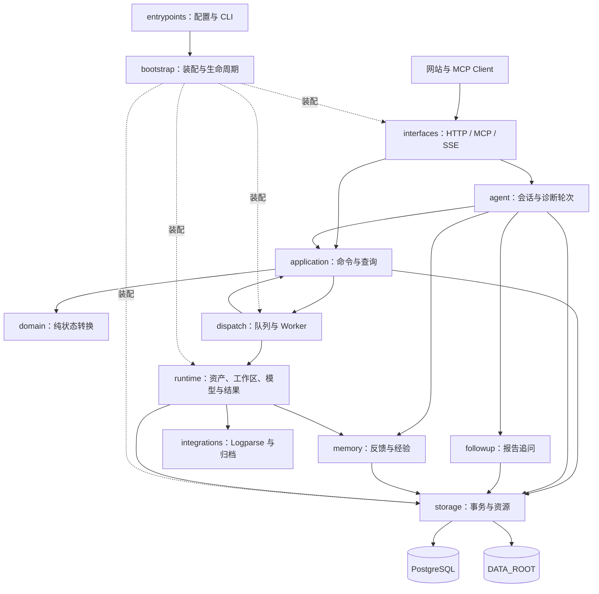

# xiaodao 框架设计

这组文档解释 xiaodao（Python 包名 `problem_locator`）当前如何工作，以及每个框架文件承担什么职责。先读本页了解系统边界，再按模块进入详细设计；查找具体文件时使用[逐文件索引](file-index.md)。

## 阅读基线与范围

本文依据 2026-09-28 的当前工作区编写：软件包 `8.2.0`，State / Job / Outcome `11`，合同修订 `v11-contract-r2`。工作区以 Git 提交 `343e1ba0ee065d216494dcb83c69d5f5a185e6a0` 为基础，包含尚未提交的实现，因此该提交本身不能完整代表本文描述的代码。

逐文件详细设计覆盖 `src/problem_locator/` 的全部 212 个文件，包括包入口、Python 实现和运行时内置资产。工程配套章节说明测试编排、合同快照、Skill 和网站示例。测试用例、历史交接材料和实验不是生产模块，按验证职责和目录导航，不将它们混入生产调用链。忽略的缓存、运行证据、虚拟环境和 `.git` 不属于设计对象。

文中描述的是已读取的实现，不表示这些未提交改动已通过发布验收。测试结论仍以对应源码快照的 Test Flow `verdict.json` 为准。代码里的 `V1`、`V2`、`S00` 等历史名称不一定等于当前产品版本；判断是否启用某条路径，应查看生产装配和实际调用点。

| 章节 | 阅读目的 | 覆盖范围 |
| --- | --- | --- |
| [入口、装配与外部集成](01-composition-integrations.md) | 理解进程如何启动、依赖如何连接、Logparse 如何受控执行 | 包根目录、`entrypoints/`、`integrations/` |
| [合同、领域与任务调度](02-core.md) | 理解 Case 状态、命令事务、Job 派发与结果提交 | `contracts/`、`domain/`、`application/`、`dispatch/` |
| [诊断运行时与资产](03-runtime.md) | 理解路由、Skill 执行、输出校验和报告生成 | `runtime/` 及全部内置资产 |
| [网站会话、接口与扩展服务](04-services-interfaces.md) | 理解 HTTP/MCP、会话、报告追问和经验库 | `interfaces/`、`agent/`、`followup/`、`memory/` |
| [存储与数据生命周期](05-storage.md) | 理解 PostgreSQL、文件资源、原子发布和清理 | `storage/` |
| [工程配套与验证设计](06-engineering.md) | 理解配置、合同生成、测试体系、Skill 与接入示例 | 仓库配置、`schemas/`、`tools/`、`tests/`、Skill、`examples/` |
| [逐文件索引](file-index.md) | 从文件名定位源码和所属设计章节 | 全部框架源码与内置资产 |

## 1. 系统职责与运行边界

xiaodao 是单实例故障诊断服务。它接收用户描述和附件，选择专用 Skill 或通用定位，准备可信输入，调度模型和 Logparse，最后保存并公开报告。服务还为网站提供自然语言会话、历史轮次、状态事件、报告追问和可选经验反馈。

生产服务只支持 Linux，ASGI 服务使用单个 worker。Windows、macOS，以及显式启用的 Linux MCP Client，都使用本机 Host 经 HTTP 连接服务端 `/mcp`。客户端不安装本地 MCP、代理或 Problem Locator Hook。网站既可按认证配置接入会话接口，也可由自己的后端封装调用；认证与会话归属由接口层校验。

生产启动要求 PostgreSQL。数据库保存业务记录，`DATA_ROOT` 保存附件、报告、工作区和执行记录。代码保留 SQLite 存储分支供旧格式、离线迁移及测试使用，这不表示生产启动会自动回退到 SQLite。活动 Case 在进程内运行。调度器启动时创建新 epoch，不读取或重放历史 Job；随后网站 Agent 恢复会话历史投影，已有完成快照的轮次同步结果，符合条件的未完成旧轮次标记中断，不会重新调用模型继续旧诊断。

## 2. 模块关系

以下图表示主要调用方向。各层通过 `contracts/ports.py` 等合同交互；`bootstrap.py` 负责把具体实现连接起来。

模块之间有四条重要边界：领域层决定“允许怎样改变状态”，应用层决定“怎样提交这次改变”，运行时决定“怎样执行固定的任务输入”，接口层决定“怎样向调用者表示结果”。模型不直接写业务数据库，也不自行发布最终 Outcome 或下载文件。

## 3. 核心对象

| 对象 | 含义与所有者 | 生命周期 |
| --- | --- | --- |
| `Conversation` / 诊断轮次 | 网站会话及一次独立诊断，由 `agent/` 管理 | 一个会话可包含多轮诊断；历史报告关联具体轮次 |
| `CaseAggregate` | Case、Job、输入、附件、证据和产物组成的业务聚合 | 应用层提交，领域层校验转换；活动聚合与持久化历史分开管理 |
| `Job` | 一次 ROUTE、DIAGNOSE 或 REVIEW 的任务描述 | 固定基础 revision、上下文和资产引用后交给调度器 |
| `ContextSnapshot` / 工作区清单 | 本次任务可用的事实、文件和运行绑定 | 由服务端生成；执行时不得读取其他任务的任意材料 |
| `JobOutcome` / `ExecutionFailure` | 成功执行的业务结果或执行失败记录 | 运行时构造并交给应用层；检查任务身份与提交条件后生效 |
| `Artifact` / `ResourceRef` | 可交付对象及其字节数、SHA-256、存储位置 | 文件先受控写入，再由业务记录决定可见性 |
| `runtime_epoch` | 当前服务进程的运行标识 | 用于任务领取、基础设施失败回报和显式恢复控制；Outcome 提交另行校验当前 Job 身份与状态 |
| 追问消息、事件与快照 | 针对某份已完成报告的解释或补充分析 | 独立于原诊断结果保存；不覆盖原报告结论 |
| 经验卡 | 从通用定位反馈提取的参考知识 | 默认关闭；命中经验仅作为后续诊断参考 |

## 4. 一次诊断的数据流

1. **接收输入。** MCP 或 Case REST 直接提交结构化命令；网站会话先由 INTAKE 把原话与附件整理为建单或补充动作。接口层限制参数类型，应用层执行幂等与 revision 检查。
2. **创建路由任务。** 领域协调器根据当前 Case 状态决定下一步，应用层把 Job 与上下文、资产版本一起保存，然后通知调度器。
3. **审核专用适用范围。** ROUTE 对候选逐项判断。只有唯一明确适用、其他候选可排除、引用原文有效且置信度达到门槛时才能选用专用 Skill；不满足则走通用定位。适用但缺材料的专用流程先等待补齐材料。
4. **准备执行材料。** 运行时建立独立工作区。专用诊断先由服务端调用 Logparse broker，固定目标日志并扫描方法标记，按需加载 Methods 方法卡；结束预处理并撤销 broker 调用权限后再启动 Specialist。
5. **执行模型。** Job 使用已固定的 profile、context policy、output contract、tool bundle 和 Skill。后端管理进程树、超时、取消、输出长度与遥测。
6. **确认并提交结果。** 运行时读取输出，按部署策略生成服务端 Outcome 与资源提案。Worker 把结果交给应用层；应用层复核 Job/Case 归属、基础 revision、当前 active Job、资源与幂等记录，提交后通知查询者。
7. **交付与后续操作。** 接口按公开投影返回状态、报告和下载信息，网站可轮询或回放 SSE。归档、历史保留、报告追问和经验提取分别由各自服务处理。

### 当前默认交付策略

部署配置默认 `METHODS_EVIDENCE_VALIDATION=off`。专用 Skill 首行输出 `<<<SKILL_DIAGNOSIS_RESULT_V1:RESOLVED>>>` 或 `<<<SKILL_DIAGNOSIS_RESULT_V1:UNRESOLVED>>>`，随后输出 Markdown 正文。服务端保存并交付正文，不执行证据语义核验或独立 Reviewer，也不为此模式生成 `result.zip`。输入准备、文件归属、路径、长度、哈希和执行协议检查仍然生效。

显式选择 `advisory` 或 `strict` 才启用结构化 Methods 结果路径，并可根据配置启用 Reviewer。通用定位沿用自己的 Markdown 交付路径。不要用底层类构造函数的默认值推断生产策略：以 `entrypoints/settings.py` 解析后传入 `bootstrap.py` 的值为准。

## 5. 一致性、失败与可观测性

写命令使用幂等标识和内容指纹区分“相同请求重试”与“标识相同但内容改变”。状态修改以 revision 和仓储事务校验为基础；派发、执行、结果提交、归档分别记录结果，不能把模型进程退出成功直接当作报告已交付。

运行异常分为业务等待、可记录的任务失败，以及影响整个实例继续接单能力的故障。`OperationalState` 保存进程内故障并停止接收新任务；它不是持久化 Case 终态的替代品。SSE、业务状态、DFX 和 Journey 各有用途：公开状态供客户端消费，DFX 解释底层故障，Journey 还原单个 Case 的过程和耗时。

资源写入、数据库提交和清理涉及不同介质，框架用暂存、原子替换、引用校验、提交锁、保留扫描和隔离目录处理这些边界。不能假定一次数据库事务同时涵盖文件系统全部副作用。具体顺序见[应用层设计](02-core.md)和[存储设计](05-storage.md)。

## 6. 扩展与维护

新增公开命令，应同步更新合同、应用服务、HTTP/MCP 投影和生成快照。七个公开 MCP 工具的根属性只能是标量、nullable 标量或标量数组，不能引入嵌套对象、动态 Map 或对象数组。

新增专用定位能力，应按注册格式声明适用范围、输入、附件与 Logparse 锚点，并交付完整 Methods 包；不要把业务判断写入领域状态机。新增模型后端或工具策略，应保持工作区隔离、取消和输出协议边界。改变存储格式或数据生命周期，应同步检查离线迁移、重启恢复和保留规则。

新增、移动或删除框架文件时，同步修改所属章节和[逐文件索引](file-index.md)。版本、默认行为和兼容状态发生变化时，同时更新本页与根 README。部署步骤、外部 API 和专题规则继续在现有 `docs/` 维护，本组文档负责解释实现之间的关系。
