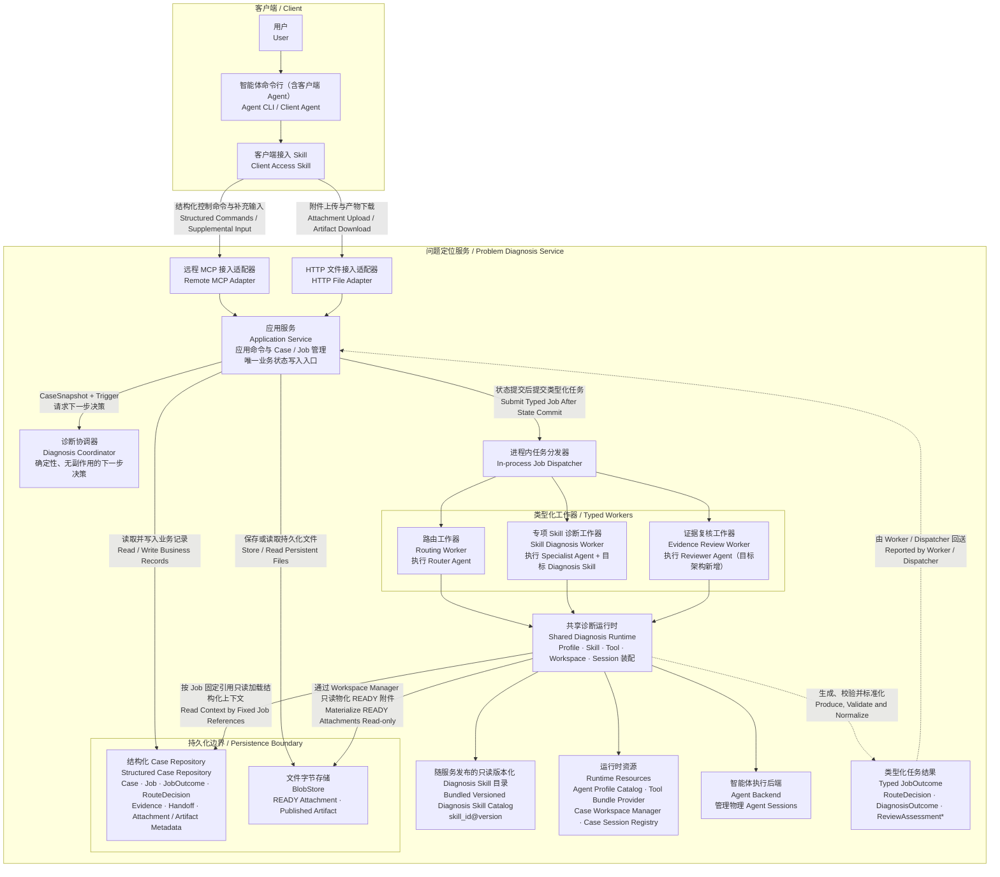

# 目标问题定位静态架构

状态：多 Agent 交叉审核通过
更新时间：2026-07-27

## 1. 文档定位

本图在当前 V1 设计主干上增加目标架构中的 Evidence Reviewer，用于统一表达客户端接入、确定性编排、类型化任务执行、上下文读取、持久化边界和异步任务结果闭环。

Evidence Reviewer 是目标架构新增能力，不属于当前 V1 实现范围。图中没有引入固定业务领域 Agent、Agent Team、红蓝对抗、动态 Skill Registry 或特定工作流框架依赖。

## 2. 静态架构

`* ReviewAssessment` 是目标架构新增的结构化复核结果，其字段和枚举留到详细设计。Reviewer 只提供复核判断，不直接修改 Case、不创建后续 Job，也不直接调用 Specialist；下一步仍由 Coordinator 决定。

## 3. 图示约定

- 实线：调用或依赖；
- 虚线：异步产生的业务结果；
- 返回值及用户多轮交互不单独画；
- Reviewer 是目标架构新增，其余保持当前设计主干。

由于普通返回值不单独画，Coordinator 返回的下一步决策没有反向箭头；Application Service 根据该决策更新业务状态、创建 Job，并在状态提交后交给 Dispatcher。

## 4. 已统一的职责边界

- Application Service 是 Case、Job、JobOutcome、Evidence 和 Handoff 的唯一业务写入入口。它读取当前 Case 后先调用 Coordinator，再在同一业务事务中保存 Outcome、应用状态变化并创建可选的下一 Job。
- Diagnosis Coordinator 是确定性、无副作用的决策组件，只根据 `CaseSnapshot + Trigger` 计算下一步；它不读写 Repository、不提交 Dispatcher，也不调用 Agent。
- Dispatcher、Worker、Runtime 和 Agent Backend 只负责执行已创建的 Job，不修改 Case，也不创建后续 Job。
- Runtime 按 Job 创建时固定的上下文引用只读加载结构化数据，并通过 Case Workspace Manager 将 `READY` 文件物化到派生工作区；Workspace 和 Agent Session 都不是业务状态权威来源。
- Runtime 生成、校验并标准化 `Typed JobOutcome`，由 Worker / Dispatcher 异步回送 Application Service，再进入相同的持久化和决策闭环。
- Repository 保存结构化业务记录；BlobStore 保存 Attachment 和 Artifact 文件字节。二者是不同的逻辑持久化边界。
- Diagnosis Skill Catalog 随服务版本发布、启动时加载、运行期只读；`skill_id@version` 不可被原地覆盖。
