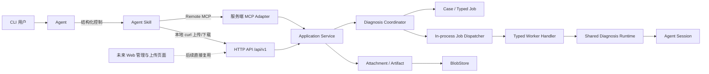
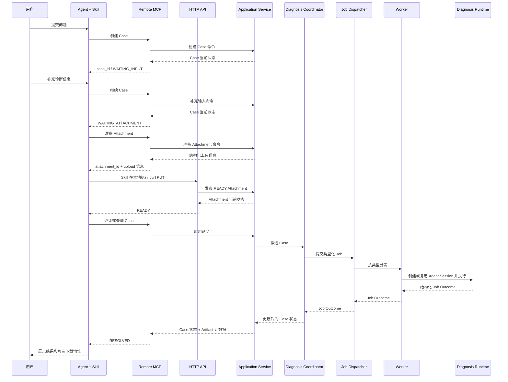

# V1 Agent 接入与文件传输设计

状态：已确认的方向设计
更新时间：2026-07-24

说明：本文中的接口路径、字段和时序用于表达已确认的接入方向，在总体框架完成并进入统一详细设计前，不视为最终接口契约。方案比较和未采纳原因见[《V1 方案选择记录》](v1-option-decisions.md)。

## 1. 决策摘要

V1 采用以下方案：

- 用户通过 Remote MCP 使用问题定位能力，不安装 Local MCP Server。
- Agent 通过 Remote MCP 完成 Case 创建、信息补充、状态查询和诊断控制。
- 本地文件由 Agent Skill 调用系统已有的 `curl`，通过 HTTP API 直接上传。
- 结构化诊断结果通过 Remote MCP 返回；结果文件通过 HTTP API 下载。
- 诊断执行底层统一异步；客户端可以立即返回或有限同步等待，等待超时后自然转为异步，不取消或重建任务。
- 服务端 Case 是客户端可见业务状态的唯一权威来源；同一 Agent 的非持久化完整对话由服务端 Agent Session 持有。
- 同一个 Agent 的多个 Job 保持原 Session，不同 Agent 之间使用结构化信息交接。
- Remote MCP 与 HTTP 对客户端使用同一个稳定服务地址；V1 在同一服务进程和监听地址上按不同路径挂载两个 Adapter。
- V1 只保证当前服务进程生命周期内基于已知 `case_id` 的继续操作；不考虑服务重启后的未完成诊断恢复。
- Case、Job、Attachment、最终结果和 Artifact 等业务数据持久化；Agent 完整对话和物理 Session 不持久化。
- V1 不实现 Web 上传页面，但上传接口必须与客户端类型无关，以便后续 Web 直接复用。
- 当前代码仓只保存设计；正式版本在新的代码仓中实现。
- 正式 V1 不需要兼容当前 Demo 的工具面、状态或内部数据结构。

## 2. 目标与非目标

### 2.1 目标

- CLI 用户无需安装、启动或升级本地 MCP 服务。
- Agent 保留 MCP 工具的结构化参数、结果和能力描述。
- 文件字节不进入 MCP JSON，由 HTTP 流式传输。
- Skill/curl 与未来 Web 页面使用同一套 Attachment API。
- 正式 V1 的接口从首次发布开始版本化，并为后续兼容升级保留稳定边界。

### 2.2 V1 非目标

- 不实现 Web 上传页面；仅保证未来可以直接接入。
- 不提供项目专用本地 CLI 或后台进程。
- 不实现本地 Case Locator、Case 自动找回、Agent Session 跨重启恢复或运行中任务的跨重启恢复。
- 不在当前仓库实现正式版本代码。
- 不在本设计中确定多实例、PostgreSQL、对象存储或 Worker 集群的具体实现。
- 不默认加入认证、TLS、一次性上传凭证或本地路径限制。

## 3. 总体架构



Remote MCP 和 HTTP API 是协议适配层，共同调用同一组 Application Service。二者不得分别实现 Case 状态机、Attachment 状态或 Job 规则。

## 4. 用户侧交付

V1 用户侧只需要：

1. 配置 Remote MCP 地址；
2. 获得 Agent Skill；
3. 本地环境能够执行 Shell 和 `curl`。

用户不需要：

- 安装 Local MCP Server；
- 安装项目专用 CLI；
- 运行本地常驻进程；
- 在本地保存服务端业务状态。

Skill 负责解释 MCP 返回的结构化上传信息，并构造本地 curl 调用。服务端不得把一条拼接完成的 Shell 命令作为协议契约返回，以免将协议与特定 Shell、操作系统或客户端实现绑定。

## 5. 服务端接口边界

### 5.1 Remote MCP 控制面

V1 Remote MCP 至少提供以下业务能力：

- 创建诊断 Case；
- 提交用户补充信息；
- 查询 Case 当前状态；
- 取消 Case；
- 为处于 `WAITING_ATTACHMENT` 的 Case 准备 Attachment；
- 返回结构化诊断结果和 Artifact 元数据。

具体工具名可在正式版本接口设计中确定，但 MCP 工具必须映射到 Application Service 的业务命令，不得直接操作数据库或文件。

### 5.2 HTTP Attachment API

未来 Web 和当前 Skill/curl 共用以下语义。

准备 Attachment：

```http
POST /api/v1/cases/{case_id}/attachments
Content-Type: application/json

{
  "name": "logs.zip"
}
```

响应：

```json
{
  "attachment_id": "att_xxx",
  "status": "UPLOADING",
  "upload": {
    "method": "PUT",
    "url": "/api/v1/attachments/att_xxx/content",
    "content_type": "application/octet-stream"
  }
}
```

Remote MCP 的“准备 Attachment”工具返回相同的结构化上传信息，但通过内部 Application Service 创建记录，不需要在同一服务进程内回调 HTTP。

上传文件：

```http
PUT /api/v1/attachments/{attachment_id}/content
Content-Type: application/octet-stream

<raw file bytes>
```

成功响应：

```json
{
  "attachment_id": "att_xxx",
  "status": "READY",
  "size": 123456,
  "sha256": "server-computed-sha256"
}
```

约束：

- Attachment 只记录 `attachment_id`、`case_id`、文件元数据、状态和不透明 `blob_key`。
- 不记录文件由 curl、Web 或其他客户端上传。
- `READY` Attachment 的元数据和原始 Blob 按 Case 数据保留策略持久化，不依赖当前 Agent Session 或 Workspace 副本存活。
- Worker 只消费 `READY` Attachment，不依赖上传来源。
- Diagnosis Runtime 执行 Job 前，由 Case Workspace Manager 根据 Attachment 元数据和 `blob_key`，把 `READY` Attachment 绑定或物化到对应 Case Workspace；引用、链接还是复制的具体方式留到详细设计。
- 上传中断时删除未完成的临时文件，Attachment 保持可重试状态。
- 成功上传采用临时文件到正式 Blob 的原子发布，避免 Worker 读取半成品。
- 文件大小上限是可配置的运行容量限制。

### 5.3 Artifact 下载

结构化根因、证据和建议通过 Remote MCP 返回。需要单独下载的结果文件作为 Artifact 暴露：

```http
GET /api/v1/artifacts/{artifact_id}/content
```

Case 查询结果只返回 Artifact 元数据和下载地址，不把文件字节放入 MCP JSON。

Artifact 按 Case 数据保留策略持久化，因此已完成 Case 可以在服务重启后继续查询并下载保留期内的结果文件。未完成 Case 的 Agent Session 不因业务数据存在而获得恢复能力。

## 6. CLI 诊断流程

本节描述逻辑上的诊断推进关系，不表示一次 MCP 请求必须持续阻塞到诊断结束。客户端等待模式遵循[《V1 总体框架粗设计》](v1-overall-framework.md)：底层统一异步，支持立即返回和有限同步等待；具体等待时长留到详细设计。



Skill/curl 是 V1 默认文件传输路径。若客户端没有 Shell 或 curl，V1 可以明确报告当前客户端不支持本地直传；Web 上传作为后续能力补充。

## 7. 后续增加 Web 上传

Web 上传是 V1 之后的增量功能，而不是另一套上传系统。

Web 页面将：

1. 调用相同的“准备 Attachment”应用命令；
2. 获得相同的 `attachment_id` 和上传信息；
3. 使用浏览器 `File` 对象 PUT 到相同的 content URL；
4. 使用相同的 Case 查询接口展示 READY 和诊断进度。

因此增加 Web 上传时不应修改：

- Attachment 数据模型；
- BlobStore 接口；
- Worker 输入；
- Case 与 Job 的核心状态规则；
- MCP 的诊断控制语义。

V1 暂不实现浏览器页面、上传进度 UI、跨域策略或 Web 专用交互。

## 8. 兼容与演进规则

- HTTP 正式接口从 `/api/v1` 开始。
- 正式 V1 发布后，新增响应字段应保持可选，现有字段语义不得静默改变。
- 破坏性 HTTP 变化使用新的 API 主版本。
- MCP 工具返回的上传信息必须是结构化数据，不返回绑定 curl、Bash 或 PowerShell 的完整命令。
- Application Service、Attachment、Artifact 和 Job 使用协议无关的内部类型。
- 后续 Web、普通 CLI 或其他协议适配器只能复用 Application Service，不能复制业务规则。
- 将来升级多实例时，可以替换 Repository、BlobStore 和 Worker 实现，而不改变本设计中的 Case、Attachment 和 Artifact 外部标识。

## 9. 无额外安全措施的基线及影响

本设计按受控内网、用户可信、文件可信的前提制定。V1 基线不默认包含：

- TLS；
- 用户或客户端认证；
- 一次性或短期上传 URL；
- 本地文件路径白名单；
- 上传前的用户二次确认；
- Token 轮换和细粒度权限。

不采用这些措施的安全影响：

- 能访问服务地址的内网主体可以调用 Case、上传和下载接口；
- 网络传输可能被内网中的其他主体观察或修改；
- 拥有 Agent Shell 权限的 Skill 可以读取该用户权限范围内的其他文件；
- 本地路径、上传地址和命令可能出现在 Agent 或 Shell 日志；
- Case ID、Attachment ID 和 Artifact ID 只是资源标识，不构成访问授权。

以上影响在当前受控内网假设下被接受，不因此自动增加安全措施。

以下措施仅作为未来可选项记录，当前均为“未采纳”：

| 可选措施 | 采用原因 | 引入影响 | 当前状态 |
|---|---|---|---|
| TLS | 防止传输被观察或修改 | 需要证书与入口配置 | 未采纳 |
| 身份认证 | 限制 Case 与文件访问主体 | 增加身份、凭据和授权管理 | 未采纳 |
| 短期上传凭证 | 限制上传地址的使用范围和时间 | 增加凭证签发与过期处理 | 未采纳 |
| 本地路径限制或确认 | 降低误上传其他文件的可能性 | 增加用户交互和客户端逻辑 | 未采纳 |

任何可选安全措施只有在用户明确选择后才能进入后续设计或实现计划。

## 10. 实现仓库边界

本设计不在当前 Demo 仓库实施。

当前仓库负责：

- 保存设计决策；
- 提供现有 Demo 作为事实参考；
- 讨论和修订正式版本接口。

未来新代码仓负责：

- 建立正式版本目录结构；
- 实现 Remote MCP、HTTP API、Application Service、Job、Worker 和存储适配器；
- 建立正式版本测试、部署和升级流程。

在新代码仓建立前，不应在当前仓库修改 Demo 实现来验证本设计，除非用户另行明确要求。
