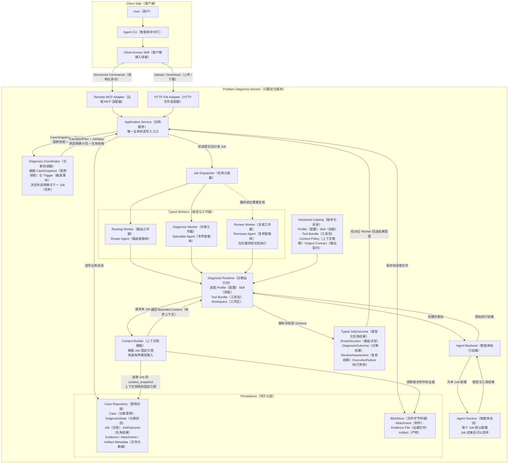
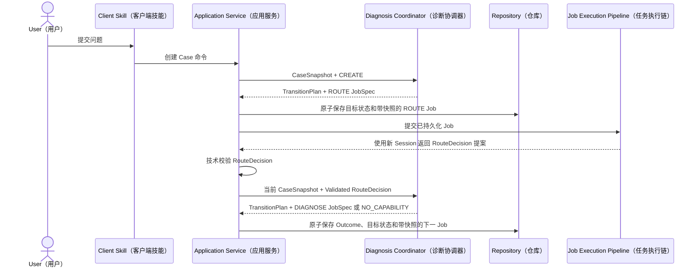
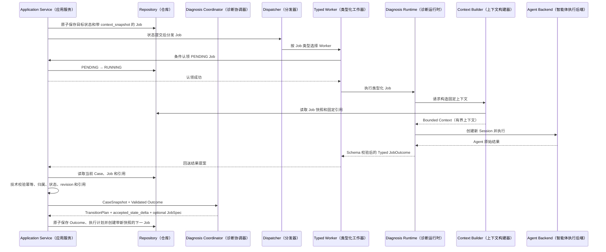
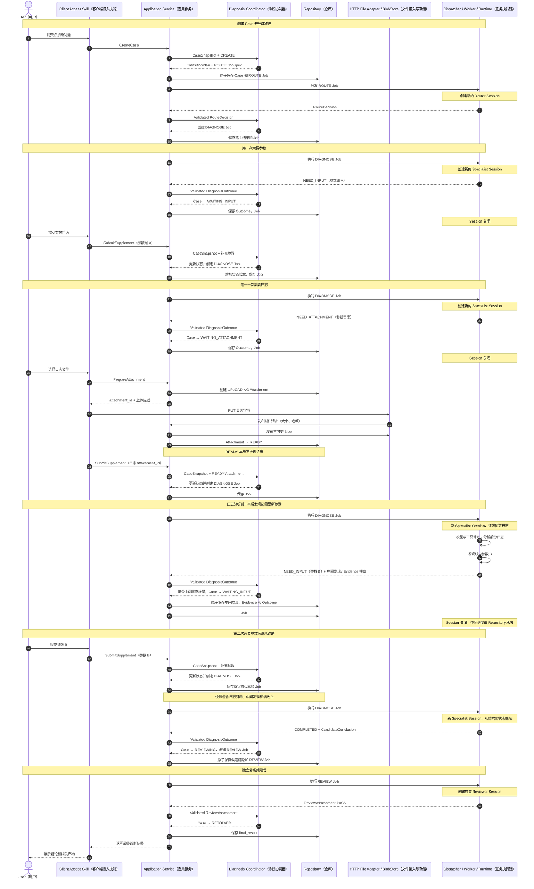

# Problem Locator V1 基线设计

状态：当前唯一有效的 V1 规范基线

基线日期：2026-07-31

适用范围：Problem Locator（问题定位系统）正式版本

## 1. 文档定位

本文统一定义 Problem Locator V1（问题定位系统第一版）的产品边界、静态架构、模块职责、领域状态、Job（任务）模型、上下文策略、Agent Session（智能体会话）策略、文件接入、执行流程、持久化范围和可靠性边界。

本文是 V1 实现与后续详细设计的唯一规范来源。若调研材料、历史讨论或旧文档与本文冲突，以本文为准。

设计理由和被替代方案记录在[《V1 决策记录》](v1-decision-record.md)中。业界调研位于 `../doc/`，仅提供参考，不自动构成设计要求。

### 1.1 核心基线

V1 的上下文与状态原则可以归纳为：

> Case（诊断案例）有状态，Job（任务）自包含，Agent Session（智能体会话）可丢弃。

具体含义：

- Case（诊断案例）及其 DiagnosisState（诊断状态）保存所有跨 Job 必须延续的诊断信息。
- Job（任务）在创建时固定本轮目标、状态版本、证据、附件、Agent Profile（智能体配置）和 Diagnosis Skill（诊断技能）版本。
- Context Builder（上下文构建器）只根据 Job 固定的引用构造本轮输入。
- 每个 Agent Job 默认创建新的 Agent Session；Session 结束或丢失不影响后续 Job 正确执行。
- Agent（智能体）只返回 Typed JobOutcome（类型化任务结果）和 DiagnosisStateDelta（诊断状态增量）提案，不能直接修改 Case。

### 1.2 本文不提前引入的复杂机制

V1 不把以下机制画成核心组件，也不要求首版实现：

- Event Sourcing（事件溯源）平台；
- Transactional Outbox（事务发件箱）；
- 独立 JobAttempt（任务执行尝试）实体；
- 长期 Session Cache（会话缓存）；
- 自动上下文摘要或多级压缩；
- Vector Database（向量数据库）；
- 并行 Diagnosis Branch（诊断分支）；
- 外部消息队列和多实例 Worker（工作器）集群。

这些能力均可在不改变本基线业务语义的前提下后续增加。

## 2. V1 目标与范围

### 2.1 目标

- 为 CLI（命令行）用户提供多轮问题定位能力。
- 允许用户补充结构化信息、日志和其他附件。
- 使用 Router Agent（路由智能体）选择一个已发布的 Diagnosis Skill。
- 使用 Specialist Agent（专项智能体）执行目标诊断。
- 在最终结论前使用 Reviewer Agent（复核智能体）核对结论与证据。
- 将 Case、诊断状态、Job、结果、证据和产物持久化。
- 保证关闭全部 Agent Session 后，仍可根据持久化状态继续未完成 Case。
- 保持模块边界可以后续演进到多实例，但 V1 仍采用单节点、低并发部署。

### 2.2 V1 非目标

- 不实现 General Code Agent（通用代码智能体）。
- 不实现并行驱动多个 Agent 探索同一个 Case。
- 不实现长期复用 Agent Session。
- 不实现自动语义摘要、向量检索或长期 Agent Memory（智能体记忆）。
- 不实现外部任务队列、多实例高可用或自动故障接管。
- 不实现动态 Skill Registry（技能注册中心）和运行期热更新。
- 不实现 Web（网页）管理或上传页面，但保留复用服务端接口的边界。
- 不实现本地 Case Locator（案例定位器）或自动查找用户历史 Case。
- 不在当前设计仓库实现正式版本代码；正式实现使用新的代码仓库。

## 3. 核心不变量

以下规则属于 V1 正确性基线，不是性能优化：

1. **Repository（仓库）是唯一诊断真相源。**
   Repository 中的 Case、DiagnosisState、Job、JobOutcome、Evidence（证据）和文件元数据共同构成系统可恢复状态；Case + DiagnosisState 是“当前诊断状态”的唯一权威投影，Job 的 `context_snapshot` 只是不可变历史输入。

2. **Application Service（应用服务）是唯一业务写入入口。**
   Coordinator（协调器）、Dispatcher（分发器）、Worker、Runtime（运行时）、Context Builder 和 Agent Backend（智能体执行后端）均不能直接修改 Case。

3. **Diagnosis Coordinator（诊断协调器）是确定性纯决策组件。**
   它只根据 `CaseSnapshot + Trigger` 计算状态变化和下一 Job 规格，不读写 Repository，也不执行 Agent。

4. **Job 输入在创建时固定。**
   Runtime 不得用执行时的最新 Case 内容静默替换 Job 所引用的状态版本、证据、附件或 Skill 版本。

5. **Agent Session 不承担跨 Job 状态。**
   同一种 Agent 连续执行多个 Job 时，也默认分别创建新的 Session。

6. **Agent 输出是提案，不是事实。**
   Runtime 负责 Schema（结构）解析；Application Service 负责幂等、归属、版本和引用等技术校验；Coordinator 负责决定业务上接受哪些 DiagnosisStateDelta；Application Service 只执行并持久化 TransitionPlan。

7. **同一 Case 同时只运行一个活跃 Job。**
   不同 Case 可以由有界 Worker Pool（工作器池）并发执行。

8. **文件字节与结构化业务状态分离。**
   Repository 保存文件元数据和引用；BlobStore（文件字节存储）保存 Attachment 和 Artifact（产物）的字节。

9. **最终结论必须经过独立复核。**
   Reviewer 使用新的 Session，只读取候选结论、当前问题、结构化诊断状态和相关证据，不继承 Specialist 的完整对话。

10. **上下文超限不得静默丢弃必需信息。**
    如果 Job 所需的最低上下文仍超过预算，Job 应返回明确错误或拆分建议，而不是悄悄省略关键约束或证据。

11. **下一 Job 固定转换后的状态。**
    同一业务提交中先得到目标 DiagnosisState，再从目标状态物化下一 Job 的 `context_snapshot`；不得从更新前状态生成快照。

12. **Job 固定引用不可原地修改。**
    Attachment、Evidence、Artifact、JobOutcome 和版本化运行资产发生内容变化时必须创建新 ID 或新版本。

13. **迟到和重复结果不能改变当前状态。**
    JobOutcome 必须同时通过活跃 Job、Job 状态、基础诊断版本和幂等校验；旧 Job 的迟到结果保存为过期记录但不得合并。

## 4. 目标静态架构



## 5. 模块职责

### 5.1 Client Access Skill（客户端接入技能）

- 解释服务端 MCP 工具的能力和结构化结果。
- 帮助 CLI Agent 构造创建 Case、提交补充信息、查询状态和取消 Case 的调用。
- 使用本地 `curl` 或等价能力通过 HTTP 上传 Attachment、下载 Artifact。
- 在用户交互中明确展示 `case_id`，便于客户端上下文丢失后手动继续。
- 不在本地保存或覆盖服务端权威业务状态。

### 5.2 Remote MCP Adapter（远程 MCP 适配器）

- 承载控制命令、小型结构化输入和结构化结果。
- 将协议请求转换为 Application Service 的应用命令。
- 不直接操作数据库、BlobStore、Dispatcher 或 Agent。
- 不实现独立于 Application Service 的 Case 状态机。

### 5.3 HTTP File Adapter（HTTP 文件适配器）

- 承载 Attachment 准备、文件字节上传和 Artifact 下载。
- 将上传、发布和下载请求转换为 Application Service 的应用命令。
- 不根据上传来源区分 CLI、Web 或其他客户端。
- 不实现第二套 Attachment 或 Artifact 业务规则。

### 5.4 Application Service（应用服务）

- 接收外部应用命令和内部 JobOutcome。
- 读取当前 Case 和 DiagnosisState。
- 执行幂等、资源归属、活跃 Job、Job 状态、`base_state_revision` 和 Evidence 引用等技术校验。
- 将通过技术校验的 Trigger 与 CaseSnapshot 交给 Diagnosis Coordinator。
- 执行 Coordinator 返回的 TransitionPlan：保存输入或 Outcome、登记已接受的 Evidence / Artifact、更新 Case 和 DiagnosisState、结束当前 Job，并创建可选的下一 Job。
- 对包含文件的候选 Evidence / Artifact，先完成 BlobStore 内发布，再在一次 Repository 事务中执行 TransitionPlan；“原子”只描述 Repository 内的业务提交，不表示两个存储之间存在分布式事务。
- 下一 Job 的 `context_snapshot` 必须从 TransitionPlan 应用后的目标 DiagnosisState 物化，并与状态更新和 Job 创建在同一次业务提交中固定。
- 在状态提交成功后将已创建的 Job 交给 Dispatcher。
- 对外返回当前 Case 状态，不直接执行耗时诊断。

### 5.5 Diagnosis Coordinator（诊断协调器）

- 输入为 `CaseSnapshot + Trigger`。
- 输入中的 JobOutcome 已由 Application Service 完成结构、归属、版本和引用等技术校验。
- 输出为确定性的 `TransitionPlan（状态转换计划）`，其中包含业务上接受的 `accepted_state_delta（已接受状态增量）`、目标 Case 状态以及可选的下一 Job 规格。
- 决定何时路由、诊断、等待用户、等待附件、复核、完成、失败或取消。
- 不读取 Repository，不写入业务状态，不提交 Dispatcher，不调用 Agent。
- 不承担 Router Agent 的语义路由能力。

### 5.6 Case Repository（案例仓库）

持久化：

- Case；
- DiagnosisState；
- Job；
- JobOutcome；
- RouteDecision；
- DiagnosisOutcome；
- ReviewAssessment；
- Evidence 元数据与结构化内容；
- Attachment 和 Artifact 元数据；
- 实际使用的 Agent Profile、Diagnosis Skill、Tool Bundle、Context Policy 和 Output Contract 版本。

Repository 不保存文件字节，也不把 Agent Session、临时 Workspace 或模型隐藏推理当作业务状态。

### 5.7 Job Dispatcher（任务分发器）

- 根据 Job 类型选择对应 Worker。
- 只分发已经持久化的 Job。
- Worker 通过 Application Service 请求条件认领 `PENDING` Job；Application Service 将其更新为 `RUNNING`。同一 `job_id` 的重复分发最多只有一次认领成功。
- V1 使用进程内队列和有界并发。
- 不修改 Case，不创建后续 Job。
- 分发失败时保留 Job 的 `PENDING` 状态；V1 由显式 `ResumeCase` 重新提交，自动扫描后置。

### 5.8 Typed Worker（类型化工作器）

V1 包括：

- `ROUTE`：Routing Worker 调用 Router Agent；
- `DIAGNOSE`：Diagnosis Worker 调用 Specialist Agent；
- `REVIEW`：Review Worker 调用 Reviewer Agent。

Worker 负责把类型化 Job 交给共享 Runtime，并把 Runtime 返回的 Typed JobOutcome 回送 Application Service。Worker 不直接推进 Case 状态。

### 5.9 Context Builder（上下文构建器）

- 根据 Job 中固定的上下文引用读取指定版本数据。
- 根据 Agent 角色构造不同的有限上下文。
- 对重复状态去重，排除被替代内容和无关历史。
- 将大型日志保留在 BlobStore 或 Evidence 中，只按 Job 固定 locator（定位信息）或固定 `context_policy_version` 的确定性规则选择片段。
- 执行 Token（令牌）预算检查。
- 不修改 Repository，不生成业务状态。

### 5.10 Diagnosis Runtime（诊断运行时）

- 加载 Agent Profile、Diagnosis Skill 和 Tool Bundle。
- 通过 Context Builder 获得本 Job 的模型输入。
- 为每个 Job 创建临时 Workspace。
- 调用 Agent Backend 创建新的物理 Agent Session。
- 驱动本 Job 内必要的模型与工具循环。
- 校验并标准化 Agent 输出，形成 Typed JobOutcome。
- Job 结束后关闭 Session；临时 Workspace 中需要保留的内容通过 JobOutcome 提交为候选 Evidence 或 Artifact，由 Application Service 决定是否发布。

### 5.11 Agent Backend（智能体执行后端）

- 创建、调用和关闭物理 Agent Session。
- 标准化不同提供方的响应、错误和中断。
- 对 Runtime 隐藏物理 Session Handle（会话句柄）、进程 PID 和具体 SDK。
- 不选择 Skill，不决定下一 Job，不修改 Case。
- V1 可以只有一个 Backend 实现。

### 5.12 Versioned Catalog（版本化目录）

- Agent Profile、Diagnosis Skill、Tool Bundle、Context Policy 和 Output Contract 随服务版本发布。
- 服务启动时扫描并加载，运行期间只读。
- 使用稳定 ID 和不可原地覆盖的版本号。
- Job 只记录逻辑版本引用，不记录发布包中的物理路径。

### 5.13 BlobStore（文件字节存储）

- 保存 READY Attachment（就绪附件）的原始字节。
- 保存 Evidence 文件和已发布 Artifact。
- 返回不透明 `blob_key` 或等价引用。
- 不保存 Case 状态机。

## 6. 领域模型

### 6.1 Case（诊断案例）

Case 表示一次围绕稳定问题目标的完整多轮诊断。

V1 基线字段：

```text
Case
├── case_id
├── status
├── case_revision
├── diagnosis_state
├── active_job_id?
├── selected_skill_ref?
├── final_result?
├── created_at
└── updated_at
```

`case_revision` 保护 Case 状态、活跃 Job 和外部命令等全部业务修改；`diagnosis_state.revision` 只表示诊断语义状态版本，也是 Job 的 `base_state_revision`。`diagnosis_state` 是 Case 当前权威诊断状态；Job 中保存的历史 `context_snapshot` 只是某次执行的固定输入，不是第二份当前状态。

`diagnosis_state.problem_spec` 至少包含：

- 当前问题；
- 目标与非目标；
- 环境或影响范围；
- 用户明确约束；
- 完成条件。

如果只是补充参数、证据或环境信息，继续使用同一 Case 并增加 `DiagnosisState.revision`。如果诊断目标发生实质变化，应创建新 Case，并允许引用旧 Case 的结构化结果。

### 6.2 Case 状态

V1 Case 业务状态：

```text
NEW
RUNNING
WAITING_INPUT
WAITING_ATTACHMENT
REVIEWING
RESOLVED
FAILED
CANCELLED
INTERRUPTED
```

说明：

- `RUNNING` 表示当前存在 `PENDING` 或 `RUNNING` 的 ROUTE / DIAGNOSE 活跃 Job，具体阶段由活跃 Job 的 `job_type` 表达，不再复制为多个 Case 状态。
- `WAITING_INPUT` 和 `WAITING_ATTACHMENT` 表示当前没有运行中的诊断 Job。
- `REVIEWING` 表示当前存在 `PENDING` 或 `RUNNING` 的 REVIEW 活跃 Job，最终候选结论正在接受独立复核。
- `RESOLVED` 只能由通过复核的候选结论进入。
- `INTERRUPTED` 表示服务重启或执行异常导致原运行 Job 不再继续，但 Case 仍可从持久化状态恢复。
- 活跃 Job 只包括 `PENDING` 和 `RUNNING`；其余 Job 状态均为终态。Case 为 `INTERRUPTED` 时不得保留可执行的活跃 Job。

### 6.3 DiagnosisState（诊断状态）

DiagnosisState 保存跨 Job 必须延续的最小结构化诊断信息：

```text
DiagnosisState
├── revision
├── problem_spec
├── confirmed_facts[]
├── active_hypotheses[]
├── rejected_hypotheses[]
├── open_questions[]
├── pending_requirements[]
├── evidence_refs[]
└── candidate_conclusion?
```

`problem_spec` 自身带版本，至少包含问题陈述、期望行为、实际行为、范围、约束和完成条件。实质改变诊断目标时创建新 Case；同一目标下的澄清和补充递增 `DiagnosisState.revision`。

最小条目结构：

```text
DiagnosisItem
├── item_id
├── statement
├── status
├── provenance
├── evidence_refs[]
├── created_revision
└── supersedes[]
```

候选结论使用稳定标识并显式记录复核状态：

```text
CandidateConclusion
├── conclusion_id
├── revision
├── content_hash
├── statement
├── supporting_evidence_refs[]
├── proposed_by_job_id
└── status
    ├── PROPOSED
    ├── REVIEWING
    ├── REJECTED
    └── ACCEPTED
```

`content_hash` 覆盖候选陈述、`supporting_evidence_refs[]`、完成条件映射和其他影响复核结论的规范化字段；证据集合变化必须产生新的 revision 和 hash。

规则：

- 用户提供的信息和 Agent 推断必须通过 `provenance` 区分。
- Agent 输出的新事实只能先进入 `proposed_facts（候选事实）`；没有充分 Evidence 且未经 Coordinator 纳入 `accepted_state_delta` 的内容不得进入 `confirmed_facts`。
- 被排除假设必须记录排除原因和对应 Evidence。
- 被新信息替代的条目不物理删除，通过状态和 `supersedes` 关系失效。
- 自由文本总结可以作为展示内容，但不能覆盖这些结构化条目。

### 6.4 Job（任务）

Job 是一个有限、自包含的服务端工作单元。

```text
Job
├── job_id
├── case_id
├── job_type
├── status
├── goal
├── base_state_revision
├── context_snapshot
├── evidence_refs[]
├── attachment_refs[]
├── previous_outcome_refs[]
├── agent_profile_ref
├── available_skill_refs[]
├── skill_ref?
├── tool_bundle_ref
├── context_policy_version
├── output_contract_version
├── review_target?
│   ├── candidate_conclusion_id
│   ├── candidate_revision
│   └── candidate_content_hash
├── replacement_for_job_id?
├── resource_limits
│   ├── max_turns
│   ├── max_tokens
│   ├── max_duration
│   └── max_tool_output
├── created_at
├── started_at?
├── finished_at?
└── runtime_epoch?
```

其中从 `goal` 到版本化运行配置的字段共同构成 Job 的 Context Manifest（上下文清单）。V1 不建立独立 `JobContextManifest` 实体。

`context_snapshot（上下文快照）`是在 Job 创建时复制的一份小型结构化执行视图，至少包含该 Job 需要的 ProblemSpec、确认事实、相关假设、未决问题、待补要求和完成条件。大型文件不复制，只保存不可变引用。

它不是：

- 完整历史聊天的快照；
- 整个 Case 数据库记录的副本；
- Workspace 文件系统副本；
- 由另一个 Agent 自动总结出来的自由文本。

`base_state_revision` 用于并发和过期校验，`context_snapshot` 用于重现该 Job 的实际业务输入。两者缺一不可。由于 V1 只直接保存当前 DiagnosisState、不通过事件回放重建旧版本，把小型快照直接放入 Job 是首版最简单的可重现方案。

ROUTE Job 固定 `available_skill_refs[]`，DIAGNOSE Job 固定选中的 `skill_ref`，REVIEW Job 固定 `review_target`。所有非终态 Job 引用的版本化资产必须在允许恢复期间仍可加载，不得由“当前最新版本”替代。

Job 创建后：

- 业务目标、快照、资源引用、复核目标和运行版本不可变；
- 执行状态可以变化；
- 只有从未开始的 `PENDING` Job 可以重复分发同一 `job_id`；已经开始后失败或中断时必须创建新 Job；
- 用户补充新信息或附件后，应创建引用新 `DiagnosisState.revision` 并带有新 `context_snapshot` 的 Job。

### 6.5 Job 状态

```text
PENDING
RUNNING
SUCCEEDED
FAILED
STALE
CANCELLED
INTERRUPTED
```

Job 状态表示执行生命周期，不等同于 Case 业务状态。

`PENDING` 和 `RUNNING` 是非终态；`SUCCEEDED`、`FAILED`、`STALE`、`CANCELLED` 和 `INTERRUPTED` 是终态。`STALE` 由 Application Service 在发现活跃 Job、基础诊断版本或固定复核目标不匹配时判定，不是 Reviewer 的业务意见。

V1 不提供业务级自动重试。需要再次运行时创建新 Job；Agent Backend 内部可以执行不改变业务语义的有界瞬时重试。Context Builder 无法在预算内保留最低必需内容时，Job 以 `FAILED` 结束并记录 `error.code = CONTEXT_LIMIT`。

Agent 返回“需要用户输入”时：

- Job 以 `SUCCEEDED` 结束；
- JobOutcome 的业务结果为 `NEED_INPUT`；
- Case 进入 `WAITING_INPUT`。

### 6.6 Typed JobOutcome（类型化任务结果）

```text
JobOutcome
├── outcome_id
├── job_id
├── case_id
├── job_type
├── base_state_revision
├── result_type
├── payload
│   ├── RouteDecision
│   ├── DiagnosisOutcome
│   ├── ReviewAssessment
│   └── ExecutionFailure
├── consumed_evidence_refs[]
├── proposed_evidence[]
├── proposed_artifacts[]
├── error
└── produced_at
```

成功的 `payload` 必须与 `job_type` 一一对应。`result_type = FAILED` 时使用 `ExecutionFailure（执行失败）`，不要求 Agent 已经产生业务载荷。DIAGNOSE Job 的载荷为：

```text
DiagnosisOutcome
├── findings[]
├── state_delta
├── requested_input[]
├── requested_attachments[]
├── candidate_conclusion?
└── recommended_next_step
```

```text
ExecutionFailure
├── stage
├── code
├── message
├── retryable
└── details?
```

`CONTEXT_LIMIT`、Backend 创建失败、工具超时和输出 Schema 无法修复等都通过 ExecutionFailure 表达。Application Service 完成技术校验后，仍把失败 Trigger 交给 Coordinator 决定 Case 是等待、创建替代 Job 还是进入 `FAILED`。

新 Evidence 或 Artifact 不能在 Agent 输出前预先拥有正式业务 ID。Runtime 将结构化候选内容和需要保留的文件作为 `proposed_evidence[]` / `proposed_artifacts[]` 回送；需要跨 Outcome 处理保存的文件先写入 BlobStore 的持久化暂存区，不能只留在易失 Job Workspace。每个候选项带 Job 内唯一 `proposal_key`、来源、locator、摘要、内容哈希和可选 `staged_blob_ref`。

Application Service 先校验候选内容和暂存文件，Coordinator 在 TransitionPlan 中分别返回 `accepted_evidence_proposal_keys[]` 与 `accepted_artifact_proposal_keys[]`。Application Service 随后分配正式 ID，把被接受的暂存 Blob 发布为可读的不可变正式 Blob，再在一次 Repository 事务中保存 Outcome、正式元数据、状态引用和下一 Job，并把 `proposal_key` 解析为正式 ID。Worker、Runtime 和 Agent 不得绕过该流程创建正式业务记录。

如果 Blob 发布失败，Repository 业务事务不得提交；如果 Blob 已发布但 Repository 事务失败，正式 Blob 成为待清理或待重试登记的孤立对象。发布键和 Outcome 处理必须幂等。Job Workspace 只有在 Outcome 处理完成，或暂存/补偿信息已经可靠登记后才能删除。

V1 通用 `result_type`：

```text
COMPLETED
NEED_INPUT
NEED_ATTACHMENT
REROUTE
NO_CAPABILITY
FAILED
```

`recommended_next_step` 只是 Agent 建议，最终下一步由 Diagnosis Coordinator 决定。

JobOutcome 及其 RouteDecision、DiagnosisOutcome、ReviewAssessment 载荷一经保存不可原地修改；更正或重新执行必须追加新记录。

### 6.7 DiagnosisStateDelta（诊断状态增量）

```text
DiagnosisStateDelta
├── proposed_facts[]
├── add_active_hypotheses[]
├── update_hypotheses[]
├── reject_hypotheses[]
├── add_open_questions[]
├── resolve_questions[]
├── add_pending_requirements[]
├── fulfill_requirements[]
├── add_evidence_refs[]
├── add_proposed_evidence_keys[]
└── propose_conclusion?
```

Application Service 的技术校验至少包括：

- Outcome 对应当前活跃 Job；
- Job 当前处于 `RUNNING`；
- Outcome、Job 与 Case 的 `case_id` 一致；
- `base_state_revision` 与 Job 固定版本及当前 `DiagnosisState.revision` 一致；
- `consumed_evidence_refs ⊆ Job.evidence_refs`；
- Outcome 引用的既有 Attachment、JobOutcome、Artifact 和其他资源必须属于当前 Case，且出现在 Job 的固定引用中；
- 候选结论的支持证据只能来自 `Job.evidence_refs`，或来自本 Outcome 的 `proposed_evidence` proposal key；
- proposed Evidence / Artifact 的临时内容存在且哈希一致；
- 同一个 Outcome 没有重复应用。

Coordinator 根据通过技术校验的 Outcome 与 CaseSnapshot 决定 Delta 是否符合业务转换，并把接受的事实、假设、要求、Evidence 提案和候选结论写入 `TransitionPlan.accepted_state_delta`。Application Service 不自行作第二套业务判断，只负责执行计划。

Delta 中的 `proposed_facts` 和 `propose_conclusion` 都是候选内容。候选事实只有进入 `accepted_state_delta` 后才能成为 `confirmed_facts`；候选结论还必须经过 REVIEW Job 才能成为 `final_result`。

如果当前 Case 已经超过基础版本，Application Service 将 Job 置为 `STALE`，把 Outcome 保存为只读审计记录且不应用 Delta；后续是否创建替代 Job 由 Coordinator 根据当前 CaseSnapshot 决定。

### 6.8 RouteDecision（路由决定）

```text
RouteDecision
├── matched
├── skill_id@version
├── reason
├── required_inputs[]
└── confidence
```

Router Agent 只能从 ROUTE Job 固定的 `available_skill_refs[]` 中选择，Application Service 必须拒绝集合外的 `skill_id@version`。没有匹配能力时返回 `NO_CAPABILITY`，V1 不转入 General Code Agent。

### 6.9 ReviewAssessment（复核结果）

```text
ReviewAssessment
├── candidate_conclusion_id
├── candidate_revision
├── candidate_content_hash
├── reviewed_state_revision
├── reviewed_evidence_refs[]
├── verdict
├── unsupported_findings[]
├── evidence_conflicts[]
├── missing_evidence[]
├── stale_references[]
└── recommendation
```

V1 `verdict`：

```text
PASS
NEED_MORE_EVIDENCE
REJECT
```

`PASS` 只能接受 REVIEW Job 的 `review_target` 所固定的候选结论；ID、版本、哈希或基础状态不匹配时，由 Application Service 将结果判为系统级 `STALE`，不交给 Reviewer 选择。`reviewed_evidence_refs[]` 必须全部来自 REVIEW Job 的固定 Evidence 集合，且 `PASS` 必须覆盖候选结论的全部 `supporting_evidence_refs[]`；引用未固定 Evidence 或遗漏支持证据时不得 `PASS`。Reviewer 不能直接修改 Case，也不能直接调用 Specialist。Application Service 技术校验 ReviewAssessment 后交给 Coordinator，再原子保存 Outcome 并执行完成、补证或重新诊断的 TransitionPlan。

### 6.10 Attachment、Evidence 与 Artifact（附件、证据与产物）

三者职责不同：

- Attachment（附件）是用户提交的原始文件；
- Evidence（证据）是能够支撑或反驳诊断判断的可定位内容，不是“文件”的同义词；
- Artifact（产物）是系统生成并供用户下载或后续引用的结果文件。

V1 最小结构：

```text
Attachment
├── attachment_id
├── case_id
├── status
├── name
├── content_type
├── size
├── sha256
└── blob_key

Evidence
├── evidence_id
├── case_id
├── source_type
├── source_ref
├── locator
├── summary
├── collected_at
└── content_hash?

Artifact
├── artifact_id
├── case_id
├── name
├── content_type
├── size
├── sha256
└── blob_key
```

Evidence 可以定位到附件行号、时间区间、请求 ID、命令结果或结构化用户输入。原始日志、截图、转储和大型工具输出保存在 BlobStore；模型上下文只接收必要片段和 Evidence 引用。

一旦被 Job 引用，Attachment、Evidence、Artifact、JobOutcome 及其类型化载荷的内容与定位语义必须不可变；内容变化时创建新 ID。Evidence 如果来自会变化的外部资源，必须先物化内容或固定可重现的版本，不能让旧 Job 在执行时读到新内容。

## 7. 上下文策略

### 7.1 Context Builder 输入

Context Builder 只接收：

- 当前 Job；
- Job 固定的 `context_snapshot` 和 `base_state_revision`；
- Job 引用的 Evidence、Attachment 和历史 Outcome；
- 固定版本的 Agent Profile、`available_skill_refs[]` 或 Diagnosis Skill、Tool Bundle 和 Context Policy；
- Job 固定版本的 Output Contract（输出契约）。

它不得自行把 Job 创建后的最新输入、最新 Attachment 或最新 DiagnosisState 混入正在执行的 Job。

### 7.2 Specialist 上下文

按以下顺序组装：

1. Agent Profile 和目标 Diagnosis Skill；
2. 当前 Job 目标和完成条件；
3. `context_snapshot` 中的问题、非目标和有效约束；
4. 已确认事实及其 Evidence 引用；
5. 活跃假设；
6. 与当前目标相关的已排除假设及排除原因；
7. 未决问题；
8. 相关附件清单和必要内容片段；
9. Typed JobOutcome 输出 Schema。

### 7.3 Router 上下文

Router 只读取：

- `context_snapshot` 中的问题和必要环境信息；
- Job 固定的 Attachment 清单；
- ROUTE Job 的 `available_skill_refs[]` 所固定的 Diagnosis Skill 摘要目录；
- RouteDecision 输出 Schema。

Router 不读取 Specialist 的内部过程，也不获得所有完整 Diagnosis Skill。

### 7.4 Reviewer 上下文

Reviewer 只读取：

- REVIEW Job 创建时固定的 `context_snapshot`，其中包含 ProblemSpec 和所需 DiagnosisState 视图；
- `review_target` 固定的候选结论 ID、版本和内容哈希；
- REVIEW Job 固定引用的候选 DiagnosisOutcome；
- REVIEW Job 固定引用的 Evidence；
- ReviewAssessment 输出 Schema。

Reviewer 不读取执行时最新 DiagnosisState，也默认不读取 Specialist 的完整对话、草稿和与候选结论无关的工具轨迹。

### 7.5 默认排除内容

- 完整历史聊天；
- 被替代的 ProblemSpec；
- 已失效决定；
- 与当前 Job 无关的历史 Outcome；
- 大型原始日志全文；
- 与当前假设无关的工具输出；
- Agent 隐藏推理过程；
- 其他 Case 的任何内容；
- Job 创建后新增但没有进入固定引用的输入或附件。

### 7.6 Context 预算

V1 使用固定优先级和 Token 预算，不实现模型自动摘要。

最低必需内容包括：

- 当前 Job 目标；
- 当前 ProblemSpec；
- 输出 Schema；
- 直接相关的确认事实、假设和 Evidence；
- 用户当前有效约束。

如果最低必需内容超过预算：

- 不允许静默删除；
- Runtime 返回明确的 `CONTEXT_LIMIT（上下文超限）`错误；
- Coordinator 可以在 TransitionPlan 中要求范围更小的新 Job，或让 Case 等待用户缩小问题范围；Job 仍由 Application Service 创建。

## 8. Agent Session（智能体会话）与 Workspace（工作区）策略

### 8.1 Session 生命周期

- 每个 ROUTE、DIAGNOSE 或 REVIEW Job 默认创建新的 Agent Session。
- 一个 Job 内部可以由 Runtime 和 Backend 驱动多次模型调用与工具调用。
- Job 到达完成、失败、等待输入或等待附件边界时结束，Session 随后关闭。
- 不同 Agent 使用不同 Session。
- 同一种 Agent 的连续 Job 也不继承完整对话。
- Session Handle、进程 PID 和提供方物理标识不进入 Case、Job 或外部接口。

未来可以增加 Session Cache 以降低延迟，但必须满足：

> 启用或禁用 Session 复用不改变 Job 的业务输入语义，也不影响 Case 是否可以继续。

### 8.2 Job Workspace（任务工作区）

- Runtime 为每个 Job 创建临时 Workspace。
- 根据 Job 固定引用只读物化 READY Attachment。
- Agent 草稿、临时命令输出和中间文件留在该 Workspace。
- 需要跨 Job 保留的结果必须作为 `proposed_evidence` 或 `proposed_artifact` 回送，并由 Application Service 发布为 Evidence 或 Artifact。
- Application Service 完成 Outcome 处理后，Job Workspace 可以删除；未被接受的暂存内容按清理策略删除。
- Workspace 用于文件归属和并发正确性，不构成安全沙箱。

## 9. 服务端执行流程

### 9.1 创建 Case 与路由



图中的 Job Execution Pipeline（任务执行链）统一按 9.2 节执行，不是绕过 Worker、Runtime 或 Application Service 校验的另一条路径。

### 9.2 通用 Job 执行闭环



### 9.3 等待用户输入或附件

当 Specialist 返回 `NEED_INPUT` 或 `NEED_ATTACHMENT`：

1. Specialist 返回等待资料的 DiagnosisOutcome；
2. Runtime 结束 Agent 执行并关闭当前 Session；
3. Application Service 技术校验 Outcome，再交给 Coordinator；
4. Coordinator 返回保存未决要求并进入 `WAITING_INPUT` 或 `WAITING_ATTACHMENT` 的 TransitionPlan；
5. Application Service 原子保存 Outcome、执行计划并结束 Job；
6. 用户通过 `SubmitSupplement（提交补充资料）`一次提交文本输入和已经 `READY` 的 Attachment 引用；
7. Application Service 完成幂等、Case 状态、Attachment 归属和 `READY` 校验，再把 Trigger 交给 Coordinator；
8. Coordinator 返回满足待补要求、增加 `DiagnosisState.revision` 的 TransitionPlan 和 DIAGNOSE JobSpec；
9. Application Service 原子执行计划，并从更新后的 DiagnosisState 物化新 Job 的 `context_snapshot`；
10. Runtime 使用新 Session 执行，不恢复旧对话。

Attachment 上传完成本身不会自动推进 Case。只有 `SubmitSupplement` 成功后，补充资料才进入新的 DiagnosisState 和下一 Job；因此不存在“资料已就绪”和“继续诊断”两个可能重复触发的控制命令。

### 9.4 最终复核

1. Specialist 返回带 `candidate_conclusion` 的候选 DiagnosisOutcome；
2. Application Service 技术校验后将 Outcome 交给 Coordinator；
3. Coordinator 返回“接受候选结论、Case 进入 `REVIEWING`、创建 REVIEW Job”的 TransitionPlan；
4. Application Service 在一次业务提交中保存 Outcome 和候选结论，并从更新后的目标 DiagnosisState 物化 REVIEW Job 的 `context_snapshot` 与 `review_target`；此时不写入 `final_result`；
5. Review Worker 使用独立新 Session 和固定的受限上下文执行；
6. Reviewer 返回绑定 `review_target` 的 ReviewAssessment；
7. `PASS` 时 Coordinator 返回完成转换，Application Service 原子将该固定候选结论接受为 `final_result` 并把 Case 置为 `RESOLVED`；
8. `NEED_MORE_EVIDENCE` 或 `REJECT` 时，Coordinator 返回继续诊断或等待资料的计划，Application Service 标记原候选结论并创建需要的新 Job；
9. 如果 Application Service 判定 REVIEW Job、基础状态或候选结论绑定已经过期，则结果记为系统级 `STALE`，不得完成 Case；后续只能根据当前持久化状态创建新的 REVIEW 或 DIAGNOSE Job。

### 9.5 多次索要参数与日志分析中途补参

以下时序展示一个 Case 先后经历“索要参数组 A”“索要一次日志”“分析日志后发现还需要参数 B”，最后形成候选结论并通过独立复核的完整过程。



本场景必须满足：

- 每次 `NEED_INPUT` 或 `NEED_ATTACHMENT` 都结束当前 Job，Job 状态为 `SUCCEEDED`，Case 进入对应等待状态，当前 Agent Session 随后关闭。
- Attachment 达到 `READY` 只表示文件可以被引用；只有后续 `SubmitSupplement` 才会推进 Case 并创建新 Job。
- Job #3 在分析日志后发现参数 B 时，必须通过 DiagnosisOutcome 提交中间发现、DiagnosisStateDelta 和候选 Evidence；只有 Coordinator 接受并由 Application Service 持久化的内容，才能进入后续 Job。
- Job #4 使用新的 Agent Session，其固定 `context_snapshot` 必须包含已接受的中间状态、日志或 Evidence 引用和参数 B，不能依赖 Job #3 的对话历史继续。
- 最终候选结论仍必须进入独立 REVIEW Job，并在 `ReviewAssessment.PASS` 后才能写入 `final_result`。

## 10. 客户端接入与文件传输

### 10.1 接入原则

- 用户不安装 Local MCP Server（本地 MCP 服务），也不运行项目专用常驻进程。
- Agent CLI 使用自身的 Remote MCP 客户端完成结构化控制交互。
- Client Access Skill 调用系统已有的 `curl` 完成本地文件上传和结果下载。
- Remote MCP 承载控制命令、小型输入和结构化结果。
- HTTP 承载附件和结果文件的字节流，也为 Web 或普通 HTTP 客户端提供等价的 Attachment 准备入口。
- Remote MCP Adapter 和 HTTP File Adapter 共同调用 Application Service。
- 两种 Adapter 不互相回调，也不分别实现业务规则。

### 10.2 统一服务入口

V1 使用同一个稳定服务地址：

```text
/mcp       Remote MCP（远程 MCP 接入）
/api/v1    HTTP API（HTTP 接口）
```

未来增加负载均衡或多实例时，客户端地址和业务语义保持稳定。

### 10.3 Remote MCP 能力

至少提供以下业务语义：

- 创建 Case；
- `PrepareAttachment（准备附件）`：创建 `UPLOADING（上传中）` 元数据并返回结构化上传描述；
- `SubmitSupplement（提交补充资料）`：一次提交可选的结构化文本输入和已经 `READY` 的 Attachment 引用；
- `ResumeCase（恢复案例）`：显式恢复因服务重启或分发中断而停住的 Case；
- 查询 Case 当前状态；
- 取消 Case；
- 获取结构化诊断结果和 Artifact 元数据。

具体 MCP 工具名称和字段留到接口详细设计。

`SubmitSupplement` 是唯一推进等待中 Case 的补充资料命令。它必须幂等，并在同一次业务提交中校验等待状态、Attachment 所属 Case 与 `READY` 状态、满足待补要求、递增状态版本并创建下一 Job。查询始终只读，服务端不主动回连 CLI。

Agent CLI 通过 Remote MCP 调用 `PrepareAttachment`；Web 或普通 HTTP 客户端可以使用 10.5 节的等价 `POST`。两条入口调用同一个 Application Service 命令。返回值是 `attachment_id`、HTTP 方法、上传 URL 和必要约束等结构化数据，不是绑定 Bash、PowerShell 或其他 Shell 的完整命令。

`ResumeCase` 不提交新诊断事实，也不修改已创建 Job 的上下文：

- Application Service 先读取 Case 与相关 Job，只做幂等、状态、`runtime_epoch` 和固定资产可用性技术校验；
- Case 存在 `PENDING` Job 且其固定版本仍可加载时，幂等地重新分发同一个 `job_id`、同一个快照；
- 每次服务进程启动产生新的 `runtime_epoch（运行代次）`；Job 从 `PENDING` 被认领时记录当前代次；
- 只有属于旧代次的 `RUNNING` Job 才能进入恢复分支；Application Service 将 `RESUME_INTERRUPTED + 原 job_type` 作为已校验 Trigger 交给 Coordinator；
- Coordinator 返回一个 Resume TransitionPlan，其中同时包含“旧 Job 转 `INTERRUPTED`（若尚未转换）、清除旧 `active_job_id`、保持同一业务阶段的替代 JobSpec”；
- Case 已经是 `INTERRUPTED` 且没有活跃 Job 时，Application Service 查找最近一个尚无替代项的 `INTERRUPTED` Job，并把同一个 Trigger 交给 Coordinator；
- 被中断的 REVIEW 仍替换为 REVIEW，不能退回 DIAGNOSE 绕过复核；
- Application Service 在一次 Repository 条件事务中执行 Resume TransitionPlan，为替代执行创建新的 `job_id`、记录 `replacement_for_job_id`，并根据目标 DiagnosisState 生成新的 `base_state_revision` 和 `context_snapshot`；
- Case 正在等待补充资料时，拒绝恢复并提示使用 `SubmitSupplement`；
- Case 已终止或已有活跃 Job 时，不重复创建 Job。

`replacement_for_job_id` 的唯一约束保证重复调用不会创建多个替代 Job。旧 Job 的迟到 Outcome 因 `active_job_id` 和 Job 状态不匹配而记为 `STALE`，不得合并。

固定资产无法加载时不得静默替换为最新版。Application Service 产生 `ASSET_VERSION_UNAVAILABLE（资产版本不可用）` Trigger；Coordinator 对 PENDING Job 返回“Job → `FAILED`、清除 active Job、Case → `FAILED`”的 TransitionPlan，对已经 `INTERRUPTED` 的 Job 保持其终态并把 Case 置为 `FAILED`。用户若要使用新资产重新诊断，应创建新 Case。

ResumeCase 提供的是至少一次业务执行语义，不保证外部工具副作用恰好一次。可恢复 Job 默认只能使用只读或幂等工具；可能产生不可逆外部副作用的工具不得被无条件重放，其确认与补偿规则留到 Tool Bundle 详细设计。

### 10.4 Attachment 生命周期

```text
UPLOADING
READY
FAILED
```

规则：

- 准备上传时先创建 `UPLOADING` Attachment 元数据。
- 上传内容先写入临时 Blob。
- 服务端计算大小和内容哈希。
- 校验成功后原子发布正式 Blob，并将 Attachment 标记为 `READY`。
- `READY` Attachment 不允许原地覆盖；重新上传产生新的 Attachment ID。
- 上传失败或中断时不发布正式 Blob。
- Worker 只消费 `READY` Attachment。
- Attachment 不记录文件来自 curl、Web 还是其他客户端。

这里的“原子发布”只指临时 Blob 到正式 Blob 的存储内发布，不假设 BlobStore 与 Repository 之间存在跨存储事务。必须保证 Repository 不会在正式 Blob 可读之前提交 `READY`。如果正式 Blob 已发布而 `READY` 元数据提交失败，Attachment 仍不可消费，并由后续补偿或对账完成提交或清理孤立 Blob；具体重试、对账频率和清理期限留到详细设计。

### 10.5 HTTP 接口语义

准备 Attachment：

```http
POST /api/v1/cases/{case_id}/attachments
Content-Type: application/json
```

上传内容：

```http
PUT /api/v1/attachments/{attachment_id}/content
Content-Type: application/octet-stream
```

下载 Artifact：

```http
GET /api/v1/artifacts/{artifact_id}/content
```

正式字段、错误码、重试规则和上传限制留到接口详细设计。

HTTP 完成 Attachment 发布后只改变文件对象状态，不自动创建诊断 Job。Client Access Skill 随后把需要采用的 Attachment ID 放入 `SubmitSupplement`。

### 10.6 有限同步等待

服务端底层统一使用异步 Job：

- 客户端可以立即返回并后续查询；
- 客户端也可以有限等待同一个异步 Job；
- Job 完成或进入等待用户状态时立即返回；
- 等待超时后自然转为异步响应；
- 超时不取消、不重建、不重复提交 Job。

## 11. 并发、幂等与一致性

### 11.1 Case 内并发

- 同一个 Case 同时只允许一个活跃 Job。
- 不同 Case 可以并发。
- 同一个 Case 的用户写命令和 JobOutcome 应串行化或使用条件更新。
- 所有 Case、活跃 Job 和命令状态更新使用 `case_revision` 条件写；JobOutcome 是否仍可合并额外校验 `base_state_revision == DiagnosisState.revision`。
- Job 和 Attachment 等独立资源的生命周期转换使用各自当前状态做条件更新。
- `SubmitSupplement` 只在等待输入或附件的状态下推进诊断；运行中可以继续上传 Attachment，但不能改变已创建 Job 的输入。
- 运行中若要改变问题目标或约束，必须先取消当前 Case 或等待当前 Job 结束；不得把新输入静默注入活跃 Job。

### 11.2 幂等

以下操作需要幂等保护：

- 创建 Case；
- 提交 `SubmitSupplement`；
- 提交 `ResumeCase`；
- 准备 Attachment；
- 发布 Attachment；
- 应用 JobOutcome；
- 取消 Case。

精确幂等键字段和保存期限留到详细设计。

### 11.3 状态提交与分发

- Application Service 必须先持久化 Job，再提交 Dispatcher。
- Dispatcher 只接收已经存在的 `job_id`。
- 重复提交同一 Job 不得创建第二份业务 Job。
- 状态提交成功但进程内分发失败时，Job 保持 `PENDING`；V1 由显式 `ResumeCase` 重新分发同一个 Job，自动扫描、外部队列和 Outbox 后置。

## 12. 持久化与恢复边界

### 12.1 持久化数据

- Case 和 DiagnosisState；
- Job 和 Typed JobOutcome；
- RouteDecision、DiagnosisOutcome 和 ReviewAssessment；
- Evidence；
- Attachment 和 Artifact 元数据；
- READY Attachment、Evidence 文件和 Artifact 字节；
- 实际使用的 Profile、Skill、Tool Bundle、Context Policy 和 Output Contract 版本。

### 12.2 非持久化运行数据

- Agent Session 完整对话；
- Backend Session Handle 和进程 PID；
- 模型隐藏推理；
- 原始流式事件；
- 未提升为 Evidence 或 Artifact 的临时工具轨迹；
- Job Workspace 及其中可重新物化的文件副本。

### 12.3 服务重启

- 已完成 Case 可以通过 `case_id` 查询。
- 未完成 Case 可以通过已知 `case_id` 从持久化 DiagnosisState 继续。
- 原 Agent Session 不恢复，也不需要恢复。
- 服务重启后，属于旧 `runtime_epoch` 的 `RUNNING` Job 在继续 Case 前必须按 10.3 节的条件事务标记为 `INTERRUPTED`，不得把不存在的执行仍视为活跃。
- 用户可以通过幂等的 `ResumeCase` 显式继续被中断的 Case；自动重新调度留到后续版本。
- 客户端丢失 `case_id` 时，V1 不负责自动找回 Case。

## 13. Reviewer（复核智能体）规则

Reviewer 必须检查：

- 每个最终结论是否有 Evidence 引用；
- Evidence 是否属于当前 Case；
- Evidence 是否来自 Job 固定的版本；
- 是否把未验证假设写成确认事实；
- 是否重新采用已经被排除的假设；
- 是否使用被新 ProblemSpec 替代的旧约束；
- 结论是否满足当前完成条件；
- 是否存在相互冲突但未解释的 Evidence。

Reviewer 只输出 ReviewAssessment，不直接写 Case、不创建下一 Job、不直接调用 Specialist。

## 14. 安全基线

V1 仍按受控内网、用户可信、文件可信的假设设计，不默认增加：

- TLS；
- 用户认证；
- 用户级 Case 隔离；
- 一次性上传凭证；
- 本地文件路径白名单；
- 上传前二次确认；
- Agent 操作系统级沙箱；
- Tool Bundle 的强权限隔离。

已知影响：

- 能访问服务地址的主体可能调用 Case 和文件接口；
- Case ID、Attachment ID 和 Artifact ID 只是资源标识，不是授权凭证；
- 网络传输可能被观察或修改；
- Client Access Skill 取得 Shell 权限后，可以读取当前用户权限范围内的其他本地文件；
- 用户提供的本地路径、上传 URL 和上传命令可能进入 Agent、工具或 Shell 日志；
- Agent 可以访问服务账号本身有权限访问的资源；
- 错误或恶意 Skill 可能产生超出预期的工具行为；
- 持久化问题描述、日志和诊断结果会延长敏感内容的保留时间。

这些限制是当前基线的显式风险接受，不代表推荐用于不受控网络。后续增加安全能力时，不应改变 Case、Job、Attachment 和 Artifact 的基本业务语义。

## 15. 兼容与演进规则

- 正式 HTTP 接口从 `/api/v1` 开始。
- 新增响应字段默认可选，不静默改变已有字段语义。
- 破坏性 HTTP 变更使用新的主版本。
- MCP 返回结构化上传信息，不返回绑定某种 Shell 的完整命令。
- Application Service 使用协议无关的内部类型。
- 后续 Web、普通 CLI 或其他客户端复用相同 Application Service。
- Session Cache、JobAttempt、独立 JobContextManifest、Outbox、外部队列和多实例 Worker 可以后续增加，但不得让 Agent Session 重新成为正确性来源。

## 16. V1 验收条件

实现设计进入编码前，至少应能通过以下架构验收：

1. 删除或关闭所有 Agent Session 后，未完成 Case 仍能根据 Repository 创建下一 Job。
2. 同一个 Job 在新 Session 中可以获得完整的业务输入。
3. Job 的 `context_snapshot`、固定资源引用以及固定 Profile / Skill / Tool / Context Policy / Output Contract 版本共同足以重现结构化业务输入，不依赖历史聊天或事件回放。
4. Runtime 不会为旧 Job 读取执行时最新的 DiagnosisState 或 Attachment。
5. 下一 Job 的快照来自同一提交中转换后的 DiagnosisState，能够看到本次接受的事实、待补要求和候选结论。
6. Job 创建后新增的 Attachment 不会进入该 Job。
7. `SubmitSupplement` 重复提交不会重复增加状态版本或创建 Job。
8. JobOutcome 的基础版本、活跃 Job 或固定复核目标不匹配时不会覆盖当前状态。
9. 同一个 JobOutcome 重复提交不会重复应用 DiagnosisStateDelta。
10. Worker 和 Runtime 只能提交候选 Evidence / Artifact，不能直接创建正式业务记录。
11. 未被显式发布的临时文件和工具结果不会成为跨 Job 依赖。
12. Reviewer 不读取 Specialist 完整对话或执行时最新 DiagnosisState。
13. `PASS` 只能接受 REVIEW Job 固定的候选结论；未通过 Reviewer 的候选结论不能进入 `RESOLVED`。
14. 中断的 REVIEW Job 恢复后仍执行 REVIEW，不能绕过复核门禁。
15. Attachment 未达到 `READY` 时不会被 Worker 消费。
16. 必需上下文超过预算时明确返回 `CONTEXT_LIMIT（上下文超限）`，不静默裁剪。
17. 同一 `job_id` 重复分发只有一次 `PENDING → RUNNING` 认领成功。
18. Remote MCP 和 HTTP 不各自实现一套 Case 状态机。

## 17. 留到详细设计的事项

- Case 与 Job 的完整状态转换表；
- DiagnosisState 各条目的精确 Schema；
- DiagnosisStateDelta 的合法转换和去重规则；
- Coordinator 的输入输出 DTO；
- `case_revision` 与 `DiagnosisState.revision` 的条件更新矩阵；
- Context Builder 的 Token 预算、片段选择和错误格式；
- Agent Backend 的执行协议和错误分类；
- Job 幂等键和条件更新机制；
- `runtime_epoch` 的生成、Job 认领以及 `PENDING` / `INTERRUPTED` Job 的恢复细节；
- 候选 Evidence / Artifact 的 proposal key、暂存和正式发布协议；
- REVIEW Job 的候选绑定与失败后转换表；
- Dispatcher 并发数和队列策略；
- 版本化运行资产的保留期限与 `ASSET_VERSION_UNAVAILABLE` 处理；
- MCP 工具名与请求响应字段；
- HTTP 错误码、上传限制和清理策略；
- BlobStore 正式发布与 Repository `READY` 提交之间的补偿、对账和孤立 Blob 清理；
- Repository 与 BlobStore 的具体产品和布局；
- 数据保留时间；
- Reviewer 的置信度、补证和拒绝细则；
- 安全能力的后续版本规划。

## 18. 下一阶段建议

进入下一会话后，建议按以下顺序继续：

1. 定义 Case、Job 和 JobOutcome 状态机；
2. 定义 DiagnosisState 与 DiagnosisStateDelta Schema；
3. 定义 Coordinator 的确定性转换表；
4. 定义 Context Builder 输入、输出和预算规则；
5. 定义 Agent Backend 执行协议；
6. 定义 Repository 事务和 Job 恢复语义；
7. 最后再细化 MCP 与 HTTP 接口字段。
