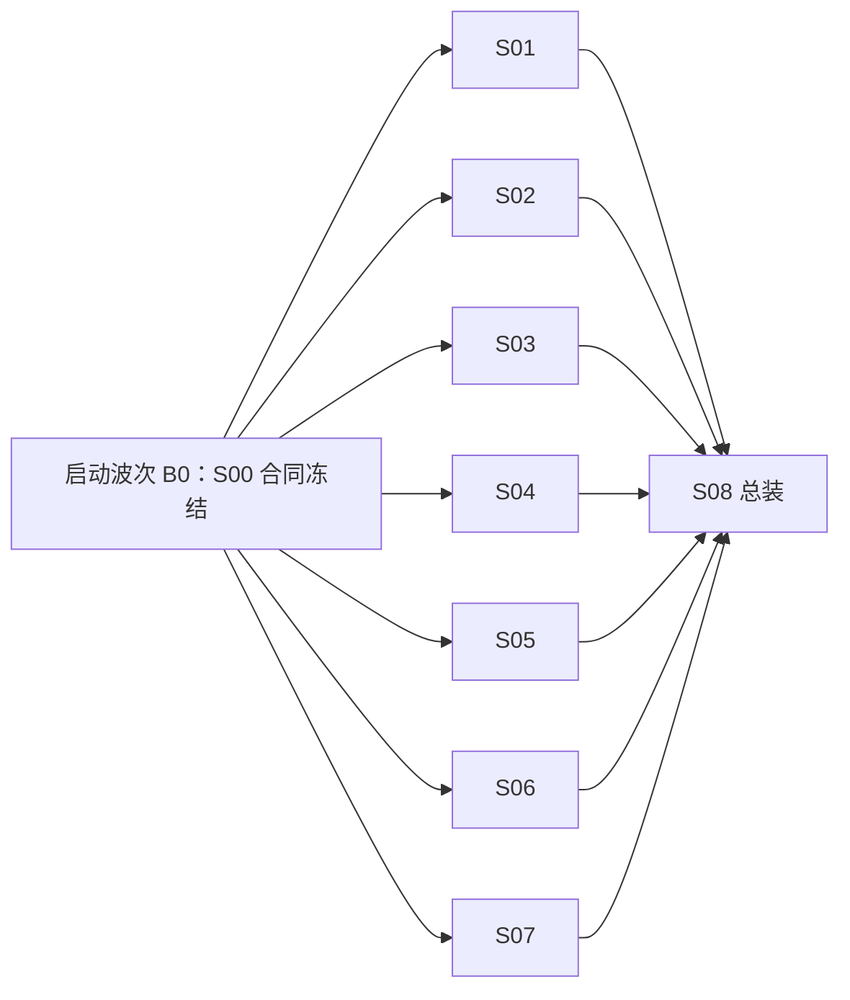

# Problem Locator V1 组合与总装说明书（S08）

状态：正式组合规范

适用范围：Problem Locator V1 各独立说明书实现完成后的合并、接缝验证、端到端验收与发布判定

## 1. 文档定位

本文只定义未来如何组合 S00～S07 的开发成果，以及 S08 如何执行总装验收。本文不实现业务代码，不替代各模块详细说明书，也不授权任何任务修改其他模块的责任范围。

本文创建时没有创建或派发开发任务，没有创建分支或 worktree，没有修改产品代码，也没有开始总装。后续只有在明确启动对应开发任务时，才按本文规定建立独立任务、分支和 worktree。

规范优先级如下：

1. `v1-baseline-design.md` 定义 V1 产品语义和不可变原则。
2. S00 冻结后的合同包定义跨模块字段、枚举、协议、Port、错误码和固定 fixture。
3. S01～S07 定义各自白名单内的实现要求。
4. 本文定义依赖批次、合并顺序、接缝测试、返工路由和最终验收。

若下层说明书与更高优先级规范冲突，任务必须停止并提交合同变更请求，不得自行选择一种解释继续实现。

## 2. 总装目标与非目标

### 2.1 总装目标

- 允许 S01～S07 在合同冻结后并行开发，并能用 fake Port 独立验证。
- 用明确的写入白名单避免多个 Codex 任务修改同一文件。
- 通过确定的合并顺序逐层暴露接缝问题。
- 用同一组规范 fixture 验证状态、文件和协议行为。
- 完成 RPC 超时主场景、恢复场景、竞态场景和失败场景验收。
- 证明日志只在首次分析 Job 中执行一次 `logparse parse`，中途补参后的下一 Job 复用解析目录，整个 Case 的 parse 次数仍为 1。
- 保持领域层和应用层对未来 PostgreSQL Repository 的可替换边界。

### 2.2 总装非目标

- 不在 S08 中重写已经由模块任务负责的业务逻辑。
- 不用集成层兼容分支掩盖合同不一致。
- 不通过保留 Agent Session 或完整聊天记录实现跨 Job 连续性。
- 不引入 PostgreSQL、双写、Docker、多实例 Worker 或外部队列。
- 不把真实外部依赖的偶发成功作为确定性单元测试的替代品。

## 3. 未来 Codex 开发任务约束

所有未来 S00～S08 开发任务统一使用：

```text
model: gpt-5.6-sol
reasoning_effort: ultra
```

每个任务必须满足：

- 全部正式实现仍在当前代码仓中完成；分支和 worktree 只是同一仓库内的并行隔离手段，不另建产品仓库。
- 一个说明书对应一个独立 Codex 任务。
- 一个任务对应一个 `codex/` 前缀分支和一个独立 worktree。
- S08 的分支固定为 `codex/v1-s08-integration`，其 worktree 同时是唯一集成 worktree；其他任务不得直接写该分支。
- S01～S07 并行任务和 S08 集成任务都从同一个 S00 合同冻结提交开始；S00 自身从任务书指定的仓库起始提交开始。
- 每个任务只写责任白名单中的文件。
- 跨模块依赖只通过冻结合同和 Port；未完成实现使用 deterministic fake。
- 时间、UUID、runtime epoch、Agent 输出和文件故障均必须可注入。
- 产品代码不得识别 fixture ID，不得为某个 golden fixture 添加特殊路径。
- S00～S08 每个任务结束时都必须提交第 12 节定义的交接 JSON，路径固定为自己的 `handoff/Sxx.json`。

不得让多个 Codex 任务在同一 worktree 并行写入。不得让某个任务因为“顺手修复”而编辑另一任务的生产目录。

## 4. S00 合同冻结门禁

S00 是所有并行开发的唯一前置门禁。S00 合并前不得启动依赖精确字段或接口的实现任务。

合同冻结包至少包含：

```text
src/problem_locator/contracts/
├─ enums.py
├─ models.py
├─ commands.py
├─ outcomes.py
├─ errors.py
├─ ports.py
├─ limits.py
└─ serialization.py

schemas/v1/
├─ contract-manifest.json
├─ state.schema.json
├─ job.schema.json
├─ agent-job-outcome.schema.json
├─ job-outcome.schema.json
├─ user-result.schema.json
├─ workspace-input-manifest.schema.json
├─ logparse-parse-claim.schema.json
├─ handoff.schema.json
└─ fixture-manifest.schema.json

tests/contracts/
├─ test_schema_snapshots.py
├─ test_fixture_validity.py
├─ test_port_conformance.py
└─ ...

tests/fixtures/contracts/
└─ ...
```

必须冻结的跨模块内容包括：

- Case、DiagnosisState、Job、AgentJobOutcome、规范 JobOutcome、Requirement、Attachment、Evidence、Artifact 和 CandidateConclusion 字段。
- `CaseStatus`、`JobStatus`、`JobType`、Outcome 类型和 disposition。
- 外部命令、内部 Trigger、TransitionPlan 和响应 DTO。
- `StateRepository`、`ResourceStore`、`ExecutionRecordStore`、PublicationCommitGuard、AttachmentUploadGuard、LogparseBrokerFactory/Session、Coordinator、ContextSnapshotProjector、Runtime、ApplicationCommand、JobControl、StateAdmin 和 Dispatcher 的 Port 签名。
- Domain 错误到 MCP、HTTP 和 CLI 的稳定错误映射。
- `case_revision` 与 `DiagnosisState.revision` 增长矩阵。
- `state.json`、`job.json`、`job_outcome.json` 的 Schema 与规范序列化。
- S04→S07 的 WorkspaceInputManifest、LogparseParseClaim、previous outcome 物化与 parse-once 判定。
- S00～S08 的 `HandoffRecord`、嵌套类型和 `handoff.schema.json`。
- FixtureManifest、条目类型和 `fixture-manifest.schema.json`。
- storage key、SHA-256、路径归属和不可变资源规则。
- 默认并发、时间、文件大小、上下文大小和保留期限限制。
- 固定时钟、固定 ID、Canonical JSON 和测试 runtime epoch 规则。

`contract-manifest.json` 的 include/exclude 与字节稳定规则逐字使用 S00：只列 contracts Python 文件和 `*.schema.json`，排除 manifest 自身、根依赖、tests、fixtures、handoff、缓存和临时文件。冻结提交使用可识别标签，例如 `v1-contract-freeze-1`。

冻结门禁要求：

1. 所有生成 Schema 与源模型一致，重新生成后 Git 无差异。
2. 所有正向 fixture 能解析，所有负向 fixture 按预期失败。
3. transition table 中引用的状态和 Trigger 全部存在。
4. fake Port 通过统一 conformance tests。
5. revision matrix 覆盖所有外部命令和 Outcome 提交路径。
6. 跨模块合同中不存在语义未决项。

冻结后，只有 S00 维护任务可以修改合同包。合同变更必须递增合同修订号；仍在开发且尚未生成最终 handoff 的受影响任务同步新冻结提交并重跑合同测试，已经生成 handoff 的任务必须按返工流程追加修复、重新测试并重新生成末端 handoff，不得重写已交付提交。

## 5. 依赖关系与开发批次

“可以并行编码”和“允许合并”是两个不同概念。S00 冻结后，S01～S07 都能基于冻结 Port 和 fake 独立启动；真实接缝必须按依赖顺序放行。



批次规则：

- B0 必须完成后才能建立其他开发分支的共同基线。
- S01～S07 在开发启动层面同属并行波次；S03/S05/S06 使用 fake 上游，S07 使用 fake Runtime/ResourceStore。
- S08 只在 S01～S07 各自独立验收完成、`handoff/S01.json`～`handoff/S07.json` 全部有效后启动；它从 S00 合同冻结提交创建 `codex/v1-s08-integration` 和唯一集成 worktree。
- S08 在集成分支中依次放行 S01、S02、S03、S04、S05、S06、S07；后合并模块不得把接缝测试写进自己的单元测试责任区。
- S08 独占全部跨模块接缝、RPC/故障 Fixture 与 E2E 测试。模块分支可以提供组件 Fixture，但不能提前写入 S08 责任路径。

## 6. 固定合并顺序与接缝门禁

`codex/v1-s08-integration` 是集成分支，也是 S08 的任务分支。它从 S00 合同冻结提交创建，固定集成顺序为：

1. S00：合同、工程骨架和公共测试工具。
2. S01：领域对象、状态机和 Coordinator。
3. S02：JsonFileStateRepository、FileResourceStore、锁和原子写。
4. S03：Application Service、幂等和资源提案提交。
5. S04：Context Builder、Runtime 和 Agent Backend。
6. S05：Dispatcher、Worker、取消、恢复和 STALE Outcome。
7. S06：Remote MCP、HTTP 文件接口、CLI 和配置入口。
8. S07：Skill、生成器和真实 logparse 集成。
9. S08：在同一集成分支完成剩余依赖装配、端到端测试、运行文档、`handoff/S08.json` 和发布判定；不存在另一个待合并的“S08 分支”。

S08 在 `src/problem_locator/bootstrap.py` 中拥有唯一的薄 `StateAdminPort` 组合实现：readiness 只汇总 S06 配置、S02 实例锁/状态校验和 S05 recovery 完成信号；validate 原样使用 S02 ValidationReport；export 从同一 StateFile generation 构造 S00 StateExport 和正式资源清单。它不得在该 facade 中加入领域转换、存储修复或接口私有 DTO。

每个模块分支最终 tip 必须是通过 S00 handoff Schema 与第 12 节 Git 事实门禁的 handoff-only commit，且以同一 S00 冻结提交为祖先。交接后禁止 rebase、squash、amend 或在 handoff 后追加未登记提交；S08 按固定顺序使用保留模块提交对象的 `git merge --no-ff` 集成。白名单设计应使合并无业务冲突；一旦冲突涉及模块责任区，停止合并并按第 11 节退回原模块生成新的实现 head 与末端 handoff，S08 不代签、不改写模块提交。每次模块合并后，S08 先在集成分支增加并提交“当前已具备全部依赖”的接缝测试和对应 Fixture，再允许合并下一个模块；接缝提交可以穿插在 S01～S07 的模块合并之间，但只能由 S08 写。每轮按顺序运行：

1. 合同测试。
2. 新合并模块的独立测试。
3. 已合并模块的回归测试。
4. 本次新增接缝测试。

必须存在以下接缝测试：

| 接缝 | 输入 | 核心断言 |
|---|---|---|
| S01 ↔ S03 | CaseSnapshot + Validated Trigger | TransitionPlan 被完整执行；proposal 正式化后用公共 projector 从目标状态物化下一 Job |
| S01 ↔ S03 ↔ S04 | continuation closure、previous outcomes、候选与新 Evidence | R10→R11 固定 LOGPARSE_RUN/源附件/等待 Outcome 及 PREVIOUS_OUTCOME Evidence 来源；incoming Outcome 与 next Job 同一 commit；REVIEW 固定全部 supporting Evidence；Runtime 实际可见 previous outcome |
| S02 ↔ S03 | 计划、资源提案、预期 revision | publication lease 覆盖资源发布/采用到状态提交；既有目标采用重做只读/fsync；清理同锁隔离；重启重交复用确定性 ID/字节且不存在引用后删除 |
| S02 ↔ S03 ↔ S05 | finalized Outcome durable outbox | 同进程投递失败不重跑 Agent；重启先通过执行记录 replay，未确认 Outcome 的 stage/正式目标/next job 不被清理 |
| S03 ↔ S05 | PENDING/RUNNING/INTERRUPTED Job | 单 Case 单活跃 Job；认领、替代、迟到结果和 replay-before-interrupt 语义正确 |
| S04 ↔ S05 | 固定 Job 与可取消执行 | Job 只执行一次；超时和取消终止完整进程树 |
| S03 ↔ S06 | MCP/HTTP 命令 | DTO、幂等、expected revision 和错误映射一致 |
| S06 ↔ S07 ↔ S04 | Settings、固定 Skill、WorkspaceInputManifest、LogparseParseClaim、UserResultPayload、附件和 LOGPARSE_RUN | S06 的不可变 raw logparse settings 只注入 S07 服务侧 BrokerFactory；S07 生成的 fingerprinted ResolvedAsset.ref 与 Job.logparse_tool_ref、Catalog 和 manifest 逐字一致，不一致则启动或 diagnose_bindings 失败且不 direct-CLI 降级；公共 Schema/字节完全一致；manifest 的 product 来自 Job 固定 Skill；job-scoped broker 是唯一启动路径，raw env 被剥离，跨 Job/第二次 parse/任意 argv/direct-CLI 被拒绝，close/cancel 回收进程；endpoint/token 经流式日志和输出扫描均不泄漏；首次 parse，后续复用；USER_RESULT 语义匹配 Candidate；Runtime 规范化后符合 JobOutcome Schema |
| S01 ↔ S03 ↔ S05 | Outcome 提交竞态 | 最多一个结果改变当前状态；迟到结果仅保存为 STALE |
| S02 ↔ S03 ↔ S06 | 上传与 SubmitSupplement | UploadDescriptor 四个 header 精确；per-attachment guard 使同 ID 串行、异 ID 可并行；每个 body 只读一次，流后在短 lease 内重读 snapshot，generation conflict 只重算 post-stage；发布成功/commit 失败后同 hash 采用、异 hash 为 IDEMPOTENCY_CONFLICT；5 GiB 全批校验零 partial publish；READY 上传不自动推进，显式提交引用后才创建 Job |

## 7. Fixture 与确定性测试规范

Fixture 目录按用途分层：

```text
tests/fixtures/
├─ contracts/
├─ components/
├─ rpc_timeout/
└─ failures/
```

统一要求：

- 时间固定为 UTC，ID、request ID 和 runtime epoch 使用可读固定值。
- JSON 使用冻结的 Canonical JSON 规则。
- 每个 fixture 在其责任子树自己的 `fixture-manifest.json` 中按 S00 `fixture-manifest.schema.json` 记录用途、Schema、size 和 SHA-256；manifest 条目必须与该 root 下除自身外的全部普通文件完全相等，禁止多个任务共同写 `tests/fixtures/fixture-manifest.json`。
- golden state 必须同时通过 Pydantic Schema 和全局不变量校验。
- fake AgentBackend 只通过 `output/job_outcome.json` 返回结果，stdout/stderr 不承载业务结果。
- RPC 超时 fixture 使用小型非敏感日志包，并提供预期 `parse_manifest.json`、目标日志结果和 parse 调用计数。
- 故障 fixture 覆盖 replace 前后故障、哈希不符、输出缺失、非法 Job 绑定、上下文超限、取消竞态和旧 epoch。

Fixture manifest 和所有权固定为：

- S00：`tests/fixtures/contracts/fixture-manifest.json`；
- S01：`tests/fixtures/components/domain/fixture-manifest.json`；
- S02：`tests/fixtures/components/storage/fixture-manifest.json`；
- S03：`tests/fixtures/components/application/fixture-manifest.json`；
- S04/S05：各自在其 `runtime-*/**` / `dispatch-*/**` 具体 Fixture 子树内维护 manifest；glob 使用 `v1-specs/README.md` 冻结的仓库相对 POSIX 语义；
- S07：`tests/fixtures/components/logparse/fixture-manifest.json`；
- S08：独占 `tests/fixtures/rpc_timeout/**` 与 `tests/fixtures/failures/**`，并分别维护根下的 `fixture-manifest.json`。

## 8. RPC 超时 R01～R14 端到端场景

主场景固定为“支付服务调用库存服务 RPC 超时”。参数组 A 的 requirement name 固定为 `caller_service`、`server_service`、`rpc_method`、`problem_time`，其中 problem_time 是毫秒精度 UTC RFC 3339 时刻；唯一日志 requirement 固定为 `log_archive`；参数 B 固定为可唯一关联目标请求的 `order_id`。结构化输入和约束逐字段采用 S00 合同。

| 编号 | 操作 | 必须观察到的状态和产物 |
|---|---|---|
| R01 | 调用 `problem_locator_create_case` | Case 创建成功，固定 ROUTE Job，Case 进入运行态 |
| R02 | Router 返回 `MATCHED` | Route Outcome 被接受，创建固定 DIAGNOSE Job，不允许 Router 索要参数 |
| R03 | Specialist 返回参数组 A 的 `NEED_INPUT` | requirements 持久化，Case 进入 `WAITING_INPUT`，当前 Job 结束 |
| R04 | 只提交参数组 A 的一部分 | 新资料立即写入 `user_facts`，Case 仍为 `WAITING_INPUT`，不创建 Job |
| R05 | 提交参数组 A 的剩余字段 | requirements 全部满足，只创建一个新的 DIAGNOSE Job，其快照包含完整参数组 A |
| R06 | Specialist 返回一次 `NEED_ATTACHMENT` | Case 进入 `WAITING_ATTACHMENT`，开放日志附件 requirement |
| R07 | prepare 并上传日志附件至 READY | 文件大小和 SHA-256 正确；仅上传不推进 Case，也不创建 Job |
| R08 | `SubmitSupplement` 显式提交 READY Attachment 引用 | requirement 满足，创建新的 DIAGNOSE Job，Job 固定引用该附件 |
| R09 | Specialist 首次分析日志 | 调用一次真实 `logparse parse`，读取 `parse_manifest.json`，再执行 `mech-target-logs`；parse 计数变为 1 |
| R10 | 首次分析无法唯一定位并返回参数 B 的 `NEED_INPUT` | 中间 Evidence 和内部 `LOGPARSE_RUN` Artifact 被接受，Case 进入 `WAITING_INPUT`；解析目录跨 Job 持久化 |
| R11 | 用户提交 `order_id` | 参数 B 持久化，创建新的 DIAGNOSE Job；Job 固定引用 Evidence、原附件、`LOGPARSE_RUN` 和使 Case 进入等待态的 R10 Outcome |
| R12 | 新 Job 继续诊断 | Runtime 物化已保存的解析目录与 previous outcome；不得解包或再次 parse；parse 总计数仍严格为 1；同一 Outcome 产生 CandidateConclusion 和唯一固定 USER_RESULT |
| R13 | 创建独立 REVIEW Job，Reviewer 返回 `PASS` | Reviewer 使用新 Session、固定 target 和候选全部 supporting Evidence，四个问题数组为空；Candidate 成为 final result，Case 进入 `RESOLVED` |
| R14 | 查询 Case、重启服务后再次查询并下载 `USER_RESULT` Artifact | 下载对象逐字是 R12 同批发布且属于 accepted candidate Job 的 `diagnosis-result.json`；按 S00 UserResultPayload 解析后，problem/candidate 逐字等于最终 Case，draft bindings 经 R12 proposal→正式 Evidence 映射后与 accepted Candidate 的 supporting/mapping Evidence 一一相等；结果、历史引用和 revision 可恢复，大小与 SHA-256 匹配；内部 `LOGPARSE_RUN` 不可下载；parse 总计数仍为 1 |

R01～R14 的 golden state 不依赖 Agent 完整对话。R10 到 R12 的连续性只来自 Repository 中的结构化状态、Evidence、Attachment、Artifact 和 Job 固定快照。

主场景还必须派生以下负向验收：

- 同 request ID、相同载荷返回首次结果，不增加 revision。
- 同 request ID、不同载荷返回 `IDEMPOTENCY_CONFLICT`。
- 旧 Job 的首次迟到 Outcome 保存为 STALE：`case_revision + 1` 只反映新增审计记录，Case status、active Job、JobStatus 与 DiagnosisState revision 不变；同一 Outcome 再次提交是 DUPLICATE，任何 revision 都不增加。
- 取消与 Outcome 同时到达时最多一个结果改变状态。
- 服务重启先重放全部未确认 finalized Outcome；只有确实没有 finalized Outcome 的旧 RUNNING Job 才转为 INTERRUPTED，Resume 创建同阶段替代 Job。
- REVIEW Job 中断后只能创建 REVIEW 替代 Job，不得降级为 DIAGNOSE。
- 固定 Skill、Attachment 或 Artifact 缺失时明确 FAILED，不得静默使用最新版本。
- `JOB_INSTRUCTION` 必须带入当前 Job.goal，`RESOURCE_MANIFEST` 必须逐字保留；二者及全部其他必需内容总和超过预算时返回 `CONTEXT_LIMIT`，不得为可选 Evidence 挤掉必需 section。
- 上传大小或哈希不符时 Attachment 不得进入 READY。
- publish 成功后注入 state commit 故障并重启；同 Outcome 重交复用相同派生 ID、稳定 produced_at 业务时间、完整 job.json 和资源字节，不能因 stage 已移动而失败或产生第二套正式对象。
- Runtime 只调用一次；Outcome 首次投递依次遭遇 `RESOURCE_PUBLISH_FAILED`、`STATE_WRITE_FAILED` 或 `REVISION_CONFLICT` 后仍只重投同一 finalized receipt，成功为 APPLIED/DUPLICATE 且 revision 最多增加一次。
- finalized Outcome 后立即崩溃；重启必须先 replay 再 interrupt。replay 仍遇瞬时存储错误时 readiness=false，不运行 Agent；取消先胜出后才 finalized 的 Outcome 在重启时补记 STALE。
- finalized Outcome 损坏时 recovery/readiness 持续失败、破坏性清理暂停，旧 Job 不进入 INTERRUPTED，Runtime/Resume 都不得重跑；RuntimeInfrastructureError 的 report-only 重试始终复用同一 failure_id，进程退出且无 finalized Outcome 时才按普通旧 RUNNING 中断。
- Catalog A 已预发布 next job 后 state commit 失败，重启只有 Catalog B 时必须采用 A 的逐字 job.json；A 已不可加载则前一 Outcome 先提交，随后 Claim 明确 `ASSET_VERSION_UNAVAILABLE`，不得改写为 B。
- replace 成功后在 chmod/fsync 注入故障；重启采用既有 Resource、job.json 或 job_outcome.json 时必须补完 finalize，不能直接返回未持久化 receipt。
- 未处理 durable outbox 与清理 barrier 交错时，其 staged refs、确定性正式目标和预发布 next job 都不得进入 quarantine；写入 disposition 后未引用对象才可按普通期限清理。
- 用 barrier 令 orphan 清理与幂等采用交错；无论谁先取得协调锁，都不得形成引用已删除正式对象的 state。
- 同 attachment_id 双 PUT 用 barrier 证明 guard 覆盖完整 stream→stage→publish→commit；两个不同 attachment 的流与其他 state generation 变化交错时，每个 body 只读一次，流后重读 snapshot，revision conflict 仅重算 post-stage。发布成功而 commit 故障时，同 hash 重试采用且 delta=0，异 hash 固定 `IDEMPOTENCY_CONFLICT`；两个不同 ID 并发逼近 5 GiB 时只有合法全批通过且没有 partial target。
- broker 负向矩阵覆盖 raw `LOGPARSE_*`/既有 broker 环境剥离、`CLAUDE_COMMAND` 保留键赋值拒绝、跨 Job/过期 token、第二次 parse、任意 argv、direct-CLI、close/cancel 进程回收，以及 endpoint/token 跨 chunk 日志与 Outcome/Proposal 内容泄漏拒绝。
- Reviewer 返回非 PASS 时，新 DIAGNOSE Job 的 PREVIOUS_OUTCOME 必须逐字包含 recommendation 和问题数组；PASS 与非空问题数组的组合必须拒绝。

## 9. 冲突规避与责任白名单

详细权威矩阵位于 `v1-specs/README.md`。总装执行时还必须遵守：

- S00 在冻结阶段独占合同包、初始 `pyproject.toml`、初始 `uv.lock` 和公共测试工具；合同冻结提交形成后，S00 不再拥有根依赖文件。
- 合同冻结后，S01～S07 通过交接 JSON 提出依赖需求，不直接修改根依赖；只有 S08 能在集成分支串行应用已经批准的 `pyproject.toml` / `uv.lock` 变更。
- S08 的完整精确白名单以 `v1-specs/README.md` 为准，包括三个明确入口文件、`README.md`、`.env.example`、`handoff/S08.json`、integration/e2e 测试和两棵跨模块 Fixture 目录；不存在“公共注册文件”等开放式路径类别。
- 各任务测试目录按模块隔离；跨模块测试只由 S08 写入 `tests/integration/**`、`tests/e2e/**`、`tests/fixtures/rpc_timeout/**` 或 `tests/fixtures/failures/**`。
- `.claude/skills/problem-locator-client/**` 只由 S06 修改；Wiki 生成器、logparse 和演示 Diagnosis Skill 的三个固定目录只由 S07 修改。新增 Skill 目录必须先更新责任矩阵。
- 发生文本合并冲突时，若冲突涉及业务行为，必须退回文件所有者；S08 只能直接解决 import、注册表和依赖注入等纯装配冲突。
- 不允许复制合同模型到模块内部形成第二套 DTO。
- 不允许通过读取执行时最新 Case 来绕过 Job 固定输入。

## 10. 总装验收矩阵

| 规范 | 独立验收 | 接缝验收 | 总装放行条件 |
|---|---|---|---|
| S00 合同 | Schema snapshot、fixture validity、Port conformance | 所有模块导入同一合同版本 | manifest 无漂移，合同修订一致 |
| S01 领域 | 全 Trigger、非法转换、revision 矩阵、不变量 | S01↔S03 | R01～R14 状态转换符合 golden state |
| S02 存储 | 实例锁、原子写、故障注入、损坏隔离、清理 | S02↔S03 | 重启后状态和资源可恢复，无静默回退 |
| S03 应用 | 幂等、归属、引用、条件提交、资源提案 | S01↔S03、S02↔S03、S03↔S06 | 所有业务写入只经过 Application Service |
| S04 Runtime | 上下文预算、命令解析、stdin、结果文件、超时、进程树终止 | S04↔S05、S04↔S07 | 每 Job 新 Session，跨 Job 不依赖会话 |
| S05 调度 | 单活跃 Job、认领、取消、INTERRUPTED、替代、STALE | S03↔S05、S04↔S05 | 重启和竞态场景全部确定性通过 |
| S06 接口 | MCP/HTTP DTO、错误码、上传下载、有限等待、CLI、Client Access Skill | S03↔S06、S02↔S03↔S06 | 黑盒协议和客户端 Skill 通过，不泄露内部路径或敏感信息 |
| S07 Skill/logparse | 生成器 2.0.0、Skill 校验、真实 logparse | S04↔S07 | R09 首次 parse，R12 复用，R14 总计数仍为 1 |
| S08 总装 | 配置、装配、依赖和入口检查 | 全部接缝 | fake E2E、真实 logparse E2E、恢复 E2E 和安全测试通过 |

发布验收至少执行并记录：

```text
python -m problem_locator validate-state --data-root <path>
python -m problem_locator export-state --data-root <path> --output <path>
python -m problem_locator serve --env-file <path>
```

Windows 和 Linux 至少各完成一次启动级验证。真实 Agent Backend 和真实 logparse 的发布级 smoke test 与确定性 fake E2E 分开记录；两类均必须通过。

## 11. 失败返工路由

返工按最靠近失败输入的责任模块路由：

| 失败表现 | 责任说明书 |
|---|---|
| Schema、枚举、错误码、Port 或 fixture 无法表达需求 | S00 |
| 相同 CaseSnapshot + Trigger 得到错误 TransitionPlan | S01 |
| 计划正确但锁、磁盘状态、原子性、路径或哈希错误 | S02 |
| 计划和存储分别正确，但业务提交、幂等或资源接受错误 | S03 |
| Context、Prompt、子进程、结果文件解析或进程终止错误 | S04 |
| Job 认领、取消、恢复、替代关系或迟到结果错误 | S05 |
| 直接调用应用服务正确，但 MCP、HTTP 或 CLI 行为错误 | S06 |
| Skill 装配、logparse 首次解析或解析目录复用错误 | S07 |
| 各模块独立正确，仅依赖注入、入口或环境组合错误 | S08 |

返工包必须包含：

- 合同修订号、集成提交和失败平台。
- 最小复现命令、fixture 名称或随机种子。
- expected/actual 结构化差异。
- 相关执行日志和资源哈希。
- 初步责任判断及判断依据。
- 是否可能影响冻结合同。

责任任务修复时必须在自己的测试目录增加回归测试，并更新交接 JSON。若确认是合同缺陷，应暂停受影响合并，由 S00 修改合同并递增修订号；不得由 S08 添加永久兼容路径。若失败无法稳定复现，应先把故障注入或时间/ID 注入补齐，不能把 flaky test 作为放行项。

## 12. S00～S08 统一 Codex 任务交接 JSON

每个未来任务结束时必须生成独立交接记录，固定文件名为 `handoff/Sxx.json`，各任务仅写自己的文件名。S08 同样提交 `handoff/S08.json`，不使用另一个未冻结字段集的最终总装报告替代。

```json
{
  "spec_id": "S08",
  "title": "V1 Integration and Release Acceptance",
  "executor": {
    "model": "gpt-5.6-sol",
    "reasoning_effort": "ultra"
  },
  "contract_revision": "v1-contract-r1",
  "contract_base_commit": "<contract-base-commit>",
  "branch": "codex/v1-s08-integration",
  "head_commit": "<head-commit>",
  "scope_completed": [
    "fixed-order module integration",
    "R01-R14 end-to-end acceptance",
    "release readiness validation"
  ],
  "changed_files": [
    "src/problem_locator/bootstrap.py",
    "tests/e2e/test_rpc_timeout.py",
    "tests/fixtures/failures/fixture-manifest.json",
    "tests/fixtures/failures/resource-cleanup-race.json",
    "tests/fixtures/rpc_timeout/fixture-manifest.json",
    "tests/fixtures/rpc_timeout/r01-create.json"
  ],
  "fixtures_consumed": [
    "tests/fixtures/components/logparse/fixture-manifest.json"
  ],
  "fixtures_produced": [
    "tests/fixtures/rpc_timeout/fixture-manifest.json",
    "tests/fixtures/failures/fixture-manifest.json"
  ],
  "tests": [
    {
      "command": "python -m pytest tests/integration tests/e2e -q",
      "status": "passed",
      "summary": "all tests passed"
    }
  ],
  "dependency_requests": [],
  "contract_change_requests": [],
  "known_limitations": [],
  "risks": [],
  "integration_notes": [],
  "forbidden_scope_touched": false
}
```

以下顶层字段是 S00～S08 完全相同的必填字段：`spec_id`、`title`、`executor`、`contract_revision`、`contract_base_commit`、`branch`、`head_commit`、`scope_completed`、`changed_files`、`fixtures_consumed`、`fixtures_produced`、`tests`、`dependency_requests`、`contract_change_requests`、`known_limitations`、`risks`、`integration_notes`、`forbidden_scope_touched`。任何字段都不得省略；没有内容的列表写空数组。新增顶层字段必须先修改 S00 交接 Schema 和本节。

交接有效条件：

- 合同修订号与集成基线一致。
- S00 的 `contract_base_commit` 是任务起始提交；S01～S08 的 `contract_base_commit` 是包含 `handoff/S00.json`、并已加冻结标签的最终 S00 冻结提交。`branch` 必须与任务书一致。`head_commit` 是加入交接文件之前已经通过测试的实现/集成提交；随后只允许一个 handoff-only commit 写入对应 `handoff/Sxx.json`，且该提交的第一父提交必须等于所声明的 `head_commit`，从而避免交接文件自引用提交哈希。
- `forbidden_scope_touched` 为 `false`。
- 对 S00～S07，把 `git diff --name-only <contract_base_commit>..<head_commit>` 先分离本任务自己的 `handoff/Sxx.json`，再把剩余路径规范成排序后的仓库相对 POSIX path；剩余结果必须与 `changed_files[]` 完全相等，不能漏报、虚报或只检查已声明子集，且每项都在该册白名单内。首次实现的 implementation head 中该 handoff 路径应不存在；返工 implementation head 可以继承上一次已验收 handoff blob，但从上一次 handoff-only tip 到新 implementation head 的提交不得修改该文件。
- 对 S08，把同一完整 diff 精确分成三类：①匹配 S08 白名单且不是 `handoff/S00.json`～`handoff/S07.json` 的路径，排序后必须与 S08 `changed_files[]` 完全相等；②各模块实现路径，必须分别出现在已验收 S01～S07 的 `changed_files[]`，对应 handoff-only tip 是 S08 head 的祖先，且 S08 head 中的 blob 与该模块所声明 `head_commit` 中的 blob 完全相同；③`handoff/S00.json`～`handoff/S07.json`，不归入任何 `changed_files[]`，但 S08 head 中每个 blob 必须逐字等于对应已验收、不可变的末端 handoff-only tip。三类并集必须恰好等于完整 diff，不能遗漏或重叠；任何无法归属或被集成层改写的路径都退回原所有者。
- 每个 handoff-only tip 相对其第一父 `head_commit` 的 diff 必须恰好只有自己的 `handoff/Sxx.json`；该 JSON 的 `changed_files[]` 不登记自身。除把该合法 tip 纳入历史的 merge commit 外，完整祖先图中任何修改 `handoff/Sxx.json` 的非 merge commit 都必须正是当时经验证的对应 handoff-only commit；S08 必须验证返工 implementation head 中剥离的旧 blob 来自最近一次已验收 handoff-only commit。后续返工再产生新的 implementation head 和新的末端 handoff-only commit，以新 blob 取代旧版本后完成重新验收。
- `fixtures_consumed` 与 `fixtures_produced` 引用所属责任子树的 manifest，且 manifest 哈希有效。
- 必需测试全部通过。
- 不存在未裁决合同变更。
- known limitations 不包含 V1 必需能力。
- S00 分支可从其任务起始提交干净重放；S01～S08 分支可从合同冻结提交干净重放。

## 13. PostgreSQL 迁移边界

PostgreSQL 不属于本次 V1 总装，但当前实现必须保持以下迁移边界：

- 领域层和应用层只依赖 `StateRepository`、`ResourceStore` Port，不得导入 JsonFileStateRepository 的实现类型。
- ID、枚举、UTC 时间、revision、Outcome Schema、资源 ID 和 SHA-256 语义从 V1 起稳定。
- `validate-state` 和 `export-state` 输出带 Schema 版本、记录计数和资源哈希的 Canonical JSON。
- 数据库升级采用停机离线导入，不做 JSON/PostgreSQL 双写。
- 导入必须保留 Case、DiagnosisState、Job、Outcome、Candidate、revision、幂等回执和资源 ID。
- 大文件可以继续由 FileResourceStore 保存，PostgreSQL 首先只接管业务元数据。
- 导入完成后核对记录数和资源哈希，再切换 Repository；原 JSON 数据保留为只读回滚证据。
- 出现第二个服务实例、高可用要求、`state.json` 接近 16 MiB、历史 Case 接近 500 个或写入延迟明显上升中的任一条件时，优先启动 PostgreSQL 升级设计，不在 JSON 方案上继续叠加分布式机制。

任何模块若直接读取 `state.json`、依赖绝对资源路径或绕过 Repository Port，均视为阻断 PostgreSQL 迁移的总装缺陷，不能发布。

## 14. 总装完成定义

只有同时满足以下条件，S08 才能宣布 V1 总装完成：

- S00～S07 的独立验收和交接记录有效。
- 合同、模块、接缝和端到端测试全部通过。
- R01～R14 主场景和全部负向分支通过。
- 真实 logparse 计数证明整个 RPC 超时 Case 只执行一次 parse。
- Reviewer PASS 是写入 final result 并进入 RESOLVED 的唯一成功路径。
- 重启、迟到结果、取消竞态、原子写和文件故障测试通过。
- MCP/HTTP 不暴露日志包字节、内部路径、凭据或环境变量。
- 状态校验、导出和服务启动命令可运行。
- PostgreSQL 迁移边界没有被具体适配器依赖破坏。
- 根 README、env 示例、运行命令、备份和恢复说明与实际行为一致。
- `handoff/S08.json` 使用第 12 节统一字段，指向 `codex/v1-s08-integration` 的实际发布候选 head，且自身通过白名单和交接 Schema 校验。

本文当前只建立上述未来总装规则；没有执行其中任何开发、合并或发布动作。
