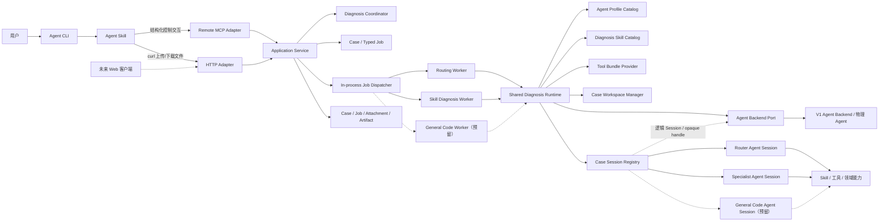
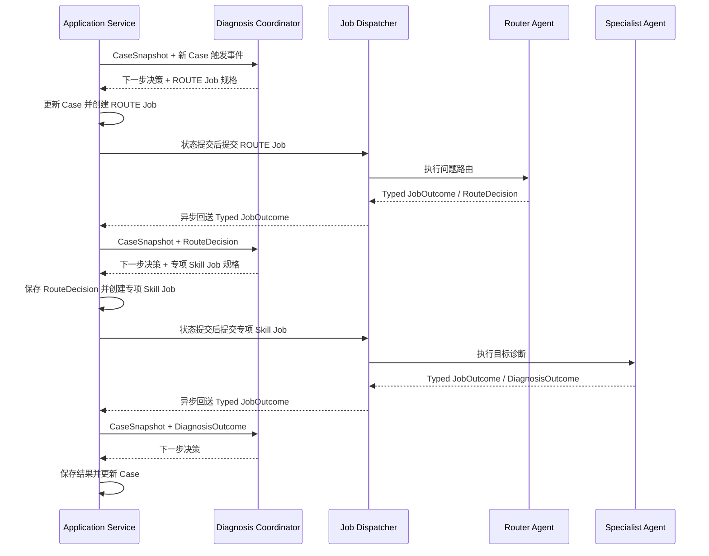
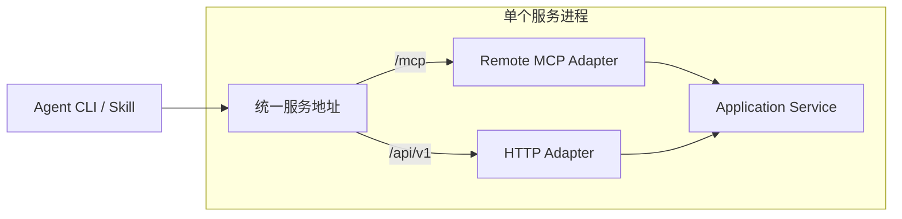

# V1 总体框架粗设计

状态：总体粗设计已确认；General Code Agent 作为后续扩展预留
更新时间：2026-07-27

## 1. 文档定位

本文先确定 Problem Locator 正式 V1 的整体框架、模块职责和关键演进边界。

当前阶段不展开完整时序、接口字段、状态机、超时时间、存储结构，以及 Application Service、Coordinator、Dispatcher 和 Worker 的具体接口与实现细节。上述内容将在总体框架确认后统一进入详细设计。

候选方案、未采纳原因和复议条件统一记录在[《V1 方案选择记录》](v1-option-decisions.md)中。

## 2. 目标范围

- 首个正式版本部署在内网，采用单节点、低并发形态。
- 当前 Demo 仅作为事实参考；正式 V1 不需要兼容 Demo。
- 正式 V1 发布的外部接口作为后续兼容演进的起点。
- 当前仓库只保存设计文档；正式实现将在新代码仓中开发。
- 模块边界应允许未来升级为内网多实例高可用，但 V1 不实现多实例。
- V1 实现 Router Agent 和 Specialist Agent；General Code Agent 只保留扩展边界，不在 V1 实现。

## 3. 总体框架

Remote MCP 和 HTTP 都是接入适配器，不分别实现业务规则。Application Service 后通过 Diagnosis Coordinator、类型化 Job 和 Dispatcher 组织诊断执行。

## 4. 已确认的客户端接入原则

- 用户不安装 Local MCP Server，也不运行项目专用本地常驻进程。
- Agent CLI 使用自身的 Remote MCP 客户端完成结构化控制交互。
- Agent Skill 调用系统已有的 `curl` 完成本地附件上传和结果文件下载。
- Remote MCP 承载控制命令、小型结构化输入和结构化结果。
- HTTP 承载附件和结果文件的字节流。
- Remote MCP Adapter 与 HTTP Adapter 最终统一调用 Application Service。
- 未来 Web 是另一种客户端接入方式，复用同一个 Application Service，不建立第二套业务逻辑。

## 5. 已确认的执行与等待模型

诊断执行底层统一采用异步模型，客户端同时支持两种交互方式：

1. **立即返回**：请求被接受后立即向客户端返回当前状态，客户端后续继续查询。
2. **有限同步等待**：客户端提交请求后，在有限时间内等待同一个异步任务出现可返回结果。

有限同步等待期间：

- 如果诊断完成，则直接返回完成结果。
- 如果诊断进入需要用户补充信息或附件的状态，则立即返回该状态。
- 如果超过等待时间仍未产生可返回结果，则自然转为异步响应，返回当前状态供客户端后续查询。
- 超时不取消任务、不重新创建任务，也不重复提交诊断。

“同步”只是同一异步任务之上的有限等待体验，服务端不建立第二套同步诊断实现。

## 6. 已确认的状态来源

- 服务端 Case 是对客户端可见业务状态的唯一权威来源。
- Case 管理 `case_id`、当前状态、输入、附件、待确认事项、结果以及相关逻辑 Agent Session 的关联。
- 客户端只需保留 `case_id` 以及可丢弃的临时展示缓存，不能用客户端缓存覆盖 Case 状态。
- 输入请求、附件、诊断任务、跨 Agent 交接结果和 Artifact 均通过 `case_id` 归属于同一个 Case。
- 同一个 Case 的状态修改必须被串行化或进行条件校验，不能由后到请求无条件覆盖当前状态；具体机制留到详细设计。

Case 不负责持久化到足以重建完整 Agent 对话的全部工作上下文。V1 允许活跃 Agent Session 在当前服务进程内持有非持久化完整对话。

如果 CLI 退出、客户端 Agent 上下文丢失或 MCP 连接中断，客户端只有在仍持有已知 `case_id`，并且服务端 Case 及其所需 Agent Session 仍然有效时，才能继续原诊断。V1 不负责自动找回已经丢失 `case_id` 的 Case。

## 7. 已确认的服务端执行框架

### 7.1 Case 与 Job

- Case 表示一次完整的多轮问题定位过程，可以跨越多次用户输入、附件补充和 Agent 执行。
- Job 表示一次有限的服务端工作。V1 包括问题路由、执行专项 Skill，以及向同一个 Agent Session 追加一次用户输入；通用代码分析 Job 作为后续扩展。
- 一个 Case 可以按顺序产生多个 Job。
- Job 在到达完成、失败、等待输入或等待附件等边界时结束，不在等待用户期间占用活跃 Worker 执行名额。

### 7.2 Application Service 与 Diagnosis Coordinator

- Application Service 是业务状态的唯一写入入口，负责接收外部应用命令和内部 `JobOutcome`、读取和更新 Case、结束当前 Job、创建下一 Job，并返回客户端可见状态。
- Application Service 根据 Coordinator 返回的下一步决策，在业务状态提交后将已经创建的 Job 交给 Dispatcher。具体事务机制和提交失败处理留到详细设计。
- Application Service 不直接运行耗时 Agent 诊断。
- Diagnosis Coordinator 根据 `CaseSnapshot` 和当前触发事件确定下一步状态变化及可选 Job 规格；它是无副作用的决策组件，不读写 Repository、不创建持久化 Job，也不提交 Dispatcher。
- Coordinator 是确定性的流程编排组件，不等同于负责语义判断的 Router Agent。

### 7.3 Dispatcher 与类型化 Worker

- Job Dispatcher 根据 Job 类型选择对应的 Worker Handler。
- V1 实现问题路由和专项 Skill 诊断两类 Agent Job，由 Routing Worker 和 Skill Diagnosis Worker 分别执行。
- General Code Job、General Code Worker 和 General Code Agent Profile 只在架构中保留扩展位置，V1 不创建或运行这些对象。
- Routing Worker 使用 Router Agent；Skill Diagnosis Worker 使用加载了目标 Skill 的 Specialist Agent。
- Router Agent 返回结构化路由结论，由 Coordinator 决定后续 Job，Application Service 创建并提交该 Job；Router Agent 不在内部直接隐式启动专项 Agent。
- V1 的 Router 只在已启用的 Diagnosis Skill 中选择目标；没有匹配能力时返回结构化的“无可用诊断能力”结果，不转入 General Code Agent。具体结果名称留到详细设计。
- Specialist Agent 可以返回需要补充信息、需要附件、完成、失败或重新路由等逻辑结果，具体结果集合留到详细设计。

### 7.4 V1 部署方式

- Dispatcher、Worker Handler 和共享 Diagnosis Runtime 均位于同一个服务进程。
- V1 使用进程内分发和有界并发，不引入外部消息队列或独立 Worker 服务。
- 不同类型的 Worker 在 V1 可以只是不同 Handler 和 Agent 配置，不要求部署为不同进程。
- 未来需要独立扩容时，可以将不同 Job 类型迁移到不同队列或 Worker 实例，而不改变 Case、Job 和外部接口的基本语义。

一次典型的路由与执行链：

## 8. 已确认的 Diagnosis Runtime

### 8.1 共享 Runtime 与 Agent Profile

- V1 的 Routing Worker 和 Skill Diagnosis Worker 共用一套 Diagnosis Runtime，不分别实现 Session、Skill、工具和工作区装配逻辑；该 Runtime 边界可以在后续接入 General Code Worker。
- 类型化 Job 指向逻辑 Agent Profile，不暴露 Claude Code、其他模型后端的物理进程或 Session 标识。
- Agent Profile 描述 Agent 角色、基础工作指令、输出约定、Skill 注入方式、Tool Bundle 和 Workspace 类型。
- Runtime 根据 Job 和 Agent Profile 组装执行环境，创建或复用 Agent Session，并将 Agent 输出转换为结构化 Job Outcome。
- Job 使用创建时固定的上下文引用；Runtime 只读解析所需的 Case 输入、Attachment、已有 Outcome 和 Evidence，不以执行时最新 Case 内容静默替换 Job 上下文。
- Runtime 不决定业务路由，也不直接修改 Case；`JobOutcome` 由 Worker / Dispatcher 回送 Application Service。Application Service 读取当前 Case 后先调用 Coordinator 得到下一步决策，再在同一业务事务中保存 Outcome、更新 Case、结束当前 Job并创建可选的下一 Job。

### 8.2 Case 级 Session Registry

- V1 中 Runtime 通过 Case 级 Session Registry 管理一个 Case 下已经创建的 Router 和 Specialist Session；后续可以在相同边界下增加 General Code Session。
- “同一个 Agent”粗略由 Case、Agent Profile 和专项类型共同确定；Specialist 还必须使用同一个 Diagnosis Skill。
- 逻辑目标相同且 Session 仍有效时复用原 Session；角色、Skill 或运行配置发生变化时创建新 Session，并使用结构化信息交接。
- Job 只引用逻辑 Agent 目标，物理 Session ID、子进程 PID 等信息由 Runtime 内部管理。
- 用户补充参数或附件时，可以继续提交原语义类型的 Job；不要求单独建立一个通用 `CONTINUE` Job 类型。

### 8.3 Agent Backend 边界

- Diagnosis Runtime 依赖统一的逻辑 Agent Backend 接口，不直接依赖 Claude Code 子进程、特定模型 SDK 或远程 Agent API。
- Coordinator 决定 Job 规格，Application Service 创建并在状态提交后提交 Job；Runtime 将一个面向 Agent 的 Job 转换为目标逻辑 Agent Session 上的一次 Turn；Agent Backend 驱动物理 Agent Session 完成该 Turn。
- Runtime 负责解析 Agent Profile，加载 Skill、Tool Bundle 和 Workspace，通过 Case Session Registry 决定创建或复用逻辑 Session，组织本轮输入，并将 Agent 结果校验、转换为 `JobOutcome`。
- Agent Backend 负责创建物理 Session、发送一轮输入、接收并标准化提供方响应与错误，以及关闭物理 Session。
- Backend 返回的物理 Session Handle 对 Runtime 是不透明值，只保存在进程内 Session 记录中，不进入 Case、Job 或外部接口。
- Agent Backend 不选择 Skill，不判断是否切换 Agent，不修改 Case，不创建后续 Job，也不决定两个 Job 能否复用同一个逻辑 Session。
- 一个 Agent Job 对应目标 Session 上的一次 Turn；多个顺序 Job 可以复用同一个 Session。Job 进入等待状态时本次 Job 结束，Session 可以继续空闲保留。
- V1 可以只有一个 Agent Backend 实现；后续增加其他 Agent 运行方式时，只新增 Backend Adapter，不改变 Runtime、Case 和 Job 的基本语义。
- Agent Backend 是运行实现的扩展边界，不是安全边界。V1 不为不同 Backend 增加沙箱、独立系统账号或权限隔离，物理 Agent 继承服务进程可用权限。

### 8.4 Agent 角色的注入差异

V1 实际运行的 Agent 角色只有 Router Agent 和 Specialist Agent。General Code Agent 是后续扩展角色，不在 V1 创建 Profile、Worker 或 Session。Application Service、Diagnosis Coordinator、Dispatcher、Worker Handler、Diagnosis Runtime、各类 Catalog/Provider/Manager 与 Session Registry 都是普通服务端组件，不是 Agent。

| Agent | 注入的流程或 Skill | 注入的工具 | 注入的工作区 |
|---|---|---|---|
| Router Agent | 路由规则和可用 Diagnosis Skill 的摘要目录 | Skill 元数据查询及必要的轻量信息查看能力 | Case 基本信息和附件清单 |
| Specialist Agent | Router 选定的一个完整 Diagnosis Skill | 公共诊断工具及该 Skill 所需的领域能力 | Case 输入、共享证据和 Session 子目录 |
| General Code Agent（预留） | 后续版本的通用代码定位流程 | 后续确定 | 后续确定；V1 不实现 |

客户端用于 Remote MCP 和 curl 的 Agent Skill，与服务端注入 Specialist Agent 的 Diagnosis Skill 是两种不同资产，设计和代码中必须使用明确名称区分。

### 8.5 Diagnosis Skill Catalog

- V1 的 Diagnosis Skill 随正式服务版本一起发布，作为服务代码仓和发布包中的静态资源。
- 服务启动时扫描配置的 Skill 目录并建立 Catalog；同一次服务进程生命周期内不热更新 Catalog。
- Skill 更新通过发布新的服务版本并重启服务生效，符合 V1 不保证服务重启后继续未完成诊断的可靠性边界。
- 每个 Skill 使用稳定的 `skill_id` 和不可原地覆盖的 `skill_version`；Job 和 Specialist Session 使用逻辑 `skill_id@version`，不记录物理文件路径。
- Runtime 只依赖逻辑 Diagnosis Skill Catalog 接口。Router 获取已启用 Skill 的摘要视图，Specialist 根据逻辑 Skill 引用获取完整包。
- 后续可将 Catalog 来源优化为独立 Skill 仓库发布的静态快照，或进一步替换为动态 Registry，而不改变 Case、Job、Agent Profile 和 Session 的基本语义。

### 8.6 Tool Bundle

- 工具通过逻辑 Tool Bundle 描述，由 Runtime 转换为具体 Agent Backend 所需的本地库、CLI、MCP Tool 或其他绑定方式。
- Tool Bundle 的目的在于表达角色需要的能力并减少无关工具，不要求 Worker Handler 分别维护工具装配逻辑。
- V1 不把 Tool Bundle 当作安全权限边界，不增加 Agent 沙箱、操作系统级工具隔离或路径白名单。
- 在当前无额外安全措施的基线下，Agent 进程仍能访问服务账号本身可访问的文件和命令；错误或恶意 Skill 可能访问对应权限范围内的其他资源。

### 8.7 Case Workspace

- 每个 Case 使用一个 Case Workspace，保存该 Case 的输入、跨 Agent 共享材料和最终 Artifact。
- 每个 Agent Session 在 Case Workspace 下使用自己的子目录，保存 Session 临时文件和运行时装配内容。
- 不同 Agent 通过 Case 记录和共享区域交换结构化证据，不复制完整内部对话。
- 新增附件进入稳定的 Case Workspace 后，Runtime 将新增引用或路径追加给已有 Session，不因附件增加而重建 Session。
- Case Workspace Manager 根据 Attachment 元数据和 Blob 引用，将 `READY` Attachment 绑定或物化到 Case Workspace；具体采用引用、链接还是复制留到详细设计。
- 后续实现 General Code Agent 时，可以在当前 Workspace Manager 边界内增加代码 Workspace Binding；这不是 V1 实现要求。
- Case Workspace 和 Session 子目录用于文件归属与并发正确性，不构成安全隔离。

### 8.8 Case 内执行约束

- 同一个 Agent Session 同时只执行一个 Job。
- 同一个 Case 同时只运行一个活跃诊断 Job，不并行驱动多个 Agent 修改同一 Case。
- 不同 Case 可以由有界 Worker Pool 并发执行。
- Session 锁、Case 锁、队列及并发数量留到详细设计。

## 9. 已确认的 Agent 上下文策略

- 一个 Job 表示对某个 Agent Session 的一次有限调用。
- 同一个 Agent 的多个 Job 复用同一个 Agent Session，并保留该 Session 中的完整对话。
- Agent 返回 `WAITING_INPUT` 或 `WAITING_ATTACHMENT` 时，本次 Job 结束并释放活跃 Worker 执行名额，但对应 Agent Session 可以继续空闲存活。
- 用户补充数据后，新 Job 重新调用同一个 Agent Session，从原完整对话继续。
- V1 的 Router Agent 和 Specialist Agent 使用不同 Session，并通过结构化交接信息传递路由结论、事实、证据和下一步目标。未来增加 General Code Agent 时同样使用独立 Session 和结构化交接。
- Case 记录相关逻辑 Session 关联和跨 Agent 交接结果，但不要求每个 Job 都生成可重建完整对话的持久化快照。
- Agent Session 随 Case 完成、失败或取消而关闭；空闲清理和容量上限留到详细设计。

该策略只保证当前服务进程生命周期内的上下文连续性。Agent 进程或服务进程丢失后，不保证恢复 Session。

## 10. 已确认的统一服务入口

- Remote MCP 与 HTTP 对客户端呈现同一个稳定服务地址。
- V1 在同一个服务进程、同一个监听地址上通过不同路径挂载两个接入适配器。
- 统一服务入口是部署和路由边界，不是新增的业务层。
- MCP Adapter 与 HTTP Adapter 在逻辑上仍然独立，并共同调用 Application Service。
- 客户端不感知具体服务实例；未来增加负载均衡或多实例时保持外部服务地址稳定。

V1 单节点部署关系：

具体域名、端口、路由框架和未来负载均衡产品留到部署详细设计。

## 11. 已确认的 V1 可靠性边界

V1 只保证同一次服务进程生命周期内的正常多轮诊断，以及基于已知 `case_id` 的继续操作，不考虑服务重启后的诊断恢复。

- Agent 正常对话期间在上下文中保留 `case_id`，服务端响应应明确返回并展示 `case_id`。
- Agent 上下文丢失后不自动找回 Case；用户仍持有 `case_id` 时可以手动继续，否则重新创建 Case。
- V1 不实现本地 Case Locator，也不实现按客户端或用户自动查找历史 Case。
- CLI 或 MCP 连接中断不作为主动取消 Case 的依据；同一服务进程仍在运行且客户端持有 `case_id` 时可以重新查询。
- 服务重启后，未完成 Case、运行中 Job 和 Agent Session 均不保证继续，用户可以重新创建 Case。
- V1 不实现启动恢复扫描、诊断检查点、自动重新调度或跨服务重启的任务恢复。
- 已完成 Case 和历史结果按照第 12 节的数据保留边界持久化；这不构成未完成诊断的恢复承诺。

未来升级高可用时，可以在保持 `case_id`、Job 和外部状态语义兼容的前提下，替换 Agent Session 与任务执行实现。

## 12. 已确认的数据保留边界

V1 持久化客户端可见的业务数据，但不持久化或恢复 Agent 运行上下文。

持久化范围：

- Case 基础信息、当前状态、用户问题、补充参数和待确认事项。
- Job 记录、结构化 Job Outcome 及必要的状态变更记录。
- Router 选择、实际使用的 Diagnosis Skill 版本和跨 Agent 结构化交接。
- Attachment 元数据及已经发布为 `READY` 的原始文件。
- 最终诊断结果、Evidence 和 Artifact 元数据及文件。

非持久化运行数据：

- Agent Session 的完整对话。
- Backend Session Handle、进程 PID 和提供方物理 Session 标识。
- 模型原始流式事件和未提升为业务记录的工具轨迹。
- Session 临时目录、Workspace 中可重新物化的附件副本、Agent 草稿和临时中间文件。

如果临时分析结果需要跨重启保留，必须显式提升为 Case 业务记录、Evidence 或 Artifact，不能只保存在 Agent 对话或临时 Workspace 中。

服务重启后：

- 已完成 Case 仍可通过 `case_id` 查询结果并下载保留期内的 Artifact。
- 未完成 Case 的原 Agent Session 不可恢复，不能继续诊断，也不自动重新创建 Job。
- 未完成 Case 应向客户端呈现为不可恢复的中断状态；具体状态名和最小状态归一化机制留到详细设计。状态归一化只用于避免继续展示过期的运行状态，不属于任务恢复扫描。

V1 通过逻辑 Repository 和 BlobStore 边界持久化业务数据。单节点实现可以使用本地持久化存储；具体数据库、文件布局、清理方式和保留天数留到详细设计。未来多实例时可以替换为共享数据库和对象存储，不改变 Case、Job、Attachment 和 Artifact 的基本语义。

该数据保留方案不增加安全措施。V1 不默认加入静态数据加密、用户级隔离或细粒度访问控制；持久化会延长问题描述、日志附件和诊断结果在服务器磁盘上的留存时间，能访问相关服务或服务器文件的主体可能读取这些数据。

## 13. 留到详细设计的事项

以下事项目前不作实现级决定：

- 有限同步等待的具体超时时间及配置方式。
- 客户端查询频率、长轮询、通知或其他状态获取机制。
- MCP 工具名称、HTTP 路径、请求字段和响应字段。
- 任务创建、幂等、错误码及重试规则。
- `WAITING_INPUT`、`WAITING_ATTACHMENT` 等状态的完整转换规则。
- Application Service、Coordinator 和 Dispatcher 的具体接口、事务实现及状态提交后分发失败的处理机制。
- Job 类型、Job 结果和 RouteDecision 的精确结构。
- Worker 总并发数、是否按类型单独限流及队列细节。
- 同一个 Case 的并发修改控制、幂等和冲突处理机制。
- Agent Profile、逻辑 Session Key 和 Job 目标的具体字段。
- Case Session Registry、Session 空闲清理、容量上限及同一 Session 的串行调用规则。
- Agent Backend 的 Session 配置、Turn 输入、标准化结果、错误分类和关闭协议。
- 跨 Agent 结构化交接信息的具体内容和格式。
- Diagnosis Skill manifest 字段、包目录结构和内容校验规则。
- Tool Bundle 到具体本地库、CLI 或 MCP Tool 的映射方式。
- Case Workspace 和 Session 子目录的具体目录结构。
- BlobStore Attachment 绑定或物化到 Case Workspace 的具体方式。
- Repository、BlobStore 的具体产品、数据结构、文件布局、清理机制和保留天数。
- Worker、数据库、BlobStore 及多实例协调的具体实现。

## 14. V1 不实现但保留的扩展

- General Code Job、General Code Worker、General Code Agent Profile 和 General Code Agent Session。
- Router 路由到通用代码分析的能力。
- 服务端代码仓的配置与选择、代码 Workspace Binding，以及 General Code Agent 的工具配置。
- 上述能力后续接入共享 Diagnosis Runtime、Agent Backend 和结构化交接边界，不要求 V1 实现空 Handler、占位 Session 或代码仓配置。
