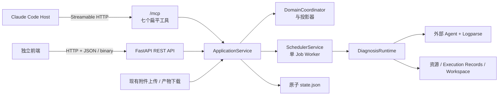

# Web FastAPI 接口决议

状态：已形成实施决议；历史选项保留用于说明取舍

## 1. 目的与边界

本文记录 Problem Locator 向独立前端提供浏览器可用 FastAPI HTTP API 的最终决议。
前端页面、组件、样式、前端工程和前端部署实现不属于本文范围。

实际行为以运行时代码、`/openapi.json`、版本化 OpenAPI 摘要和 Test Flow verdict 为准。

最终范围为创建、单 Case 查询/长轮询、两阶段附件上传、补参、公开产物列表和下载。不提供
恢复、取消、服务端 Case 历史列表、认证、权限、用户或租户模型。REST 使用独立嵌套 DTO；
七个 MCP 输入 schema 继续严格扁平。服务启用无凭据通配 CORS，并正式支持当前稳定版 Chrome
直接跨源调用 Linux Uvicorn。

## 2. 当前架构事实

当前服务是 Linux 单实例、单 Uvicorn worker、单 Job worker 的 FastAPI 应用：

- Claude Code Host 通过 Streamable HTTP `/mcp` 调用七个公开 MCP 工具。
- FastAPI 提供 `/live`、`/ready`、`/openapi.json`、`/docs` 和本文冻结的七个 REST 操作。
- 恢复、取消和服务端 Case 历史列表不以普通 REST API 暴露。
- `ApplicationService` 已经实现上述业务能力，HTTP 层可以复用相同的 Command、Query、
  `DomainCoordinator`、存储和调度路径，不需要另建诊断流程。
- `get_case` 原生支持最长 30 秒的等待，可以作为浏览器长轮询基础，首版不必引入
  WebSocket 或 SSE。
- 七个公开 MCP 输入 schema 必须继续保持根层扁平。REST 可以讨论独立的浏览器友好合同，
  但不得改变或绕过 MCP 扁平化约束。



## 3. 决策一：首版 API 覆盖范围

这个决策确定前端能否在不依赖 Claude Code 或 MCP 的情况下完成一次诊断。

### 选项 A：完整闭环

历史候选的完整资源与动作如下；最终冻结范围见本节末的决议：

| 方法与路径 | 用途 | 应用层映射 |
| --- | --- | --- |
| `POST /api/v1/cases` | 创建 Case | `CreateCase` |
| `GET /api/v1/cases/{case_id}` | 查询状态或长轮询等待 | `get_case` |
| `POST /api/v1/cases/{case_id}/attachments` | 准备附件 | `PrepareAttachment`，现有路由 |
| `PUT /api/v1/attachments/{attachment_id}/content` | 上传附件内容 | `UploadAttachmentContent`，现有路由 |
| `POST /api/v1/cases/{case_id}/supplements` | 提交待补输入和 READY 附件 | `SubmitSupplement` |
| `POST /api/v1/cases/{case_id}/resume` | 恢复中断的 Case | `ResumeCase` |
| `POST /api/v1/cases/{case_id}/cancel` | 取消 Case | `CancelCase` |
| `GET /api/v1/cases/{case_id}/artifacts` | 列出公开产物 | `list_artifacts(..., False)` |
| `GET /api/v1/artifacts/{artifact_id}/content` | 下载公开产物 | `open_artifact`，现有路由 |

优点：

- 前端只依赖 HTTP API，即可处理正常路径、等待补参、等待附件、中断恢复、取消和结果下载。
- 业务行为继续由同一个 `ApplicationService` 和领域状态机决定。
- 可以正式作为网页版的稳定后端能力交给独立前端团队。

代价：

- 需要把 REST 请求、响应、错误、幂等和并发语义作为新的公共合同维护。
- 每个写操作都需要覆盖参数验证、版本冲突、应用错误映射和 DFX/Journey 事件。
- 浏览器附件上传必须经过真实浏览器验证，不能只以 curl 或 `httpx` 测试代替。

### 选项 B：核心诊断

只提供创建、查询、补参和附件，不提供恢复、取消和产物列表。

优点是接口较少，能够覆盖大多数没有异常的诊断。缺点是 `INTERRUPTED` Case 无法从网页恢复，
用户无法取消运行任务，终态产物还要依赖其他入口获取。适合内部原型，不适合作为长期前端合同。

### 选项 C：只提交与查询

只提供创建 Case 和查询状态。

实现最少，但 Case 进入 `WAITING_INPUT`、`WAITING_ATTACHMENT` 或 `INTERRUPTED` 后，网页流程会
停止，必须切换到 Claude Code。该选项更接近只读演示，不构成完整网页版支持。

### 最终决议

采用定制范围：创建、查询、附件、补参、公开产物列表和下载；不纳入选项 A 中的恢复和取消。
新增的是 HTTP 适配能力，不是第二套诊断业务逻辑。

## 4. 决策二：前端与 FastAPI 的部署关系

该决策决定 CORS、HTTPS 和访问控制的责任边界。CORS 只是浏览器跨域策略，不等于认证或授权。

### 选项 A：生产同域反向代理

示例：

```text
https://locator.example.internal/          -> 前端静态资源
https://locator.example.internal/api/v1/*  -> FastAPI
https://locator.example.internal/mcp       -> FastAPI
```

优点：

- 浏览器不触发跨域限制，FastAPI 不需要启用 CORS。
- HTTPS、企业登录、来源限制和访问审计可以统一放在反向代理或企业网关。
- 附件上传、自定义请求头和产物下载的浏览器行为更简单。

代价：

- 前后端虽然可以独立构建，但部署时需要统一域名和网关路由。
- 前端本地开发需要开发服务器代理，或者临时的精确 CORS 配置。

### 选项 B：固定跨域

例如前端使用 `https://locator-ui.example.internal`，API 使用
`https://locator-api.example.internal`。FastAPI 必须配置精确 Origin allowlist，不能把
`*` 作为带凭据环境的便利配置。

至少需要明确：

- 允许的方法：`GET`、`POST`、`PUT`、`OPTIONS`。
- 允许的请求头：`Content-Type`、`Idempotency-Key`、`X-Content-SHA256`，以及最终选定的认证头。
- 前端可读取的响应头：`X-Problem-Locator-Correlation-ID`、`X-Content-SHA256`、
  `Content-Length`、`Content-Disposition`。
- 是否携带 Cookie；若携带，还必须同时设计凭据、SameSite 和 CSRF 边界。

优点是前后端可以完全独立部署。代价是附件上传会产生预检请求，CORS 和凭据配置的错误面扩大，
而且 CORS 仍不能阻止 curl 或服务端程序访问 API。

### 选项 C：生产同域，同时支持可选的严格 CORS

默认不开放跨域；只有配置精确 Origin allowlist 时才安装或启用 CORS 中间件。生产可以使用同域，
本地开发或特殊部署可以显式加入 `http://localhost:<port>` 或固定前端域名。

### 最终决议

服务允许任意 Origin，`allow_credentials=false`，允许 `GET`、`POST`、`PUT`、`OPTIONS` 和网页
所需的三个可控请求头。首版明确不包含账号、Cookie、会话、角色、权限、所有权或租户隔离。

## 5. 决策三：REST 请求合同形态

响应可以继续复用现有 `ApplicationResponse`、`CaseQueryResponse`、`CaseView`、`ArtifactView`
和统一成功/错误 envelope。本决策主要针对写请求的 JSON 形态。

### 选项 A：浏览器友好的嵌套 JSON

创建 Case 示例：

```json
{
  "request_id": "web-generated-idempotency-key",
  "raw_problem_text": "用户提交的完整原始问题",
  "problem_spec": {
    "statement": "问题描述",
    "expected_behavior": "预期行为",
    "actual_behavior": "实际行为",
    "scope": "诊断范围",
    "goals": ["确认根因"],
    "non_goals": [],
    "constraints": ["不得修改生产数据"],
    "completion_criteria": ["给出证据支持的结论"]
  },
  "initial_user_facts": [
    {
      "name": "problem_time",
      "value": "2026-08-16 10:30"
    }
  ],
  "wait_seconds": 0
}
```

补充输入示例：

```json
{
  "request_id": "another-idempotency-key",
  "expected_case_revision": 3,
  "inputs": [
    {
      "name": "problem_time",
      "value": "2026-08-16 10:30"
    }
  ],
  "attachment_ids": [
    "00000000-0000-0000-0000-000000000001"
  ],
  "wait_seconds": 0
}
```

优点：

- 字段关系清晰，前端 TypeScript 类型容易表达。
- 避免 name/value 配对数组长度一致但索引错位的问题。
- 校验错误可以给出清晰路径，例如 `problem_spec.completion_criteria[0]`。
- REST DTO 可以确定性地转换为现有应用 Command。

约束：

- REST 请求模型必须与 MCP 请求模型分离。
- MCP 仍只接受当前根层标量、nullable 标量和标量数组。
- schema 测试必须证明七个 MCP 工具没有出现 `$ref/$defs`、嵌套 object、动态 Map 或对象数组。

### 选项 B：完全复用 MCP 扁平形态

REST 继续使用根层 `statement`、`expected_behavior` 等字段，并通过
`initial_user_fact_names`/`initial_user_fact_values`、`input_names`/`input_values` 配对。

优点是 REST 与 MCP 输入完全一致，可以复用部分现有请求模型。缺点是把 Host 的兼容性限制传播到
浏览器 API，前端容易错配数组，REST 的长期演进也会受到 MCP 约束牵制。

### 选项 C：同时兼容嵌套和扁平输入

优点是不同客户端可以任选格式。缺点是需要定义两种字段同时出现时的优先级，OpenAPI 会成为联合
类型，错误信息、幂等内容身份和测试面都会扩大，也不符合当前严格拒绝错误字段、不做隐式兼容的
设计风格。

### 最终决议

选择选项 A。REST 使用独立的严格嵌套 DTO；MCP 扁平合同保持不变；不提供双形态兼容层。

## 6. 所有方案都应保留的协议语义

- 响应继续使用 `ok/data/error` envelope，并沿用当前 `ApplicationError` 与 HTTP 状态映射。
- 每个写操作由客户端提供唯一 `request_id`，服务端继续使用现有幂等记录，不在 HTTP 层偷偷重试。
- 修改已有 Case 的操作必须携带 `expected_case_revision`。版本冲突时前端应重新查询 Case 后再让用户
  决定是否重试，不能由服务端覆盖新状态。
- 查询接口允许 `wait_for_job_id` 和 `wait_seconds`，其中 `wait_seconds` 继续受现有最大值约束。
- REST 不直接读写 `state.json` 或文件系统资源，所有业务调用必须经过应用 Port。
- 公开产物列表只能调用 `list_artifacts(case_id, False)`，不得暴露内部 Logparse Run、候选产物或
  Review 前资源。
- 每个 HTTP 请求继续产生 `X-Problem-Locator-Correlation-ID`，参数、验证失败和应用错误继续进入
  服务端 DFX；语义状态变化继续由应用层写 Journey。

## 7. 附件上传的浏览器合同

REST 附件准备要求 `declared_size` 和 `declared_sha256` 必填；MCP 仍允许二者为 null。REST 上传描述
只把 `Idempotency-Key`、`Content-Type`、`X-Content-SHA256` 列为脚本可控的 required headers，并用
`expected_content_length` 表达预期长度。Chrome 使用真实 `Blob`/`File` 作为 PUT body 并生成
`Content-Length`；服务端仍要求四个实际请求头恰好出现一次。

合同继续满足附件大小、SHA-256、Content-Type、幂等、流式读取、上传锁和 Case 容量约束。正式
验收必须覆盖真实 Chrome 跨源预检和上传；curl 或 `httpx` 只能覆盖服务端确定性行为，不能替代该
浏览器证据。

## 8. Case 列表是独立决策

现有 Query Port 只支持按 Case ID 查询，不支持列出 Case。“完整闭环”默认可以通过创建响应中的
Case ID、页面深链接或前端本地历史打开 Case，但不自动包含服务端历史列表。

可选方向：

- 不新增列表：前端保存最近 Case ID，并允许用户输入 ID 打开。
- 新增全局分页列表：需要定义排序、游标、字段裁剪、总量限制和谁有权看到哪些 Case。
- 新增按用户隔离的分页列表：必须先有可信用户身份和 Case 所有权模型。

最终决议是不新增列表。网页保存创建响应中的 Case ID，并通过深链接重新打开。

## 9. 已形成的决议

1. 首版提供创建、查询、附件、补参、公开产物列表和下载。
2. 启用无凭据通配 CORS，不设计访问模型。
3. REST 使用独立嵌套 DTO，响应复用公开应用 DTO 和 envelope。
4. 不提供 Case 列表、恢复或取消。
5. REST 附件元数据必填，MCP 和官方客户端 Skill 不变。
6. `/openapi.json` 与 `/docs` 公开；正式浏览器目标仅为当前稳定版 Chrome，且不验证反向代理。

## 10. 确定方案后的验证原则

- 先为新增 HTTP DTO、路由、错误映射、幂等和版本冲突增加确定性接口测试。
- 增加 REST 与 MCP 对同一应用命令产生等价业务结果的测试，但不要求两者请求 JSON 形态相同。
- 对七个 MCP 工具运行全量 schema lint，证明扁平合同没有回归。
- 用真实 Chrome 验证创建、长轮询、补参、上传和下载，并覆盖成功的通配 CORS 预检；不测试未
  暴露的取消和恢复。
- 所有新测试活动仍以 `tools/test-flow/run.sh` 或 `tools/test-flow/run.ps1` 为唯一入口；最终结论只
  来自与对应源码身份绑定的 `verdict.json`。
