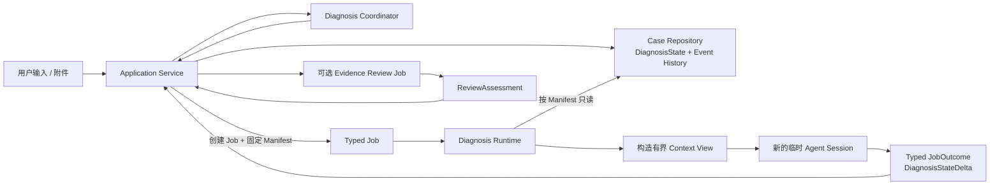

# GitHub 高星 Agent 项目的上下文与状态管理调研

状态：调研材料，非已确认设计决策  
调研日期：2026-07-28  
关联主题：Problem Locator 的 Agent Session、Job 上下文、诊断状态持久化与长会话退化治理

## 1. 调研目的

Problem Locator 当前设计需要在以下方案之间做出选择：

1. 同一个 Agent 跨多个 Job 复用长期 Session；
2. 长期 Session 接近上下文上限时进行摘要、裁剪或轮换；
3. 每个 Job 从持久化状态构造上下文，并使用新的 Agent Session；
4. 保存完整事件历史，同时只向模型提供经过压缩的有限视图。

本调研选取 GitHub 上具有较高关注度的 Agent 框架和编码 Agent，重点考察：

- 业务或任务状态的权威来源；
- Agent 对话是否长期复用；
- 是否进行步骤级 checkpoint；
- 上下文超长时如何处理；
- 进程退出后能否恢复；
- 哪些设计适合 Problem Locator。

Stars 为 2026-07-28 左右的近似值，只用于说明社区关注度，不代表架构质量或项目成熟度。

## 2. 核心结论

高星 Agent 项目没有形成“全部长期复用 Session”或“全部逐 Job 重建”的统一方案，主要分为两类：

### 2.1 用户交互型编码 Agent

典型项目包括 OpenHands、Cline、Aider 和 SWE-agent。

它们通常采用：

```text
一个任务对应一段持续增长的对话或事件历史
+ 文件系统、Git 或 Workspace 保存真实执行结果
+ 接近上下文上限时进行摘要、裁剪或过滤
+ 必要时由用户创建新任务
```

这类方案强调交互连续性和较低的重复上下文成本，但不能从根本上消除：

- 摘要丢失细节；
- 旧假设继续影响后续判断；
- 长历史中的噪声稀释有效信息；
- Agent 对真实项目状态产生错误记忆。

### 2.2 编排与持久化框架

典型项目包括 LangGraph，以及 CrewAI 的 Flow 部分。

它们更倾向于：

```text
外部结构化状态
+ 步骤边界 checkpoint
+ 确定性流程编排
+ 执行节点从当前状态构造输入
```

这种设计更适合需要审计、恢复、并发控制和证据一致性的系统。

### 2.3 对 Problem Locator 最重要的观察

高星项目中很少有系统把“模型生成的一段自由文本摘要”当成业务事实的唯一来源。

更可靠的共同方向是：

- 完整历史可以保存；
- 模型不必读取完整历史；
- 文件、事件、结构化状态或 checkpoint 承担恢复职责；
- 摘要只是一种模型输入视图，不应成为权威状态；
- Agent Session 最好不成为系统正确性的必要条件。

## 3. 项目对比

| 项目 | 约 Stars | 主要状态载体 | 上下文管理方式 | 恢复方式 | 类型判断 |
|---|---:|---|---|---|---|
| [OpenHands](https://github.com/OpenHands/OpenHands) | 77.1k | Conversation Base State、完整事件日志、Workspace | Condenser 保留头尾并压缩中间事件 | 从 Base State 和事件文件恢复 Conversation | 事件溯源 + 持久会话 + 压缩视图 |
| [Cline](https://github.com/cline/cline) | 63.3k | Task 对话历史、任务目录、Git 文件 checkpoint | Auto Compact；也可通过 `/newtask` 提炼交接 | 从任务历史恢复完整 Task | 长 Session + 自动摘要 + 显式换任务 |
| [AutoGen](https://github.com/microsoft/autogen) | 60k | Agent/Team 消息上下文 | 默认完整历史，可配置最近 N 条或 Token 上限 | `save_state/load_state` 恢复 Agent/Team 状态 | 有状态 Agent + 可插拔上下文窗口 |
| [CrewAI](https://github.com/crewAIInc/crewAI) | 53.6k | Agent Memory、Task Context、Flow State | Agent 自动摘要；Flow 使用结构化状态 | Flow 状态持久化，Agent Memory 可继续使用 | 结构化 Flow + 有状态 Agent |
| [Aider](https://github.com/Aider-AI/aider) | 46.2k | 聊天历史、Git、当前文件、Repo Map | 达到软 Token 上限后自动摘要；支持 `/clear` | 可恢复聊天记录，代码状态由 Git/文件承担 | 长 Session + 摘要 + Git 事实源 |
| [LangGraph](https://github.com/langchain-ai/langgraph) | 38.3k | Graph State、Thread、StateSnapshot | 消息字段可裁剪或摘要；状态每个 super-step checkpoint | 从 checkpoint 恢复、回放或分叉 | 外部状态 + 步骤级快照 |
| [SWE-agent](https://github.com/SWE-agent/SWE-agent) | 19.5k | Agent trajectory、Sandbox/Repository | History Processor 删除旧 observation 或特定输出 | 主要保存 trajectory，任务执行通常单次完成 | 长轨迹 + 可插拔历史过滤 |
| [mini-SWE-agent](https://github.com/SWE-agent/mini-swe-agent) | 6k | 线性消息历史、Repository | 不使用复杂压缩；所有步骤持续追加消息 | 主要依赖任务内线性轨迹 | 极简长历史基线 |

## 4. 各项目的具体做法

### 4.1 LangGraph：步骤级结构化 checkpoint

LangGraph 将 Agent 或工作流建模为状态图：

- `State` 是共享的结构化数据；
- 每个节点读取当前 State 并产生状态更新；
- 每个 super-step 结束后保存 `StateSnapshot`；
- snapshot 带有 `thread_id`、`checkpoint_id`、父 checkpoint、下一节点和节点输出；
- 可以从历史 checkpoint 恢复、回放或创建分支。

对于长对话，LangGraph 并不认为 checkpoint 自动解决上下文长度问题。消息仍然可能作为 State 中的一个字段持续增长，因此另外提供：

- 删除旧消息；
- 保留最近消息；
- 对历史消息进行摘要；
- 将长期记忆放入独立 Store。

官方资料：

- [LangGraph Persistence](https://docs.langchain.com/oss/python/langgraph/persistence)
- [LangGraph Memory](https://docs.langchain.com/oss/python/langgraph/add-memory)

对 Problem Locator 的参考价值：

- `DiagnosisState` 可以对应 LangGraph State；
- Job 边界可以对应 super-step；
- `JobContextManifest` 可以对应不可变的 checkpoint 引用；
- `DiagnosisStateDelta` 可以对应节点状态更新；
- Agent Session 可以被视为执行实现，而不是权威状态。

需要注意：

LangGraph 的通用 StateSnapshot 可以保存完整消息列表。Problem Locator 不应直接照搬“消息就是状态”，而应定义领域化的事实、假设、证据和决策结构。

### 4.2 OpenHands：完整事件日志与压缩视图分离

OpenHands 的 Conversation 持久化内容包括：

- 完整消息和工具调用事件；
- Agent 配置；
- 当前执行状态；
- 工具输出；
- Token 和调用统计；
- Workspace 上下文；
- 已激活 Skill；
- Agent 自定义状态。

其持久化设计将数据分成：

```text
base_state.json
    保存配置、状态、统计和 Agent State

events/event-*.json
    追加保存消息、工具调用、Observation 等事件
```

事件历史过长时，Condenser 不删除原始事件，而是：

1. 检测上下文阈值；
2. 保留最前面的系统相关事件；
3. 保留最近事件；
4. 使用模型或规则压缩中间事件；
5. 将压缩结果作为新的 `Condensation` 事件写入事件日志；
6. 构造给模型的 View 时，用摘要替换被压缩事件。

官方资料：

- [OpenHands Conversation Persistence](https://docs.openhands.dev/sdk/guides/convo-persistence)
- [OpenHands Condenser Architecture](https://docs.openhands.dev/sdk/arch/condenser)

对 Problem Locator 的参考价值：

- 可以保存完整 JobEvent 和 JobOutcome 用于审计；
- 给模型的 `ContextView` 可以与持久化历史分开；
- 压缩行为本身也应该成为可追踪事件；
- 原始 Evidence 不应因上下文压缩而丢失。

局限：

OpenHands 仍然以 Conversation/Event History 为主要工作上下文，并通过摘要解决长期增长问题。Problem Locator 对证据准确性要求更高，不能只依靠 Condenser 生成的文本恢复诊断状态。

### 4.3 Cline：Task 长会话、Auto Compact 和新任务交接

Cline 将一次工作建模为 Task：

- 一个 Task 对应一个主要目标；
- Task 保存完整对话、代码修改、命令执行和决定；
- Task 有独立 ID 和存储目录；
- 文件变更通过 Git checkpoint 回退；
- Task 可以跨编辑器重启恢复。

当上下文接近模型上限时，Cline 的 Auto Compact 会：

1. 生成当前任务的综合摘要；
2. 保存技术细节、代码修改和决定；
3. 用摘要替换旧对话；
4. 在同一 Task 中继续。

Cline 还提供 `/newtask`，把计划、已完成工作、相关文件和下一步提炼成新任务，相当于显式的结构化程度较低的 Agent 交接。

官方资料：

- [Cline Task Management](https://docs.cline.bot/core-workflows/task-management)
- [Cline Auto Compact](https://docs.cline.bot/features/auto-compact)
- [Cline Commands](https://docs.cline.bot/core-workflows/using-commands)

对 Problem Locator 的参考价值：

- 一个 Case 应限制为一个清晰的问题目标；
- 问题范围改变时，应创建新 Case 或新的 ProblemSpecRevision；
- 新 Case 可以引用旧 Case 的结构化 Handoff；
- 文件 checkpoint 与诊断 checkpoint 必须区分。

局限：

Cline 的摘要主要服务于继续编码。它不能保证每个事实都有 Evidence 引用，也不能保证已排除假设不会在摘要中被错误恢复。

### 4.4 AutoGen：有状态 Agent 和可插拔 Model Context

AutoGen 的 `AssistantAgent` 默认使用 `UnboundedChatCompletionContext`，会把完整消息历史发送给模型。

它同时提供：

- `BufferedChatCompletionContext`：只发送最近 N 条消息；
- `TokenLimitedChatCompletionContext`：按 Token 上限选择最近消息；
- `HeadAndTailChatCompletionContext`：保留头部与尾部消息；
- `save_state/load_state`：序列化和恢复 Agent/Team 消息状态；
- 自定义 Model Context：开发者可以实现自己的过滤策略。

官方资料：

- [AutoGen Agent Model Context](https://microsoft.github.io/autogen/stable/user-guide/agentchat-user-guide/tutorial/agents.html#using-model-context)
- [AutoGen Model Context API](https://microsoft.github.io/autogen/stable/reference/python/autogen_core.model_context.html)

对 Problem Locator 的参考价值：

- Context Policy 应作为可替换边界；
- 可分别提供最近消息、Token 上限、头尾保留等 View；
- 保存和恢复 Context 不应与具体模型 Backend 绑定。

局限：

AutoGen 的核心状态仍以消息上下文为主。它解决的是“向模型发送哪些消息”，不是“哪些诊断事实具有业务权威性”。此外，AutoGen 已进入维护模式，新项目需要同时关注其后继 Microsoft Agent Framework。

### 4.5 CrewAI：Flow 结构化状态与 Agent Memory 混合

CrewAI 同时提供两种抽象：

- Crew：强调多个自主 Agent 的角色协作；
- Flow：强调确定性的事件驱动流程和结构化状态。

Agent 可以启用 Memory，在多次交互中保留上下文。当历史超过窗口时，`respect_context_window=True` 会自动摘要；设置为 False 时则停止执行。

Flow 使用 Python/Pydantic 状态对象，并通过 start、listen 和 router 等步骤修改和路由状态。

官方资料：

- [CrewAI Repository](https://github.com/crewAIInc/crewAI)
- [CrewAI Agent Context](https://github.com/crewAIInc/crewAI/blob/main/docs/en/concepts/agents.mdx)
- [CrewAI Documentation](https://docs.crewai.com/)

对 Problem Locator 的参考价值：

- Application Service 和 Coordinator 应保持 Flow 式确定性；
- Specialist Agent 可以在有限 Job 内自主执行；
- Agent Memory 不能覆盖 Flow/Case 的权威状态。

局限：

如果同时把 Agent Memory 和 Flow State 当成真实状态，会产生两个来源。Problem Locator 应明确只有 Case/DiagnosisState 是权威来源。

### 4.6 Aider：聊天摘要与 Git/Repo Map 外部事实

Aider 主要依赖：

- 当前聊天历史；
- 当前加入 Chat 的文件；
- Git 工作区和 Commit；
- Repo Map；
- 自动生成的聊天摘要。

当聊天历史达到配置的软 Token 上限后，Aider 自动进行摘要。用户也可以：

- `/clear` 清空聊天历史；
- `/drop` 移除不需要的文件；
- `/map` 查看 Repo Map；
- 在新 Session 中通过 Git diff 补充最近修改。

官方资料：

- [Aider Configuration](https://aider.chat/docs/config/aider_conf.html)
- [Aider In-chat Commands](https://aider.chat/docs/usage/commands.html)
- [Aider Release History](https://aider.chat/HISTORY.html)

对 Problem Locator 的参考价值：

- 真实文件和 Evidence 应独立于对话存在；
- 模型上下文只引用当前相关材料；
- 用户应能显式清理或重建 Agent 上下文。

局限：

Aider 依赖 Git 和人工交互恢复工程上下文，不提供 Problem Locator 所需的结构化事实、假设和证据状态机。

### 4.7 SWE-agent：Trajectory 与 History Processor

SWE-agent 保存任务执行 trajectory，并在每次请求模型前通过 History Processor 生成消息视图。

内置策略包括：

- 保留最近 N 个 Observation；
- 删除旧工具输出；
- 按工具类型标记必须保留的 Observation；
- 使用正则移除大型 Diff 等内容；
- 为模型 Prompt Cache 调整历史布局。

原始 trajectory 可以继续保存，History Processor 只决定发送给模型的内容。

官方资料：

- [SWE-agent History Processor](https://swe-agent.com/1.0/reference/history_processor_config/)
- [SWE-agent Architecture](https://swe-agent.com/0.7/background/architecture/)

mini-SWE-agent 进一步简化为：

- 每个步骤只向线性消息历史追加内容；
- shell action 使用相互独立的进程执行；
- 不提供复杂历史压缩；
- 更适合作为短期、封闭任务的研究基线。

官方资料：

- [mini-SWE-agent Repository](https://github.com/SWE-agent/mini-swe-agent)

对 Problem Locator 的参考价值：

- Context Builder 应支持可插拔的 History/Context Processor；
- 大型日志和工具输出应保存在 Artifact/Evidence 中，模型上下文只包含引用和相关片段；
- Context Processor 不应修改 Repository 中的权威记录。

## 5. 主要架构模式

### 5.1 模式 A：长期 Session + 摘要

代表项目：

- Cline；
- Aider；
- CrewAI Agent；
- OpenHands 的模型 View；
- AutoGen 默认 Agent。

优点：

- 实现直观；
- 同一 Session 内交互连续；
- 可以利用 Prompt Cache；
- 不需要每轮重新装配全部上下文。

缺点：

- 摘要是有损的；
- Session 内容容易与真实状态漂移；
- 调试结果依赖历史消息排列；
- 故障恢复和多实例接手复杂；
- 容易形成 Session 亲和性。

### 5.2 模式 B：外部状态 + 步骤 checkpoint

代表项目：

- LangGraph；
- CrewAI Flow。

优点：

- 状态可查询、审计、恢复；
- 执行步骤可以重放；
- Agent/节点可以更接近无状态；
- 更容易做并发控制和故障接管。

缺点：

- 需要认真设计 State Schema；
- 状态更新和 reducer 规则需要确定；
- 如果把全部消息直接放入 State，仍然会产生上下文膨胀。

### 5.3 模式 C：完整事件历史 + 有界模型视图

代表项目：

- OpenHands；
- SWE-agent。

优点：

- 原始执行历史保留；
- 可以替换不同压缩或过滤策略；
- 便于审计和离线分析。

缺点：

- 事件历史与当前有效状态需要区分；
- 每次从事件恢复状态可能成本较高；
- 摘要或过滤 View 仍可能遗漏关键信息。

### 5.4 模式 D：结构化状态为主，Session 仅作为缓存

这是本调研建议 Problem Locator 采用的模式：

```text
Repository 中的 DiagnosisState 决定系统当前状态

JobContextManifest 决定本 Job 可以读取什么

Agent Session 只是 Job 的执行容器

复用 Session 只能是性能优化

关闭所有 Session 后，系统仍能从 Repository 正确继续
```

该模式可以视为：

```text
LangGraph 的结构化 checkpoint
+ OpenHands 的 append-only 事件
+ SWE-agent 的可插拔上下文过滤
+ Cline 的单目标 Task 边界
```

## 6. 对 Problem Locator 的建议架构

### 6.1 权威诊断状态

在 Structured Case Repository 中增加领域化 `DiagnosisState`：

```text
DiagnosisState
├── problem_spec_revision
├── confirmed_facts[]
├── active_hypotheses[]
├── rejected_hypotheses[]
├── decisions[]
├── open_questions[]
├── evidence_refs[]
└── next_step
```

每个字段应带有必要的：

- ID；
- revision；
- provenance；
- Evidence 引用；
- 状态；
- supersedes 关系。

### 6.2 追加式审计历史

保留：

```text
Job
JobOutcome
RouteDecision
ReviewAssessment
DiagnosisStateDelta
ContextCompactionEvent
```

这些记录用于：

- 审计；
- 调试；
- 回放；
- 评估 Agent；
- 重新计算当前 DiagnosisState。

它们不应全部直接发送给模型。

### 6.3 不可变 JobContextManifest

Application Service 创建 Job 时同时固定：

```text
JobContextManifest
├── case_revision
├── diagnosis_state_revision
├── problem_spec_revision
├── evidence_refs[]
├── attachment_refs[]
├── previous_outcome_refs[]
├── agent_profile
└── skill_id@version
```

Runtime 根据该 Manifest 构建有界 Context View，而不是读取执行时的最新 Case，也不是依赖旧 Session 的隐式记忆。

### 6.4 Job 默认使用新 Session

建议将语义基线定义为：

```text
每个 Job 都可以在一个全新 Agent Session 中正确执行
```

第一版可以直接每个 Job 新建 Session，从而删除：

- 长期 Session Registry；
- Session 空闲回收；
- Session 健康评分；
- Session 轮换阈值；
- Session 亲和性；
- 服务重启后的 Session 恢复问题。

未来如果需要降低延迟或利用 Prompt Cache，可以复用 Session，但必须满足：

```text
复用与不复用产生相同的业务语义
```

即 Session 只能是缓存，不能是正确性来源。

### 6.5 Typed Outcome 只返回状态增量

Agent Job 返回：

```text
DiagnosisStateDelta
├── new_facts[]
├── hypothesis_changes[]
├── decision_changes[]
├── resolved_questions[]
├── new_questions[]
├── evidence_refs[]
└── recommended_next_step
```

Application Service 负责：

1. 校验引用和 revision；
2. 调用 Coordinator；
3. 保存 Outcome；
4. 合并合法的状态变化；
5. 创建下一 Job。

Agent、Worker、Runtime 和 Backend 都不能直接修改 Case。

### 6.6 模型只读取有界 View

Context Builder 可以采用以下顺序构建模型输入：

```text
当前 ProblemSpec
当前 Job 目标
有效约束
已确认事实及 Evidence 引用
当前活跃假设
与当前假设有关的已排除项
相关附件或日志片段
唯一下一步和输出 Schema
```

以下内容默认不进入模型上下文：

- 完整历史聊天；
- 无关 JobOutcome；
- 已失效 ProblemSpec；
- 已被替代的决定；
- 大型原始日志；
- 与当前假设无关的工具输出；
- Agent 的隐藏推理过程。

## 7. 建议的目标执行链



该执行链的关键性质：

- Repository 是唯一权威状态源；
- Job 输入可复现；
- Agent Session 可以随时丢弃；
- 完整历史可审计但不会无限进入模型；
- Reviewer 可以使用独立的新 Session；
- 服务端以后可以自然升级为多实例 Worker。

## 8. 对现有 OPT-015 的影响

现有 OPT-015 已确认：

```text
同一个 Agent 跨 Job 保持 Session，
不同 Agent 使用结构化信息交接。
```

该结论主要考虑：

- 同 Agent 对话连续；
- 不需要设计完整恢复快照；
- 当前部署为单节点、低并发；
- 暂不要求跨服务重启恢复。

本次调研表明，它未充分计入：

- 长会话上下文压缩造成的信息损失；
- 旧假设和过期指令累积；
- Session 与 Case 状态漂移；
- Session 亲和性和空闲资源占用；
- 多实例和故障接管的后续迁移成本；
- 测试结果依赖完整历史消息的问题。

因此建议重新打开 OPT-015，候选结论调整为：

```text
JobContextManifest 和 DiagnosisState 是执行正确性的来源。

每个 Job 默认可以使用全新 Agent Session。

Session 复用只作为 Runtime 的透明性能优化，
不得改变 Job 输入语义，也不得成为恢复前提。
```

本调研文档不直接把该建议标记为已确认方案。是否替换 OPT-015，应在更新正式设计文档时单独决策。

## 9. 推荐参考优先级

### 第一优先级：LangGraph

重点参考：

- StateSnapshot；
- checkpoint revision；
- 节点状态增量；
- 恢复、回放和分叉语义。

不建议照搬：

- 将完整消息列表直接作为长期权威状态。

### 第二优先级：OpenHands

重点参考：

- Base State 与 append-only Events 分离；
- 原始历史与模型 View 分离；
- 压缩行为本身可追踪；
- Workspace 状态持久化。

不建议照搬：

- 依赖自由文本 Condensation 恢复关键诊断事实。

### 第三优先级：SWE-agent

重点参考：

- Context/History Processor 接口；
- 日志和工具输出的选择性保留；
- 原始 trajectory 与模型输入分离。

### 第四优先级：Cline

重点参考：

- 一个 Task 一个目标；
- 新任务交接；
- 项目文件 checkpoint 与聊天上下文区分。

### 对比参考：AutoGen、CrewAI、Aider

主要用于理解：

- 长 Session 的开发体验；
- Token 限制策略；
- 摘要、Buffer、Head/Tail 等 Context View；
- Agent Memory 与结构化流程状态可能形成的双状态问题。

## 10. 总结

GitHub 高星 Agent 项目的主流实践并不是简单选择“保留对话”或“每轮重建”，而是逐渐形成以下分层：

```text
原始执行历史：用于审计和恢复

结构化当前状态：用于业务正确性

有限模型视图：用于单次推理

Agent Session：用于临时执行或性能优化
```

对 Problem Locator，推荐把这一分层明确写入目标架构：

> Case/DiagnosisState 保存真相，JobContextManifest 固定本轮输入，Context Builder 生成有界视图，Agent Session 可以随时丢弃。

这比长期复用 Session 后再通过摘要补救更适合证据驱动的问题定位系统。

## 11. 资料来源

- LangGraph Repository: <https://github.com/langchain-ai/langgraph>
- LangGraph Persistence: <https://docs.langchain.com/oss/python/langgraph/persistence>
- LangGraph Memory: <https://docs.langchain.com/oss/python/langgraph/add-memory>
- OpenHands Repository: <https://github.com/OpenHands/OpenHands>
- OpenHands Persistence: <https://docs.openhands.dev/sdk/guides/convo-persistence>
- OpenHands Condenser: <https://docs.openhands.dev/sdk/arch/condenser>
- Cline Repository: <https://github.com/cline/cline>
- Cline Task Management: <https://docs.cline.bot/core-workflows/task-management>
- Cline Auto Compact: <https://docs.cline.bot/features/auto-compact>
- Cline Commands: <https://docs.cline.bot/core-workflows/using-commands>
- AutoGen Repository: <https://github.com/microsoft/autogen>
- AutoGen Model Context: <https://microsoft.github.io/autogen/stable/user-guide/agentchat-user-guide/tutorial/agents.html#using-model-context>
- AutoGen Model Context API: <https://microsoft.github.io/autogen/stable/reference/python/autogen_core.model_context.html>
- CrewAI Repository: <https://github.com/crewAIInc/crewAI>
- CrewAI Documentation: <https://docs.crewai.com/>
- CrewAI Agent Context: <https://github.com/crewAIInc/crewAI/blob/main/docs/en/concepts/agents.mdx>
- Aider Repository: <https://github.com/Aider-AI/aider>
- Aider Configuration: <https://aider.chat/docs/config/aider_conf.html>
- Aider Commands: <https://aider.chat/docs/usage/commands.html>
- SWE-agent Repository: <https://github.com/SWE-agent/SWE-agent>
- SWE-agent History Processor: <https://swe-agent.com/1.0/reference/history_processor_config/>
- mini-SWE-agent Repository: <https://github.com/SWE-agent/mini-swe-agent>
